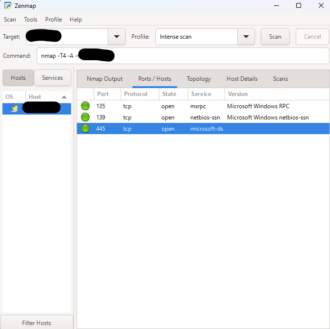
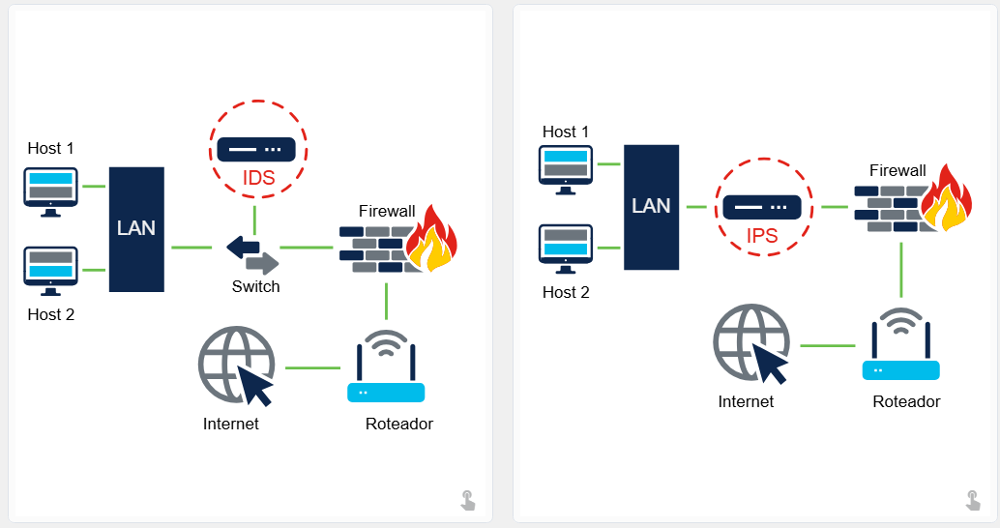

# 4.1.1 Dispositivos de Segurança

Os dispositivos de segurança podem ser dispositivos independentes, como um roteador, ou ferramentas de software executadas em um dispositivo de rede. Eles se enquadram em seis categorias gerais.

## Roteadores

Embora os roteadores sejam usados principalmente para interconectar vários segmentos de rede, eles geralmente também oferecem recursos básicos de filtragem de tráfego. Essas informações podem ajudá-lo a definir quais computadores de um determinado segmento de rede podem se comunicar com quais segmentos de rede.

## Firewalls

Os firewalls podem analisar melhor o tráfego de rede e identificar comportamentos mal-intencionados que precisam ser bloqueados. Os firewalls podem ter políticas de segurança sofisticadas aplicadas ao tráfego que passa por eles.

## Sistemas de Prevenção de Invasão (IPS)

Os sistemas IPS usam um conjunto de assinaturas de tráfego que correspondem e bloqueiam tráfego e ataques mal-intencionados.

## Redes Privadas Virtuais (VPN)

Os sistemas de VPN permitem que funcionários remotos utilizem um túnel criptografado seguro em seus computadores móveis para se conectarem à rede da empresa. Também podem interconectar filiais com a rede da matriz de forma segura.

## Antivírus e Antimalware

Esses sistemas utilizam assinaturas ou análises comportamentais para identificar e bloquear a execução de códigos mal-intencionados.

## Outros Dispositivos de Segurança

Outros dispositivos incluem:

- Dispositivos de segurança para web e e-mail;
- Dispositivos de descriptografia;
- Servidores de controle de acesso de clientes;
- Sistemas de gerenciamento de segurança.

# 4.1.3 Firewalls

Os firewalls podem ser classificados de acordo com a camada em que atuam e os critérios utilizados para filtrar o tráfego.

## Firewall de Camada de Rede

Filtra as comunicações com base nos endereços IP de origem e destino.

## Firewall de Camada de Transporte

Filtra as comunicações com base nas portas de origem e destino, além dos estados de conexão.

## Firewall de Camada de Aplicação

Filtra as comunicações de acordo com um aplicativo, programa ou serviço específico.

## Firewall Sensível ao Contexto (Context-Aware)

Filtra as comunicações considerando:

- Usuário;
- Dispositivo;
- Função;
- Tipo de aplicação;
- Perfil de ameaça.

## Servidor Proxy

Filtra solicitações de conteúdo web, como:

- URLs;
- Nomes de domínio;
- Tipos de mídia.

## Servidor Proxy Reverso

Posicionados à frente de servidores web, os proxies reversos:

- Protegem os servidores;
- Ocultam sua infraestrutura;
- Distribuem cargas de acesso;
- Melhoram o desempenho.

## Firewall NAT (Network Address Translation)

Oculta ou mascara os endereços IP privados dos hosts da rede.

## Firewall Baseado em Host

Filtra portas e chamadas de serviço diretamente em um sistema operacional específico.

# 4.1.5 Varredura de Portas

Na rede, cada aplicação em execução recebe um identificador chamado **porta**. Esse número é utilizado nas duas extremidades da comunicação para garantir que os dados sejam entregues ao serviço correto.

A **varredura de portas** (*Port Scanning*) consiste em sondar um computador, servidor ou outro dispositivo de rede para identificar quais portas estão abertas.

Essa técnica pode ser utilizada:

- De forma maliciosa, para reconhecimento de sistemas e serviços;
- De forma legítima, por administradores de rede para auditoria e validação de políticas de segurança.

## Exemplo de Utilização

1. Baixe e execute uma ferramenta de varredura de portas, como o **Zenmap**.
2. Informe o endereço IP do computador alvo.
3. Escolha um perfil de varredura padrão.
4. Clique em **Scan**.

A ferramenta exibirá:

- Serviços em execução;
- Portas utilizadas;
- Estado de cada porta.

## Estados das Portas

### Aberto (Open)

A porta ou serviço está acessível por outros dispositivos da rede.

### Fechado (Closed)

A porta não possui nenhum serviço ativo e não pode ser explorada.

### Filtrado (Filtered)

O acesso é bloqueado por um firewall ou outro mecanismo de segurança.

## Varredura Externa

Para realizar uma varredura externa da rede, é necessário utilizar o endereço IP público do roteador ou firewall.

Uma forma simples de descobrir o IP público é pesquisar:

> **"Qual é o meu endereço IP?"**

Em seguida:

1. Acesse o **Nmap Online Port Scanner**;
2. Informe o IP público;
3. Execute a opção **Quick Nmap Scan**.

Se as portas abaixo estiverem abertas, provavelmente existe encaminhamento de portas (*port forwarding*) configurado:

- 21 (FTP)
- 22 (SSH)
- 25 (SMTP)
- 80 (HTTP)
- 443 (HTTPS)
- 3389 (RDP)

*Teste realizado na minha máquina.*

## Portas Identificadas

### Porta 135/TCP — RPC Endpoint Mapper

Utilizada pelo Windows para localizar serviços RPC (*Remote Procedure Call*). Diversos componentes do sistema dependem dela.

### Porta 139/TCP — NetBIOS Session Service

Protocolo tradicional de compartilhamento de arquivos e impressoras em redes Windows.

### Porta 445/TCP — SMB (Server Message Block)

Responsável pelo compartilhamento de:

- Arquivos;
- Pastas;
- Impressoras;
- Comunicação entre computadores Windows.

# 4.1.7 Sistemas de Detecção e Prevenção de Intrusos

Os sistemas de detecção (**IDS**) e prevenção (**IPS**) de intrusão são mecanismos de segurança utilizados para identificar e responder a atividades maliciosas na rede.

## IDS (Intrusion Detection System)

Um IDS pode ser:

- Um dispositivo dedicado;
- Uma ferramenta integrada ao servidor;
- Um recurso do firewall;
- Um componente do sistema operacional.

Seu funcionamento consiste em comparar o tráfego de rede com um banco de dados de regras e assinaturas conhecidas de ataques.

Quando uma correspondência é encontrada, o IDS:

1. Registra o evento;
2. Gera alertas;
3. Notifica administradores.

### Limitações do IDS

O IDS **não bloqueia ataques**. Seu papel é:

- Detectar;
- Registrar;
- Reportar.

Como a inspeção gera processamento adicional e latência, normalmente o IDS é implantado fora do fluxo principal da rede (*out-of-band*).

## IPS (Intrusion Prevention System)

O IPS possui capacidade de:

- Detectar ameaças;
- Bloquear conexões;
- Negar tráfego malicioso automaticamente.

Um dos sistemas mais conhecidos é o **Snort**.

A versão comercial desenvolvida pela Cisco é o **Sourcefire**, capaz de realizar:

- Análise de tráfego em tempo real;
- Monitoramento de portas;
- Registro de eventos;
- Correspondência de conteúdo;
- Detecção de ataques;
- Detecção de varreduras de portas;
- Integração com ferramentas de análise e geração de relatórios.

# 4.1.8 Detecção em Tempo Real

A detecção de ataques em tempo real exige monitoramento contínuo por meio de:

- Firewalls;
- IDS/IPS;
- Sistemas de proteção de endpoints;
- Plataformas de inteligência de ameaças.

As soluções modernas também utilizam:

- Análise comportamental;
- Correlação de eventos;
- Detecção baseada em contexto.

## Ataques DDoS

Os ataques **Distributed Denial of Service (DDoS)** representam uma das maiores ameaças atuais.

Suas principais características incluem:

- Grande volume de tráfego;
- Origem distribuída em centenas ou milhares de dispositivos comprometidos;
- Aparência de tráfego legítimo.

Por essas razões, sua detecção e mitigação exigem respostas rápidas e automatizadas.

# 4.1.9 Proteção Contra Malware

Uma abordagem eficiente para combater ameaças avançadas, como:

- Ataques de dia zero (*Zero-Day*);
- Ameaças Persistentes Avançadas (APT);

é a utilização de soluções corporativas de análise de malware.

Um exemplo é o **Advanced Malware Protection (AMP) Threat Grid**, da Cisco.

O AMP pode ser implantado em:

- Endpoints;
- Servidores;
- Dispositivos de segurança de rede.

Seu funcionamento envolve:

1. Análise de milhões de arquivos;
2. Correlação com bases massivas de amostras maliciosas;
3. Identificação de comportamentos suspeitos;
4. Detecção de campanhas e vetores de distribuição de malware.

# 4.1.10 Práticas Recomendadas de Segurança

Diversas organizações publicam diretrizes de boas práticas em segurança da informação. Entre as referências mais reconhecidas estão as recomendações do **NIST (National Institute of Standards and Technology)**.

## Executar Avaliação de Risco

Conhecer o valor dos ativos protegidos auxilia na definição dos investimentos em segurança.

## Criar uma Política de Segurança

Definir regras claras, responsabilidades, cargos e expectativas para todos os colaboradores.

## Implementar Segurança Física

Restringir acesso a:

- Salas de servidores;
- Racks de rede;
- Equipamentos críticos.

Também devem existir mecanismos de supressão de incêndio.

## Aplicar Medidas de Segurança para Recursos Humanos

Realizar verificações de antecedentes e procedimentos de admissão adequados.

## Realizar e Testar Backups

- Executar backups regularmente;
- Validar periodicamente a restauração dos dados.

## Manter Patches e Atualizações

Atualizar continuamente:

- Sistemas operacionais;
- Aplicações;
- Equipamentos de rede.

## Empregar Controles de Acesso

Implementar:

- Controle de privilégios;
- Segregação de funções;
- Autenticação forte.

## Testar a Resposta a Incidentes

Criar equipes de resposta e realizar simulações periódicas.

## Implementar Ferramentas de Monitoramento

Utilizar soluções capazes de:

- Monitorar eventos;
- Correlacionar logs;
- Integrar tecnologias de segurança.

## Implementar Dispositivos de Segurança de Rede

Utilizar:

- Roteadores;
- Firewalls;
- Appliances de segurança de última geração.

## Implementar Proteção de Endpoints

Empregar soluções corporativas de:

- Antivírus;
- Antimalware;
- Detecção e resposta a incidentes.

## Educar os Usuários

Promover treinamentos frequentes sobre:

- Boas práticas de segurança;
- Engenharia social;
- Políticas corporativas.

Uma das instituições mais reconhecidas mundialmente nessa área é o **SANS Institute**.

## Criptografar Dados

Todos os dados sensíveis da organização devem ser protegidos por mecanismos de criptografia, incluindo comunicações por e-mail.