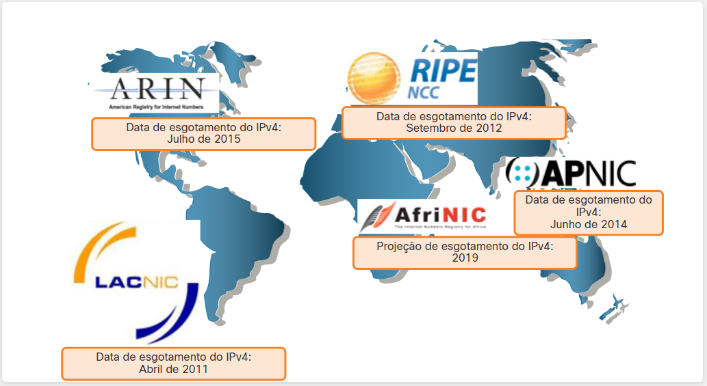

#  10.1.1 A Necessidade do IPv6

## RIR IPv4 Exhaustion Dates

Você já sabe que o IPv4 está ficando sem endereços. É por isso que você precisa aprender sobre IPv6.

Projetado para ser o sucessor do IPv4, O IPv6 tem um espaço de endereço maior, de 128 bits, fornecendo 340 undecilhão (ou seja, 340 seguidos por 36 zeros) de endereços possíveis. No entanto, o IPv6 é mais do que, apenas, endereços maiores.

Quando a IETF começou o desenvolvimento de um sucessor para o IPv4, aproveitou para corrigir as limitações do IPv4 e incluir aprimoramentos. Um exemplo é o ICMPv6 (Internet Control Message Protocol versão 6), que inclui a resolução de endereços e a configuração automática de endereços, não encontradas no ICMP para IPv4 (ICMPv4).

O esgotamento de endereços IPv4 tem sido o fator motivador para a migração para o IPv6. À medida que África, Ásia e outras áreas do mundo ficarem mais conectadas à Internet, não haverá endereços IPv4 suficientes para acomodar esse crescimento. Conforme mostra a figura, quatro dos cinco RIRs estão com endereços IPv4 esgotados.

## Datas de Esgotamento do IPv4 por RIR

O IPv4 tem um máximo teórico de 4,3 bilhões de endereços. Os endereços privados em combinação com o Network Address Translation (NAT - tradução de endereços de rede) têm sido fundamentais para retardar o esgotamento do espaço de endereços IPv4. No entanto, o NAT é problemático para muitos aplicativos, cria latência e possui limitações que impedem severamente as comunicações ponto a ponto.

Com o número cada vez maior de dispositivos móveis, os provedores móveis têm liderado o caminho para a transição para o IPv6. Os dois principais provedores de telefonia móvel nos Estados Unidos relatam que mais de 90% de seu tráfego usa IPv6.

A maioria dos principais ISPs e provedores de conteúdo, como YouTube, Facebook e NetFlix, também fizeram a transição. Muitas empresas como Microsoft, Facebook e LinkedIn estão fazendo transição para IPv6 somente internamente. Em 2018, o ISP Comcast de banda larga relatou a implantação de mais de 65% e a British Sky Broadcasting de mais de 86%.

Internet das Coisas

A internet de hoje é significativamente diferente da internet das últimas décadas. A internet de hoje é mais do que e-mail, páginas da web e transferências de arquivos entre computadores. A Internet em evolução está se tornando a Internet das Coisas (IoT - Internet of Things). Computadores, tablets e smartphones não serão mais os únicos dispositivos que acessam a internet Os dispositivos equipados com sensor e prontos para a Internet do amanhã incluirão tudo, desde automóveis e dispositivos biomédicos, até eletrodomésticos e ecossistemas naturais.

Com uma população cada vez maior na Internet, espaço de endereços IPv4 limitado, problemas com NAT e a Internet das Coisas, chegou o momento de iniciar a transição para o IPv6.

# 10.1.2 Coexistência entre IPv4 e IPv6

Não há uma data exata para migrar para o IPv6. Tanto o IPv4 como o IPv6 coexistirão no futuro próximo e a transição levará vários anos. A IETF criou vários protocolos e ferramentas para ajudar os administradores de rede a migrarem as redes para IPv6. As técnicas de migração podem ser divididas em três categorias:

- Pilha Dupla: A pilha dupla permite que IPv4 e IPv6 coexistam no mesmo segmento de rede. Os dispositivos de pilha dupla executam os protocolos IPv4 e IPv6 simultaneamente. Conhecido como IPv6 nativo, isso significa que a rede do cliente tem uma conexão IPv6 com seu ISP e é capaz de acessar o conteúdo encontrado na internet através de IPv6.
- Tunelamento: é um método de transporte de pacote IPv6 através de uma rede IPv4. O pacote IPv6 é encapsulado dentro de um pacote IPv4, de forma semelhante a outros tipos de dados.
- Conversão: O NAT64 (Network Address Translation 64) permite que os dispositivos habilitados para IPv6 se comuniquem com os dispositivos habilitados para IPv4 usando uma técnica de conversão semelhante ao NAT IPv4. Um pacote IPv6 é traduzido para um pacote IPv4 e um pacote IPv4 é traduzido para um pacote IPv6.

Observação: O tunelamento e a tradução são para transição para IPv6 nativo e só devem ser usados quando necessário. O objetivo deve ser as comunicações IPv6 nativas da origem até o destino.

