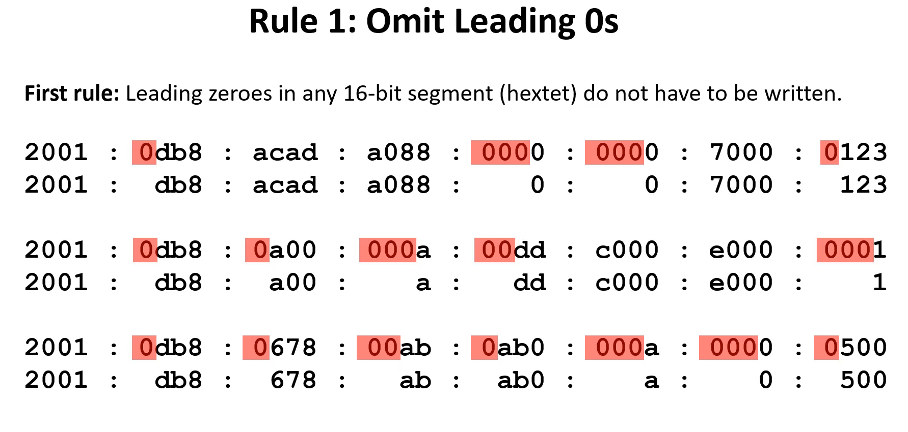
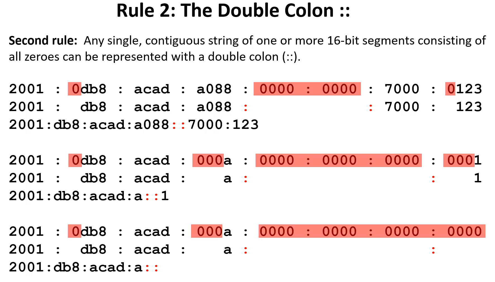
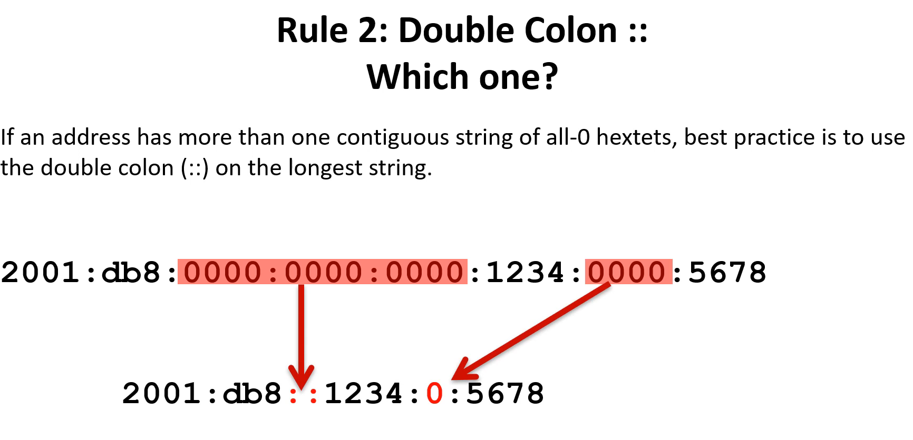

# 10.2.1 Sistema de numeração hexadecimal

Antes de abordar o endereçamento IPv6, é importante que você saiba que os endereços IPv6 são representados usando números hexadecimais. Este sistema numérico, de base dezesseis, usa os dígitos de 0 a 9 e as letras de A a F:

0 1 2 3 4 5 6 7 8 9 A B C D E F

Nos endereços IPv6, esses 16 dígitos são representados por hextetos (discutidos a seguir), permitindo representar esses endereços enormes em um formato muito mais legível.

# 10.2.2 Formatos do endereçamento IPv6

## Segmentos ou Hextets de 16 bits

O primeiro passo para aprender sobre IPv6 em redes é entender a forma como um endereço IPv6 é escrito e formatado. Os endereços IPv6 são muito maiores do que os endereços IPv4, razão pela qual é improvável que fiquemos sem eles.

Os endereços IPv6 têm 128 bits e são escritos como uma sequência de valores hexadecimais. Cada 4 bits são representados por um único dígito hexadecimal, totalizando 32 valores hexadecimais, como mostra a Figura 1. Os endereços IPv6 não diferenciam maiúsculas e minúsculas e podem ser escritos tanto em minúsculas como em maiúsculas.

No ipv4 octeto: 8 bits no endereço
No ipv6 hexteto: segmento de 16 bits ou 4 algarimos hexadecimais

Formato Preferencial

Como mostrado na Figura 1, o formato preferencial para escrever um endereço IPv6 é x: x: x: x: x: x: x: x, com cada “x” consistindo em quatro algarismos hexadecimais. O termo octeto refere-se aos oito bits em um endereço IPv4. No IPv6, um hexteto é o termo não oficial usado para se referir a um segmento de 16 bits ou quatro algarismos hexadecimais. Cada “x” é um único hexteto de 16 bits ou quatro dígitos hexadecimais.

Formato preferencial significa que o endereço IPv6 é gravado usando todos os 32 dígitos hexadecimais. Isso não significa necessariamente que é o método ideal para representar o endereço IPv6. Existem duas regras que ajudam a reduzir o número de dígitos necessários para representar um endereço IPv6.

#  10.2.4 Regra 1 - Omitir zeros à esquerda

Nesta regra, omitimos zeros a esquerda para redução do IPv6

#  10.2.5 Regra 2- Dois pontos duplos

Na segunda regra, substituímos hextetos de 0 por "::", lembrando que só pode ter um :: no IPv6.
Outro ponto importante é utilizar :: na maior string, caso tenha mais de um lugar com sequência de zeros.

