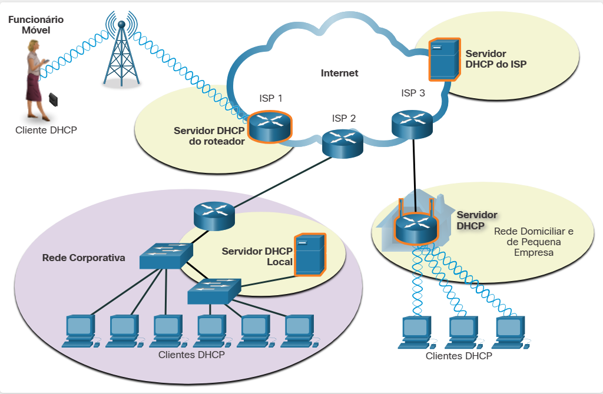

#  11.1.1 Atribuição de endereço IPv4 estático

Os endereços IPv4 podem ser atribuídos estática ou dinamicamente.

Com uma atribuição estática, o administrador de rede deve configurar manualmente as informações da rede para um host. No mínimo, isso inclui o seguinte:

Endereço IP– Identifica o computador na rede.
Máscara de Sub-rede - Identifica a rede à qual o host está conectado
Gateway padrão – Identifica o dispositivo de rede que o host usa para acessar a Internet ou outra rede remota.
Os endereços estáticos têm algumas vantagens. Por exemplo, são úteis para impressoras, servidores e outros dispositivos de rede que precisam estar acessíveis para clientes na rede. Se os hosts normalmente acessam um servidor em um determinado endereço IPv4, não seria bom que esse endereço mudasse.

Embora a atribuição estática de informações de endereçamento possa proporcionar um controle maior dos recursos de rede, a digitação de informações em cada host pode ficar demorada. Quando os endereços IPv4 são inseridos estaticamente, o host executa apenas verificações básicas de erro no endereço IPv4. Isso aumenta a probabilidade de que ocorram erros.

Ao usar endereçamento IPv4 estático, é importante manter uma lista precisa de quais endereços IPv4 estão atribuídos a quais dispositivos. Além disso, como são endereços permanentes, normalmente eles não são reutilizados.

#  11.1.2 Atribuição dinâmica de endereço IPv4

Nas redes locais, geralmente, a população de usuários muda com frequência. Novos usuários chegam com notebooks e precisam de uma conexão. Outros têm novas estações de trabalho que precisam ser conectadas. Em vez de fazer com que o administrador de rede atribua endereços IPv4 em cada estação de trabalho, é mais eficiente ter endereços IPv4 atribuídos automaticamente. Isso é feito com um protocolo conhecido como Dynamic Host Configuration Protocol (DHCP).

O DHCP fornece um mecanismo para atribuição automática de informações de endereçamento, como endereço IPv4, máscara de sub-rede, gateway padrão e outras informações de configuração, como mostrado na figura.

O DHCP em geral é o método preferido de designação de endereços IPv4 para hosts em redes grandes porque reduz a carga sobre a equipe de suporte da rede e praticamente elimina erros de entrada.

Outro benefício do DHCP é que o endereço não é permanentemente atribuído a um host, mas é só “alugado” por um período. Se o host é desligado ou retirado da rede, o endereço retorna ao pool para ser reutilizado. Isso é especialmente útil com usuários móveis que vêm e vão em uma rede.

#  11.1.3 Servidores DHCP

Se você inserir um hotspot sem fio em um aeroporto ou uma lanchonete, o DHCP possibilitará o acesso à Internet. Ao entrar na área, o cliente DHCP de seu laptop entra em contato com o servidor DHCP local via conexão sem fio. O servidor DHCP atribui um endereço IPv4 ao seu notebook.

Vários tipos de dispositivos podem ser servidores DHCP, desde que executem software de serviço DHCP. Na maioria das redes médias a grandes, o servidor DHCP normalmente é um servidor local dedicado baseado em PC.

Nas redes residenciais, é provável que o servidor DHCP esteja localizado no ISP. Um host na rede residencial recebe a configuração IPv4 diretamente do ISP, como mostrado na figura.

