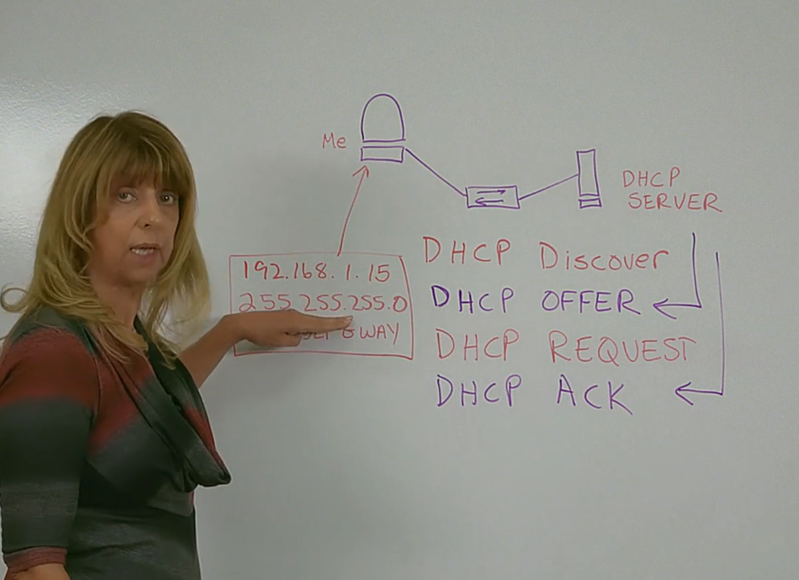
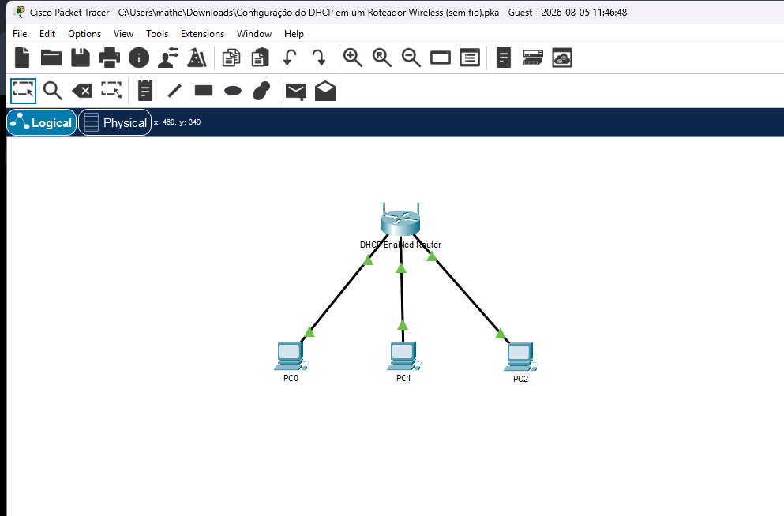

# Operação do DHCPv4

DHCP Discover (cliente requisita um ip)
DHCP OFFER (dhcp manda um ip sugerido)
DHCP REQUEST (cliente aceita e pede formalmente o ip)
DHCP ACK (servidor confirma e libera o uso)

# Resolução atividade de pings utilizando DHCP:

