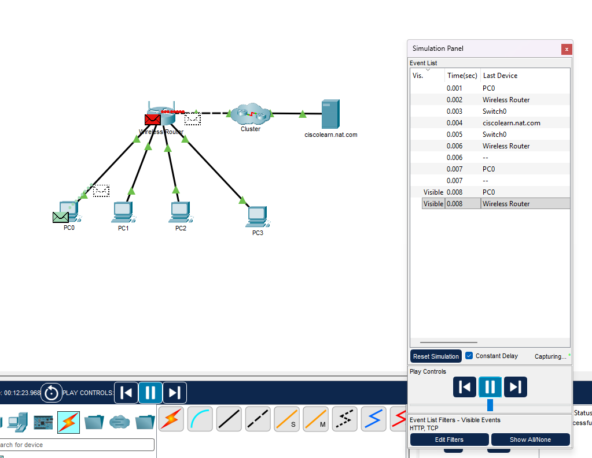

#  12.1.2 Roteadores como Gateways

O roteador fornece um gateway pelo qual os hosts de uma rede podem se comunicar com hosts de diferentes redes. Cada interface em um roteador está conectada a uma rede separada.

O endereço IPv4 atribuído à interface identifica a rede local que está diretamente conectada a ele.

Todo host de uma rede deve usar o roteador como um gateway para outras redes. Portanto, cada host deve conhecer o endereço IPv4 da interface do roteador conectada à rede na qual o host está conectado. Esse endereço é conhecido como endereço de gateway padrão. Ele pode ser configurado estaticamente no host ou recebido dinamicamente por DHCP.

Quando um roteador sem fio está configurado para ser um servidor DHCP da rede local, ele envia automaticamente o endereço IPv4 correto da interface para os hosts como o endereço de gateway padrão. Dessa forma, todos os hosts na rede podem usar o endereço IPv4 para encaminhar mensagens aos hosts localizados no ISP e obter acesso a hosts na Internet. Os roteadores sem fio geralmente são definidos para serem servidores DHCP por padrão.

O endereço IPv4 dessa interface do roteador local passa a ser o endereço de gateway padrão para a configuração do host. O gateway padrão é fornecido estaticamente ou por DHCP.

Quando um roteador sem fio está configurado como servidor DHCP, ele fornece seu próprio endereço IPv4 interno como gateway padrão aos clientes DHCP. Também fornece a eles seu endereço IPv4 e sua máscara de sub-rede.

#  12.1.3 Roteadores como limites entre redes

O roteador sem fio atua como servidor DHCP para todos os hosts locais conectados a ele, por cabo de Ethernet ou sem fio. Esses hosts locais estão localizados em uma rede interna. A maioria dos servidores DHCP são configurados para atribuir endereços privados aos hosts na rede interna, em vez de endereços públicos roteáveis da Internet. Isso garante que, por padrão, a rede interna não possa ser acessada diretamente da Internet.

O endereço IPv4 padrão configurado na interface do roteador local sem fio geralmente é o primeiro endereço de host naquela rede. Os hosts internos devem receber endereços dentro da mesma rede do roteador sem fio, sejam eles configurados estaticamente ou através do DHCP. Quando configurado como um servidor DHCP, o roteador sem fio fornece endereços nesse intervalo. Ele também fornece informações de máscara de sub-rede e seu próprio endereço IPv4 da interface como gateway padrão, como mostrado na figura.

Muitos ISPs usam o servidor DHCP para fornecer endereços IPv4 do lado de Internet do roteador sem fio localizado nas instalações de clientes. A rede atribuída ao lado de Internet do roteador sem fio é conhecida como rede externa.

Quando um roteador sem fio está conectado a um ISP, ele atua como um cliente DHCP para receber o endereço IPv4 correto de rede externa para a interface de Internet. Os ISPs normalmente fornecem um endereço roteável pela Internet, o que permite que os hosts conectados ao roteador sem fio tenham acesso à Internet.

O roteador sem fio serve como limite entre a rede interna local e a Internet externa.

#  O que é o NAT
O NAT (Network Address Translation, ou Tradução de Endereço de Rede) é uma técnica usada por roteadores para converter os endereços IP privados de uma rede interna em um único endereço IP público, permitindo que vários dispositivos acessem a internet simultaneamente.

