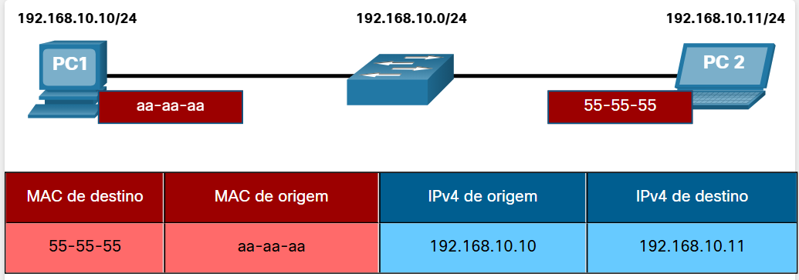
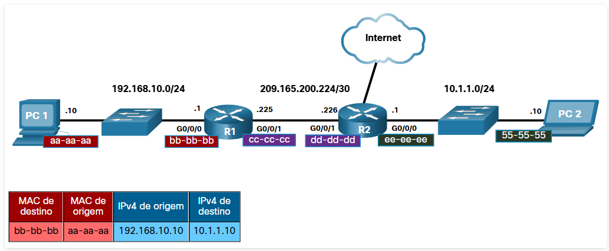
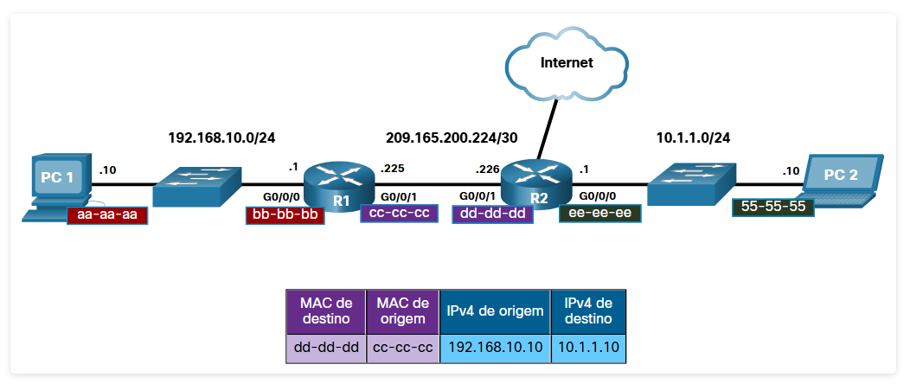
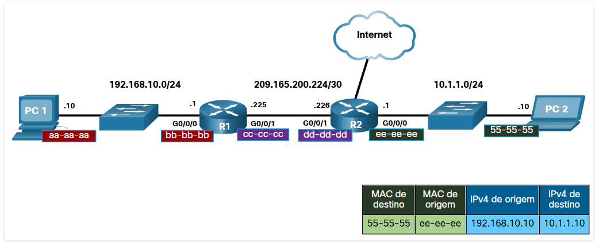

#  13.1.1 Destino na mesma rede

Às vezes, um host deve enviar uma mensagem, mas ele só sabe o endereço IP do dispositivo de destino. O host precisa saber o endereço MAC desse dispositivo, mas como ele pode ser descoberto? É aí que a resolução de endereços se torna crítica.

Dois endereços principais são atribuídos a um dispositivo em uma LAN Ethernet:

Endereço físico (o endereço MAC) - Usado para comunicações de NIC para NIC na mesma rede Ethernet.
Endereço lógico (o endereço IP) – Usado para enviar o pacote do dispositivo de origem para o dispositivo de destino. O endereço IP de destino pode estar na mesma rede IP que a origem ou pode estar em uma rede remota.
Os endereços físicos da camada 2 (ou seja, endereços MAC Ethernet) são usados para entregar o quadro de enlace de dados, contendo o pacote IP encapsulado, a partir de uma NIC para outra NIC que está na mesma rede. Se o endereço IP de destino estiver na mesma rede, o endereço MAC de destino será o do dispositivo de destino.

Considere o exemplo a seguir usando representações de endereço MAC simplificadas.

#  13.1.2 Destino em uma Rede Remota

Quando o endereço IP de destino (IPv4 ou IPv6) estiver em uma rede remota, o endereço MAC de destino será o endereço do gateway padrão do host (ou seja, a interface do roteador).

Considere o exemplo a seguir usando uma representação de endereço MAC simplificada.

Neste exemplo, PC1 deseja enviar um pacote para PC2. O PC2 está localizado na rede remota. Como o endereço IPv4 de destino não está na mesma rede local que PC1, o endereço MAC de destino é o do gateway padrão local, no roteador.

Os roteadores examinam o endereço IPv4 destino para determinar o melhor caminho para encaminhar o pacote IPv4. Quando o roteador recebe o quadro Ethernet, ele desencapsula as informações da Camada 2. Usando o endereço IPv4 de destino, ele determina o dispositivo do próximo salto e, em seguida, encapsula o pacote IPv4 em um novo quadro (da camada de enlace) para a interface de saída.

No nosso exemplo, o R1 agora encapsularia o pacote com novas informações de endereço da Camada 2, conforme mostrado na figura.

O novo endereço MAC de destino seria o da interface G0/0/1 em R2 e o novo endereço MAC de origem seria o da interface G0/0/1 em R1.

Ao longo de cada link do caminho, um pacote IP é encapsulado em um quadro. O quadro é específico para a tecnologia do enlace associado a esse link, como Ethernet. Se o dispositivo do próximo salto for o destino final, o endereço MAC de destino será o da NIC Ethernet do dispositivo, conforme mostrado na figura.

Como os endereços IP dos pacotes IP em um fluxo de dados são associados aos endereços MAC em cada link ao longo do caminho até o destino? Para pacotes IPv4, isso é feito através de um processo chamado ARP (Address Resolution Protocol). Para pacotes IPv6, o processo é ICMPv6 Neighbor Discovery (ND).

O Protocolo de Resolução de Endereços (Address Resolution Protocol - ARP) é usado para determinar o endereço MAC de um dispositivo com um endereço IPv4 de destino conhecido. Neighbor Discovery (ND) é usado para determinar o endereço MAC de um dispositivo com um endereço IPv6 de destino conhecido.

