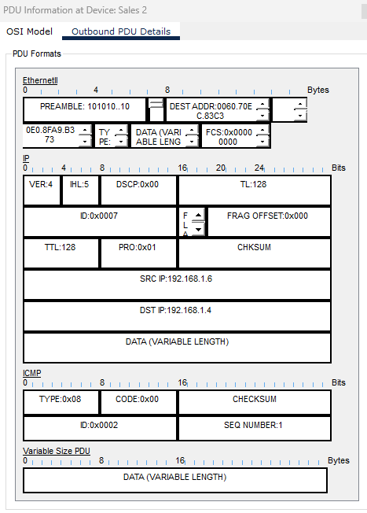

#  14.3.1 Redes de Área Local

O termo Rede de Área Local (LAN) se refere a uma rede local ou a um grupo de redes locais interconectadas que estão sob o mesmo controle administrativo. No início das redes de computadores, as LANs eram definidas como pequenas redes que existiam em uma única localização física. Embora as LANs possam ser uma única rede local instalada em uma casa ou pequeno escritório, a definição de LAN evoluiu para incluir redes locais interconectadas, consistindo em muitas centenas de hosts, instalados em vários prédios e locais.

É importante lembrar que todas as redes locais dentro de uma LAN estão sob um controle administrativo. Outras características comuns das LANs são que elas normalmente usam protocolos Ethernet ou Wireless e suportam altas taxas de transmissão de dados.

O termo Intranet geralmente é usado para se referir a uma LAN privada que pertence a uma organização e foi projetada para ser acessada somente por membros da organização, funcionários ou terceiros com autorização.

#  14.3.2 Segmentos de rede local e remota

Dentro de uma LAN, é possível colocar todos os hosts em uma única rede local ou dividi-los entre várias redes conectadas por um dispositivo na camada de distribuição. A forma como esse posicionamento é determinado depende dos resultados desejados.

## Todos os hostes em um segmento de rede local:

Colocar todos os hosts em uma única rede local permite que eles sejam vistos por todos os outros hosts. Isso ocorre porque existe um domínio da broadcast e os hosts usam o ARP para se localizarem.

Em um projeto de rede simples, pode ser vantajoso manter todos os hosts em uma única rede local. Entretanto, à medida que as redes crescem, o aumento de tráfego diminui a velocidade e o desempenho da rede. Nesse caso, pode valer a pena mover alguns hosts para uma rede remota.

Vantagens de um único segmento local:

Adequado para redes mais simples
Menos complexidade e menor custo de rede
Permite que os dispositivos sejam “vistos” por outros dispositivos
Transferência de dados mais rápida - comunicação mais direta
Facilidade de acesso ao dispositivo
Desvantagens de um único segmento local:

Todos os hosts estão em um domínio de broadcast que causa mais tráfego no segmento e pode retardar o desempenho da rede
Mais difícil de implementar QoS
Mais difícil de implementar segurança

## Hosts em um segmento remoto:

Colocando hosts adicionais em uma rede remota diminuirá o impacto em demandas de tráfego. No entanto, os hosts em uma rede não poderão se comunicar com hosts na outra rede sem o uso de roteamento. Os roteadores aumentam a complexidade da configuração de rede e podem introduzir latência (ou seja, atraso) nos pacotes enviados de uma rede local para outra.

Vantagens:

Mais adequado para redes maiores e mais complexas
Divide domínios de transmissão e reduz o tráfego
Pode melhorar o desempenho em cada segmento
Deixa as máquinas invisíveis para as pessoas em outros segmentos de rede local
Pode fornecer segurança avançada
Pode melhorar a organização de rede
Desvantagens:

Exige o uso de roteamento (camada de distribuição)
O roteador pode retardar o tráfego entre segmentos
Mais complexidade e custos (exige roteador)

#  14.3.3 Packet Tracer - Observar o fluxo de tráfego em uma rede roteada - Rascunho da atividade

Sales 1 IP: 192.168.1.4/24

No Outbound PDU Details temos IP -> ICMP e TYPE: 0X08 com CODE: 0x00, evidenciando um "Ping" ou um "Echo Request".

Sales 1 IP novo: 192.168.3.3/24

