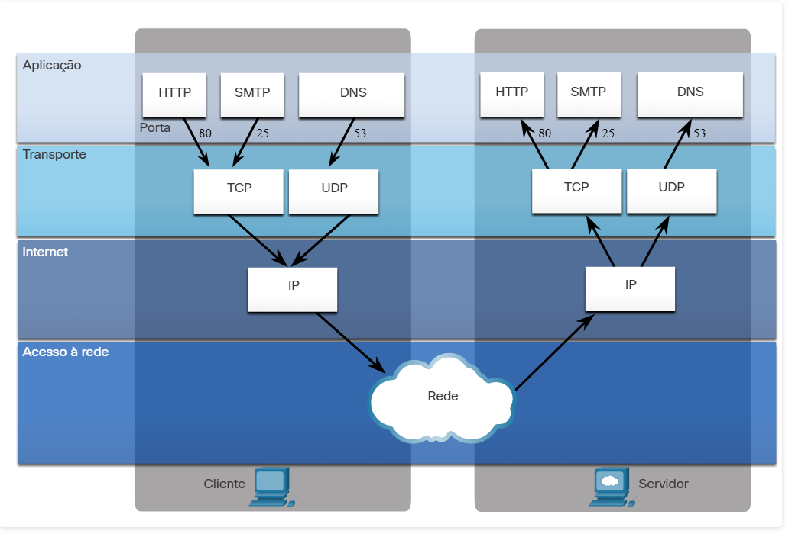
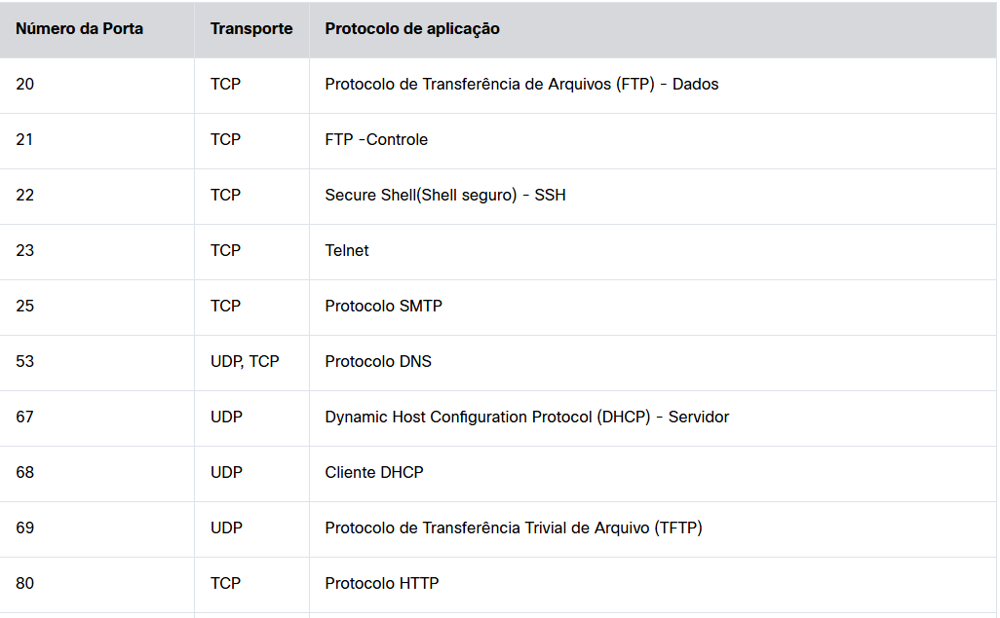
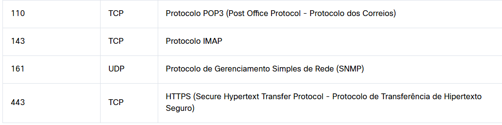
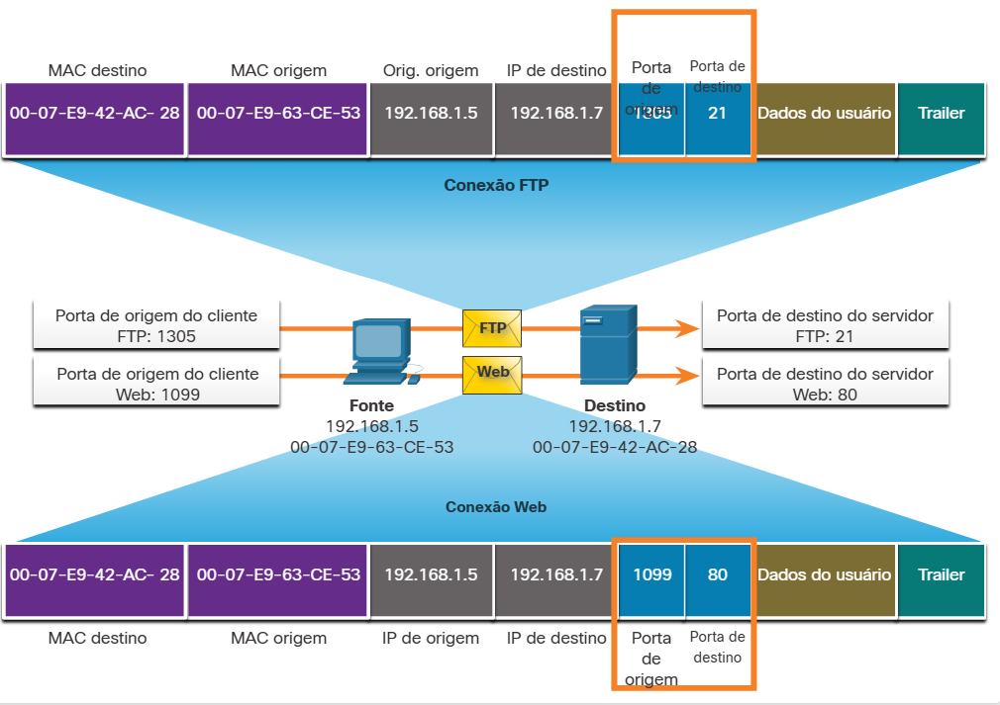

#  15.2.2 Números de porta TCP e UDP

São muitos os serviços que acessamos pela Internet ao longo do dia. DNS, Web, E-mail, FTP, Mensagem instantânea e VoIP são apenas alguns desses serviços que são disponibilizados por sistemas cliente/servidor em todo o mundo. Eles podem ser fornecidos por um único servidor ou por vários servidores em grandes datacenters.

Quando uma mensagem é entregue usando o TCP ou o UDP, os protocolos e os serviços são identificados por um número de porta. Uma porta é um identificador numérico dentro de cada segmento que é usado para rastrear conversas específicas entre um cliente e um servidor. Cada mensagem que um host envia contém uma porta origem e destino.

1 a 65.535 são dividas as portas em 3 categorias:

- Portas bem conhecidas: portas mais comuns utilizadas, que variam de 1 a 1023, associadas a aplicativos de rede.
- Portas registradas: As portas de 1024 a 49151 podem ser usadas como destino ou origem. Podem ser utilizadas por empresas para registrar aplicativos específicos, como de mensagem
- Portas Privadas: de 49152 a 65535, utilizadas por qualquer app, normalmente como porta de origem.

Algumas aplicações podem usar tanto TCP quanto UDP. Por exemplo, o DNS usa o protocolo UDP quando os clientes enviam requisições a um servidor DNS. Contudo, a comunicação entre dois servidores DNS sempre usa TCP.

Pesquise no site da IANA o registro de portas para visualizar a lista completa de números de portas e aplicativos associados.

#  15.2.3 Pares de Soquetes

As portas origem e destino são colocadas no segmento. Os segmentos são encapsulados em um pacote IP. O pacote IP contém o endereço IP de origem e destino. A combinação do endereço IP de origem e o número de porta de origem, ou do endereço IP de destino e o número de porta de destino é conhecida como um socket.

No exemplo na figura, o PC está solicitando simultaneamente serviços FTP e Web do servidor de destino.

No exemplo, a solicitação FTP gerada pelo PC inclui os endereços MAC da Camada 2 e os endereços IP da Camada 3. A solicitação também identifica o número da porta de origem 1305 (ou seja, gerado dinamicamente pelo host) e a porta de destino, identificando os serviços de FTP na porta 21. O host também solicitou uma página da Web do servidor usando os mesmos endereços de Camada 2 e Camada 3. No entanto, ele está usando o número da porta de origem 1099 (ou seja, gerado dinamicamente pelo host) e a porta de destino identificando o serviço Web na porta 80.

O socket é usado para identificar o servidor e o serviço que está sendo solicitado pelo cliente. Um socket do cliente pode ser assim, com 1099 representando o número da porta de origem: 192.168.1.5:1099

O soquete em um servidor da web pode ser 192.168.1.7:80

Juntos, esses dois sockets se combinam para formar um par de sockets: 192.168.1.5:1099, 192.168.1.7:80

Os sockets permitem que vários processos em execução em um cliente se diferenciem uns dos outros, e várias conexões com um processo no servidor sejam diferentes umas das outras.

Este número de porta age como um endereço de retorno para a aplicação que faz a solicitação. A camada de transporte rastreia essa porta e a aplicação que iniciou a solicitação, de modo que quando uma resposta é retornada, ela pode ser encaminhada para a aplicação correta.

