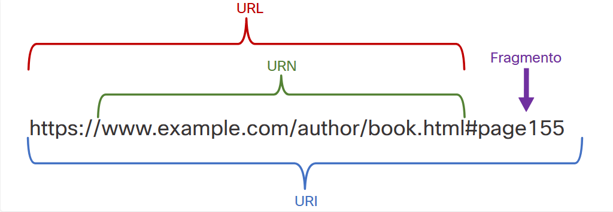

#  16.1.3 URI, URN e URL

Parts of a URI
Recursos e serviços da Web, como APIs RESTful, são identificados usando uma URI (Identificador de recurso uniforme) Um URI é uma sequência de caracteres que identifica um recurso de rede específico. Conforme mostrado na figura, uma URI tem duas especializações:

- Nome do Recurso Uniforme (URN) -identifica apenas o espaço para nome do recurso (página da web, documento, imagem etc.) sem referência ao protocolo.
- URL (Localizador de Recurso Uniforme) - define o local da rede de um recurso específico na rede. URLs de HTTP ou HTTPS são normalmente usados por navegadores web. Outros protocolos como FTP, SFTP, SSH e outros podem ser usados por meio de uma URL. Uma URL usando SFTP pode estar no formato: sftp://sftp.example.com.
Estas são as partes de uma URI, como mostrado na figura:

- Protocolo/esquema –HTTPS ou outros protocolos como FTP, SFTP, mailto e NNTP
- Nome do host - www.example.com
- Caminho e nome do arquivo - /author/book.html
- Fragmento - # page155

## Partes de uma URI

