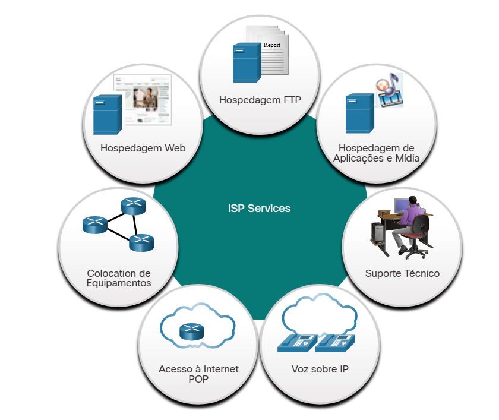

# 2.3.1 Serviços ISP

Um provedor de serviços de Internet (ISP) fornece o link entre a rede doméstica e a Internet. Um ISP pode ser o provedor de TV a cabo local, um provedor de serviços de telefonia fixa, a rede celular que fornece seu serviço de smartphone ou um provedor independente que aluga largura de banda na infraestrutura de rede física de outra empresa.

Muitos ISPs também oferecem serviços adicionais aos assinantes, como mostrado na figura. Esses serviços podem englobar contas de e-mail, armazenamento de rede, hospedagem de sites e serviços de segurança ou backup automático.

Os ISPs são essenciais para a comunicação na Internet global. Cada ISP conecta-se a outros ISPs para formar uma rede de links que interconectam usuários em todo o mundo. Os ISPs são conectados de maneira hierárquica que garante que o tráfego da Internet geralmente siga o caminho mais curto da origem ao destino.

O backbone de Internet é como uma autoestrada de informações que fornece links de dados de alta velocidade para conectar as diversas redes de provedores de serviços nas grandes áreas metropolitanas do mundo todo. O principal meio físico que conecta o backbone de Internet é o cabo de fibra óptica. Esse cabo normalmente é instalado no subterrâneo para conectar cidades dentro de continentes. Os cabos de fibra óptica também passam sob o mar para conectar continentes, países e cidades.

