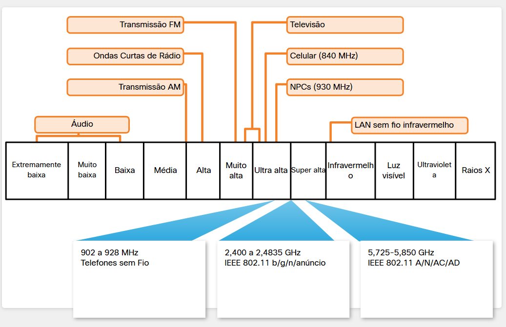
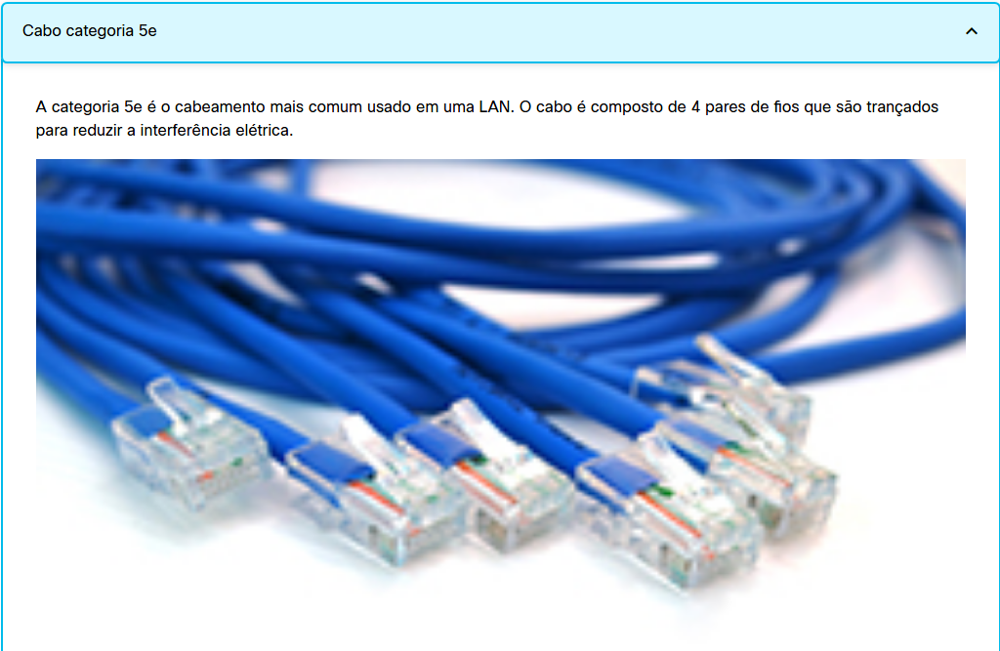
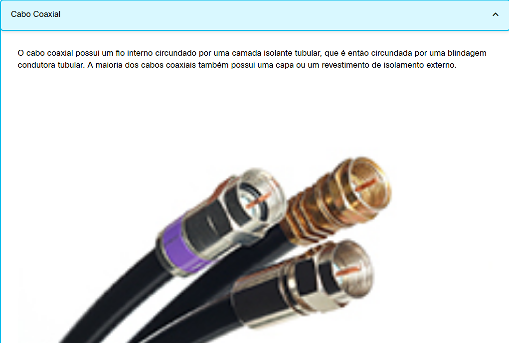
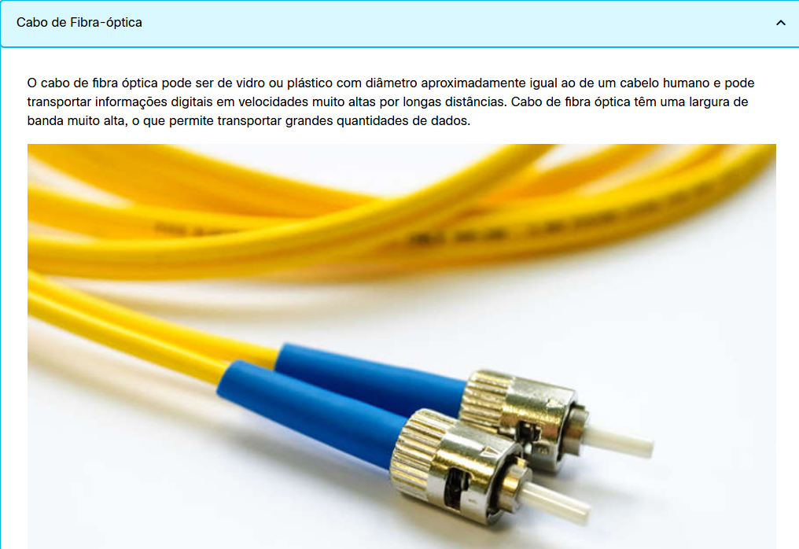

#  4.2.1 Frequências de LAN sem fio

As tecnologias sem fio mais usadas em redes residenciais estão nas faixas de frequências não licenciadas de 2,4 GHz e 5 GHz.

Bluetooth é uma tecnologia que utiliza a banda de 2,4 GHz. Embora restrita a comunicações de curto alcance e baixa velocidade, ela tem a vantagem de estabelecer comunicação com vários dispositivos ao mesmo tempo. Essa comunicação um para muitos tornou a tecnologia Bluetooth o método preferido para conectar periféricos de computador, como mouses, teclados e impressoras sem fio. O Bluetooth é útil como método de transmissão de áudio para alto-falantes ou fones de ouvido.

Outras tecnologias que usam as bandas 2,4 GHz e 5 GHz são as modernas tecnologias de LAN sem fio que estão em conformidade com vários padrões IEEE 802.11. A diferença em relação à tecnologia de Bluetooth é que elas transmitem em um nível de potência muito maior, o que lhes dá maior alcance e melhor rendimento. Determinadas áreas do espectro eletromagnético podem ser usadas sem permissão.

A figura mostra onde existem tecnologias sem fio no espectro eletromagnético.

#  4.2.2 Tecnologias de Redes com fio

Embora muitos dispositivos de rede doméstica comportem comunicações sem fio, ainda há algumas aplicações em que os dispositivos utilizam uma conexão por switch com fio que não é compartilhada com outros usuários na rede.

O protocolo com fio implementado com mais frequência é o protocolo Ethernet. A Ethernet usa um conjunto de protocolos que permite que os dispositivos de rede se comuniquem através de uma conexão LAN com fio. Uma LAN Ethernet pode conectar dispositivos usando muitos tipos diferentes de mídia de fiação.

Dispositivos conectados diretamente usam um cabo de ligação Ethernet, normalmente par trançado não blindado. Esses cabos podem ser comprados com os conectores RJ-45 já instalados e vêm em vários comprimentos. Casas construídas recentemente podem já ter tomadas Ethernet cabeadas nas paredes. Para residências que não têm cabeamento UTP, há outras tecnologias, como o uso da rede elétrica, que podem distribuir conectividade com fio nos ambientes.

