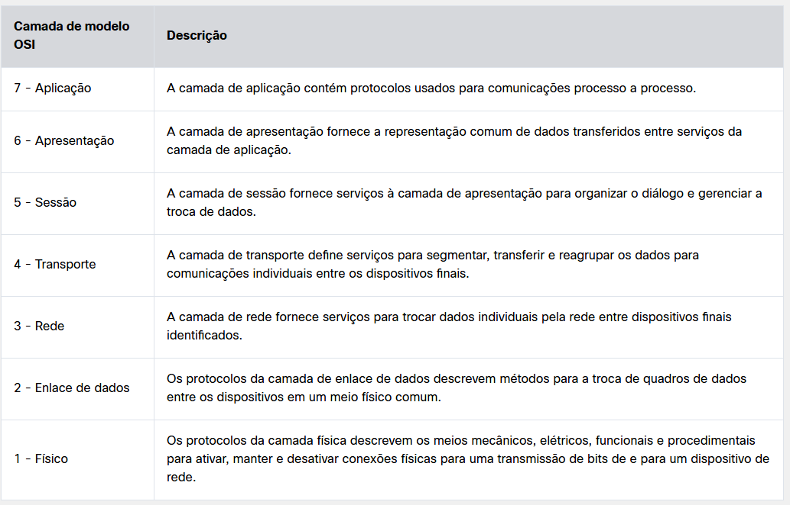
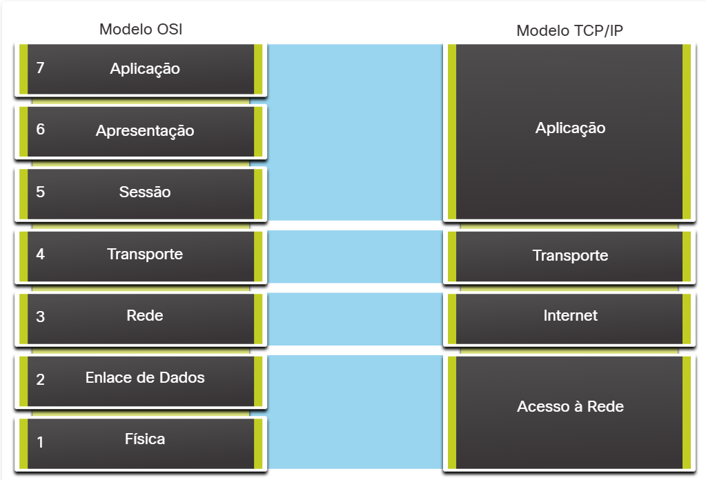

#  5.3.3 O modelo TCP/IP

#  5.3.4 O Modelo de Referência OSI

#  5.3.5 Comparação entre os Modelos OSI e TCP/IP

Já que o TCP/IP é o conjunto de protocolos usado nas comunicações de Internet, por que precisamos conhecer também o modelo OSI?

O modelo TCP/IP é um método para visualizar as interações dos diversos protocolos que compõem o conjunto de protocolos TCP/IP. Ele não descreve as funções gerais que são necessárias para todas as comunicações em rede. Ele descreve as funções de rede específicas para os protocolos em uso na pilha de protocolos TCP / IP. Por exemplo: na camada de acesso à rede, o conjunto de protocolos TCP/IP não especifica quais protocolos devem ser usados na transmissão por um meio físico, nem o método de codificar os sinais de transmissão. As Camadas 1 e 2 do modelo OSI discutem os procedimentos necessários para acessar a mídia e o meio físico para enviar dados por uma rede.

Os protocolos que compõem o conjunto de protocolo TCP/IP podem ser descritos em termos do modelo de referência OSI. As funções que ocorrem na camada de Internet do modelo TCP/IP estão incluídas na camada de rede do modelo OSI, como mostrado na figura. A funcionalidade da camada de transporte é a mesma entre os dois modelos. No entanto, a camada de acesso à rede e a camada de aplicação do modelo TCP/IP são divididas no modelo OSI para descrever funções discretas que devem ocorrer nessas camadas.

As principais semelhanças estão nas camadas de transporte e rede; no entanto, os dois modelos diferem em como eles se relacionam com as camadas acima e abaixo de cada camada:

A Camada OSI 3, a camada de rede, é mapeada diretamente para a camada de Internet TCP / IP. Essa camada é usada para descrever os protocolos que endereçam e encaminham mensagens em uma rede interconectada.
A Camada OSI 4, a camada de transporte, mapeia diretamente para a camada de transporte TCP / IP. Essa camada descreve os serviços e as funções gerais que fornecem uma entrega ordenada e confiável de dados entre os hosts origem e destino.
A camada de aplicativos TCP / IP inclui vários protocolos que fornecem funcionalidade específica para uma variedade de aplicativos do usuário final. As camadas 5, 6 e 7 do modelo OSI são usadas como referências para desenvolvedores e fornecedores de software de aplicação para produzir aplicaçõesque operam em redes.
Ambos os modelos TCP/IP e OSI são usados geralmente para referenciar protocolos em várias camadas. Como o modelo OSI separa a camada de enlace de dados da camada física, geralmente é usado para referenciar as camadas inferiores.