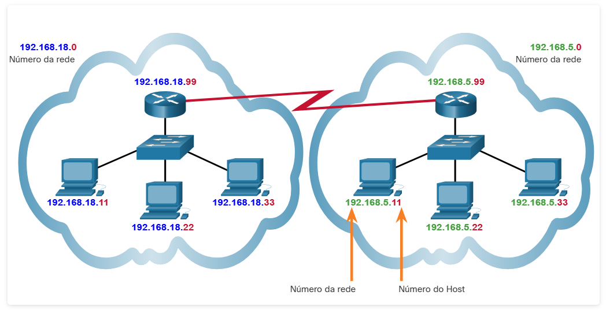

#  8.2.2 Redes e hosts

O endereço lógico IPv4 de 32 bits é hierárquico e contém duas partes, a rede e o host Na figura, a porção de rede é azul e a porção de host é vermelha. As duas partes são necessárias em um endereço IPv4. Ambas as redes têm a máscara de sub-rede 255.255.255.0. Máscara de sub-rede é usada para identificar a rede à qual o host está conectado.

Como exemplo, um host com o endereço IPv4 192.168.5.11 e a máscara de sub-rede 255.255.255.0. Os três primeiros octetos (192.168.5) identificam a porção de rede do endereço e o último octeto (11) identifica o host. Isso é conhecido como endereçamento hierárquico porque a porção de rede indica a rede na qual está localizado cada endereço exclusivo de host. Os roteadores precisam saber apenas como alcançar cada rede, em vez de precisar saber a localização de cada host individual.

Com o endereçamento IPv4, poderão existir diversas redes lógicas em uma rede física se a porção de rede dos endereços de hosts de rede lógica for diferente. Por exemplo: três hosts em uma única rede local física têm a mesma porção de rede do endereço IPv4 (192.168.18) e outros três hosts têm porções de rede diferentes de seus endereços IPv4 (192.168.5). Os hosts com o mesmo número de rede em seus endereços IPv4 poderão se comunicar entre si, mas não com os outros hosts sem o uso de roteamento. Neste exemplo, há uma rede física e duas redes IPv4 lógicas.

Outro exemplo de rede hierárquica é o sistema telefônico. Em um número de telefone, o código de país, o código de área e a central telefônica representam o endereço de rede e os dígitos restantes representam um número de telefone local.

