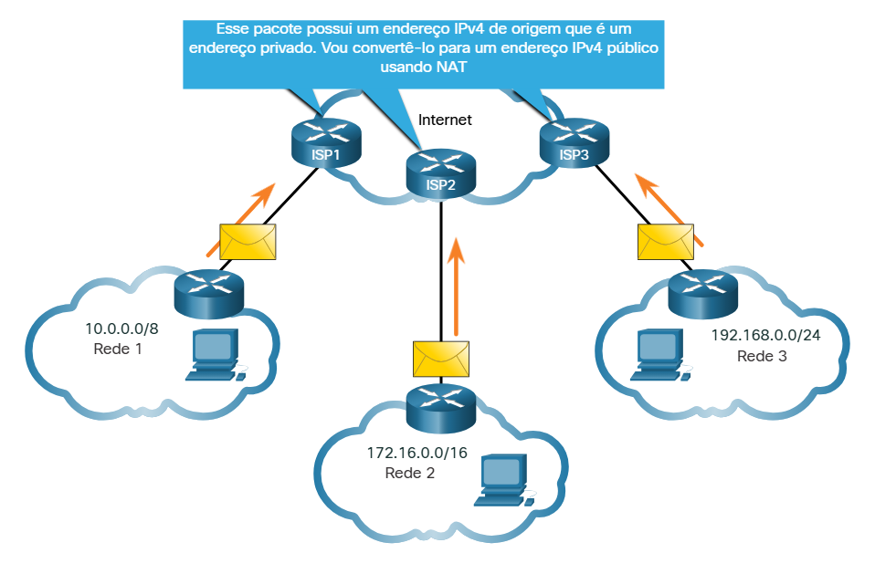

#  9.2.2 Roteamento para a Internet

Private IPv4 Addresses and Network Address Translation (NAT)
A maioria das redes internas, de grandes empresas a redes domésticas, usa endereços IPv4 privados para endereçar todos os dispositivos internos (intranet), incluindo hosts e roteadores. No entanto, os endereços privados não são globalmente roteáveis.

Na figura, as redes de clientes 1, 2 e 3 estão enviando pacotes fora de suas redes internas. Esses pacotes têm um endereço IPv4 de origem que é um endereço privado e um endereço IPv4 de destino público (globalmente roteável). Os pacotes com um endereço privado devem ser filtrados (descartados) ou traduzidos para um endereço público antes de encaminhar o pacote para um ISP.

## Endereços IPv4 privados e Tradução de Endereços de Rede (NAT)

Antes que o ISP possa encaminhar esse pacote, ele deve traduzir o endereço IPv4 de origem, que é um endereço privado, para um endereço IPv4 público usando a Conversão de Endereços de Rede (NAT). O NAT é usado para converter entre endereços IPv4 privados e IPv4 públicos. Isso geralmente é feito no roteador que conecta a rede interna à rede ISP. Os endereços IPv4 privados na intranet da organização serão traduzidos para endereços IPv4 públicos antes do encaminhamento para a Internet.

Começou com 10. → IP Privado
Começou com 192.168. → IP Privado
Começou com 172. → veja o segundo número:
- 16 a 31 → IP Privado
- qualquer outro → Público

#  9.2.4 Endereços IPv4 de Uso Especial

Existem determinados endereços, como o endereço de rede e o endereço de broadcast, que não podem ser atribuídos aos hosts. Há também endereços especiais que podem ser atribuídos a hosts, mas com restrições quanto ao modo como interagem na rede.

Endereços de loopback

Os endereços de loopback (127.0.0.0 / 8 ou 127.0.0.1 a 127.255.255.254) são comumente identificados apenas como 127.0.0.1. Eles são endereços especiais usados por um host para direcionar tráfego para ele mesmo Por exemplo, o comando ping é comumente usado para testar conexões com outros hosts. Mas você também pode usar o comando ping para testar a configuração de IP do seu próprio dispositivo, como mostrado na figura.

### Endereços locais de link

Os endereços locais de link (169.254.0.0 / 16 ou 169.254.0.1 a 169.254.255.254) são mais conhecidos como endereços APIPA ( endereçamento IP privado automático ) ou endereços auto-atribuídos. Eles são usados por um cliente Windows para se autoconfigurar caso o cliente não consiga obter um endereçamento IP por outros métodos. Endereços de link local podem ser usados em uma conexão ponto a ponto, mas não são comumente usados para esse fim.

#  9.2.5 Endereçamento Classful Legado

Em 1981, os endereços IPv4 foram atribuídos usando o endereço classful, conforme definido na RFC 790 (https://tools.ietf.org/html/rfc790), Números Atribuídos Os clientes receberam um endereço de rede com base em uma das três classes, A, B ou C. A RFC dividiu os intervalos de unicast em classes específicas da seguinte maneira:

Classe A (0.0.0.0/8 to 127.0.0.0/8) – Projetado para suportar redes extremamente grandes com mais de 16 milhões de endereços de host. A Classe A usou um prefixo fixo /8 com o primeiro octeto para indicar o endereço de rede e os três octetos restantes para endereços de host (mais de 16 milhões de endereços de host por rede).
Classe B (128.0.0.0 / 16 - 191.255.0.0 / 16) - Projetada para oferecer suporte às necessidades de redes de tamanho moderado a grande com até aproximadamente 65.000 endereços de host. A Classe B usou um prefixo fixo /16 com os dois octetos de alta ordem para indicar o endereço de rede e os dois octetos restantes para endereços de host (mais de 65.000 endereços de host por rede).
Classe C (192.0.0.0 / 24 - 223.255.255.0 / 24) - Projetado para oferecer suporte a pequenas redes com no máximo 254 hosts. A Classe C usou um prefixo fixo / 24 com os três primeiros octetos para indicar a rede e o octeto restante para os endereços de host (apenas 254 endereços de host por rede).
Observação: Há também um bloco multicast Classe D consistindo de 224.0.0.0 a 239.0.0.0 e um bloco de endereço experimental Classe E consistindo de 240.0.0.0 - 255.0.0.0.

Na época, com um número limitado de computadores usando a internet, o endereçamento clássico era um meio eficaz para alocar endereços. Como mostrado na figura, as redes de classe A e B têm um número muito grande de endereços de host e Classe C tem muito poucos. As redes de classe A representaram 50% das redes IPv4. Isso fez com que a maioria dos endereços IPv4 disponíveis não fossem utilizados.

Em meados da década de 1990, com a introdução da World Wide Web (WWW), o endereçamento clássico foi obsoleto para alocar de forma mais eficiente o espaço de endereços IPv4 limitado. A alocação de endereço de classe foi substituída por endereçamento sem classe, que é usado hoje. O endereçamento sem classe ignora as regras das classes (A, B, C). Endereços de rede IPv4 públicos (endereços de rede e máscaras de sub-rede) são alocados com base no número de endereços que podem ser justificados.

#  9.2.6 Atribuição de Endereços IP

## Regional Internet Registries

Endereços IPv4 públicos são endereços roteados globalmente pela Internet. Endereços IPv4 públicos devem ser exclusivos.

Os endereços IPv4 e IPv6 são gerenciados pela IANA (Internet Assigned Numbers Authority). A IANA gerencia e aloca blocos de endereços IP aos registros regionais de Internet (RIRs). Os cinco RIRs são mostrados na figura.

Os RIRs são responsáveis por alocar endereços IP aos ISPs que fornecem blocos de endereços IPv4 para organizações e ISPs menores. As organizações também podem obter seus endereços diretamente de um RIR (sujeito às políticas desse RIR).

<strong>AfriNIC</strong> (Centro de Informação de Redes Africanas) - Região da África
<strong>APNIC</strong> (Centro de informações de redes da Ásia-Pacífico) - Região Ásia/Pacífico
<strong>ARIN</strong> (Registro Americano de Números da Internet) - Região da América do Norte
<strong>LACNIC</strong> (Registro regional de endereços IP da América Latina e do Caribe) - América Latina e algumas ilhas do Caribe
<strong>RIPE NCC</strong> (Centro de coordenação da rede Réseaux IP Européens) - Europa, Oriente Médio e Ásia Central

