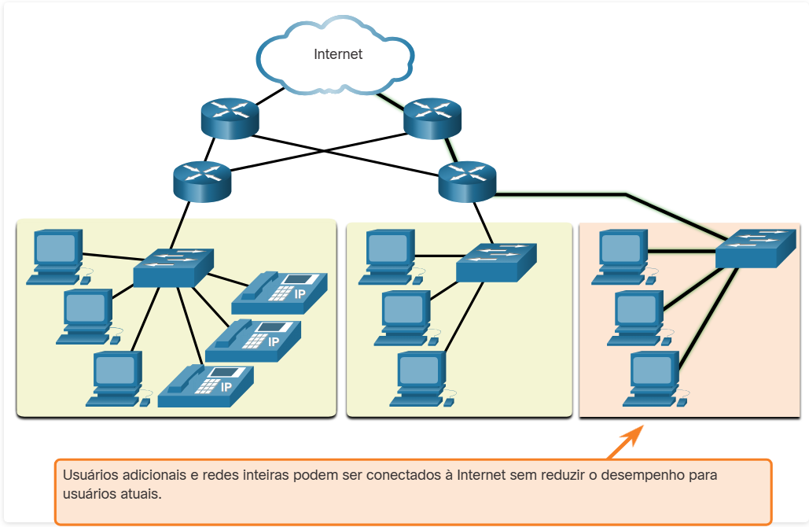
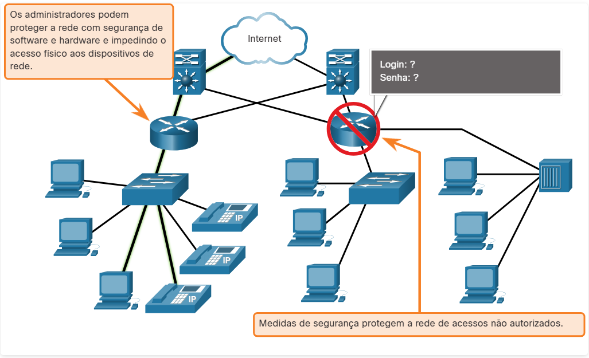

#  1.1.1 Arquitetura de Rede

Você já esteve ocupado trabalhando on-line, e achou que "a internet caiu" ? Como você sabe até agora, a internet não caiu, você acabou de perder sua conexão com ela. Isso é muito frustrante. Com tantas pessoas no mundo confiando no acesso à rede para trabalhar e aprender, é imperativo que as redes sejam confiáveis. Nesse contexto, confiabilidade significa mais do que sua conexão à Internet. Este tópico se concentra nos quatro aspectos da confiabilidade da rede.

O papel da rede mudou de uma rede somente de dados para um sistema que permite a conexão de pessoas, dispositivos e informações em um ambiente de rede convergente rico em mídia. Para que as redes funcionem com eficiência e cresçam nesse tipo de ambiente, a rede deve ser construída sobre uma arquitetura de rede padrão.

As redes também suportam uma ampla gama de aplicativos e serviços. Elas devem operar sobre muitos tipos diferentes de cabos e dispositivos, que compõem a infraestrutura física. O termo arquitetura de redes, neste contexto, refere-se às tecnologias que apoiam a infraestrutura e os serviços programados e as regras, ou protocolos, que movimentam os dados na rede.

À medida que as redes evoluem, aprendemos que há quatro características básicas que os arquitetos de rede devem atender para atender às expectativas do usuário:

Tolerância a falhas
Escalabilidade
Qualidade de serviço (QoS)
Segurança

#  1.1.3 Tolerância a Falhas

Uma rede tolerante a falhas é aquela que limita o número de dispositivos afetados durante uma falha. Ela foi desenvolvida para permitir uma recuperação rápida quando ocorre uma falha. Essas redes dependem de vários caminhos entre a origem e o destino de uma mensagem. Se um caminho falhar, as mensagens serão instantaneamente enviadas por um link diferente. Ter vários caminhos para um destino é conhecido como redundância.

A implementação de uma rede comutada por pacotes é uma das maneiras pelas quais redes confiáveis fornecem redundância. A comutação de pacotes divide os dados do tráfego em pacotes que são roteados por uma rede compartilhada. Uma única mensagem, como um e-mail ou stream de vídeo, é dividido em vários blocos, chamados pacotes. Cada pacote tem as informações de endereço necessárias da origem e do destino da mensagem. Os roteadores na rede alternam os pacotes com base na condição da rede no momento. Isso significa que todos os pacotes em uma única mensagem podem seguir caminhos muito diferentes para o mesmo destino. Na figura, o usuário desconhece e não é afetado pelo roteador que está alterando dinamicamente a rota quando um link falha.

#  1.1.4 Escalabilidade

Uma rede escalável se expande rapidamente para oferecer suporte a novos usuários e aplicativos. Ela faz isso sem degradar o desempenho dos serviços que estão sendo acessados por usuários existentes. A figura mostra como uma nova rede é facilmente adicionada a uma rede existente. Essas redes são escaláveis porque os projetistas seguem padrões e protocolos aceitos. Isso permite que os fornecedores de software e hardware se concentrem em melhorar produtos e serviços sem precisar criar um novo conjunto de regras para operar na rede.

#  1.1.5 Qualidade de Serviço

A qualidade do serviço (QoS) é um requisito crescente das redes atualmente. Novos aplicativos disponíveis para usuários em redes, como transmissões de voz e vídeo ao vivo, criam expectativas mais altas em relação à qualidade dos serviços entregues. Você já tentou assistir a um vídeo com intervalos e pausas constantes? Conforme o conteúdo de vídeo, voz e dados convergem na mesma rede, o QoS se torna um mecanismo essencial para gerenciar os congestionamentos e garantir a entrega confiável do conteúdo para todos os usuários.

O congestionamento acontece quando a demanda por largura de banda excede a quantidade disponível. A largura de banda é medida pelo número de bits que podem ser transmitidos em um único segundo, ou bits por segundo (bps). Ao tentar uma comunicação simultânea pela rede, a demanda pela largura de banda pode exceder sua disponibilidade, criando um congestionamento na rede.

Quando o volume de tráfego é maior do que o que pode ser transportado pela rede, os dispositivos retêm os pacotes na memória até que os recursos estejam disponíveis para transmiti-los. Na figura, um usuário está solicitando uma página da Web e outro está em uma ligação. Com uma política de QoS configurada, o roteador é capaz de gerenciar o fluxo do tráfego de voz e de dados, priorizando as comunicações por voz se a rede ficar congestionada. O foco do QoS é priorizar o tráfego sensível ao tempo. O tipo de tráfego, e não o conteúdo, é o que é importante.

#  1.1.6 Segurança de rede

A infraestrutura da rede, os serviços e os dados contidos nos dispositivos conectados à rede são recursos pessoais e comerciais críticos. Os administradores de rede devem abordar dois tipos de preocupações de segurança de rede: segurança da infraestrutura de rede e segurança da informação.

Proteger a infraestrutura de rede inclui proteger fisicamente os dispositivos que fornecem conectividade de rede e impedir o acesso não autorizado ao software de gerenciamento que reside neles, conforme mostrado na figura.

Os administradores de rede também devem proteger as informações contidas nos pacotes transmitidos pela rede e as informações armazenadas nos dispositivos conectados à rede. Para atingir os objetivos de segurança de rede, existem três requisitos principais.

Confidencialidade - A confidencialidade dos dados significa que apenas os destinatários pretendidos e autorizados podem acessar e ler os dados.
Integridade - A integridade dos dados garante aos usuários que as informações não foram alteradas na transmissão, da origem ao destino.
Disponibilidade - A disponibilidade de dados garante aos usuários acesso oportuno e confiável aos serviços de dados para usuários autorizados.

