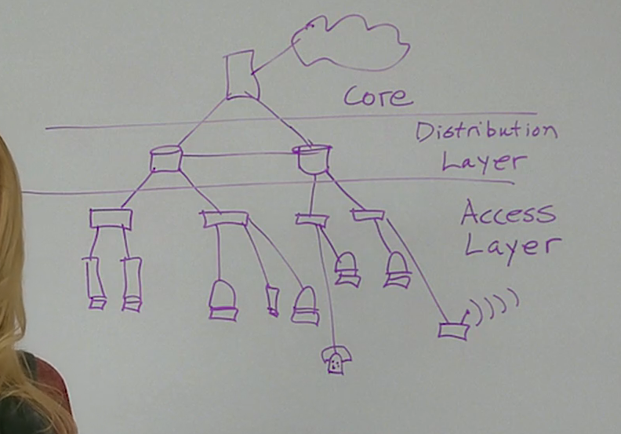

#  1.2.5 Vantagens de um Design Hierárquico

#  1.2.6 Acesso, Distribuição e Núcleo

O tráfego IP é gerenciado de acordo com as características e os dispositivos associados a cada uma das três camadas do modelo de design hierárquico na rede: acesso, distribuição e núcleo.

### Camada de Acesso

A camada de acesso fornece um ponto de conexão à rede para dispositivos de usuário final e permite que vários hosts se conectem a outros hosts por um dispositivo de rede, geralmente um switch ou um access point. Normalmente, todos os dispositivos dentro de uma única camada de acesso terão a mesma porção de rede do endereço IP.

Se uma mensagem é destinada a um host local, com base na porção de rede do endereço IP, a mensagem permanece local. Caso ela seja destinada a uma rede diferente, será passada para a camada de distribuição. Os switches fornecem a conexão para os dispositivos da camada de distribuição, geralmente um dispositivo layer 3 tal como um roteador ou um switch layer 3.

### Camada de distribuição

A camada de distribuição fornece um ponto de conexão para redes separadas e controla o fluxo de informações entre as redes. Normalmente, ela contém switches mais eficientes do que a camada de acesso, além de roteadores para fazer o roteamento entre redes. Os dispositivos da camada de distribuição controlam o tipo e a quantidade de tráfego que flui da camada de acesso para a camada do núcleo.

### Camada de Núcleo

A camada do núcleo é uma camada de backbone de alta velocidade com conexões (de backup) redundantes. Ela é responsável por transmitir grandes quantidades de dados entre várias redes finais. Os dispositivos da camada de núcleo normalmente incluem roteadores e switches de alta velocidade e muito eficientes. O objetivo principal da camada do núcleo é transportar dados rapidamente.