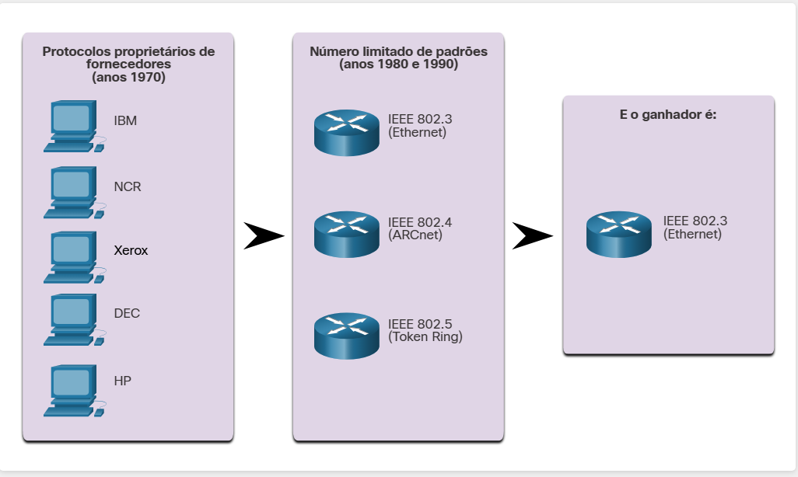

#  4.1 Ethernet

#  4.1.1 A ascensão da Ethernet

Nos primórdios das redes, cada fornecedor utilizava seus próprios métodos de interconexão de dispositivos de rede e protocolos de rede. Se você adquirisse equipamentos de fornecedores diferentes, não havia garantias de que eles funcionariam em conjunto. O equipamento de um fornecedor podia não se comunicar com o equipamento de outro.

Com a expansão das redes, foram desenvolvidos padrões que definiram regras para a operação de equipamentos de rede de diferentes fornecedores. Os padrões são vantajosos para as redes porque:

Facilitam o design
Simplificam o desenvolvimento de produtos
Promovem a concorrência
Fornecem interconexões consistentes
Facilitam o treinamento
Oferecem mais opções de fornecedor aos clientes
Não há um protocolo oficial de padrão de rede local, mas, com o tempo, uma tecnologia se tornou mais comum do que as outras: a Ethernet. Os protocolos Ethernet definem como os dados são formatados e transmitidos pela rede com fio. Os padrões Ethernet especificam protocolos que operam nas Camadas 1 e 2 do modelo OSI. Ela passou a ser um padrão de fato, o que significa que a Ethernet é a tecnologia usada por quase todas as redes locais com fio, como mostrado na figura.

#  4.1.2 Evolução da Ethernet

"O Instituto de Engenheiros Elétricos e Eletrônicos, ou IEEE", mantém os padrões de rede, incluindo Ethernet e padrões sem fio. Os comitês do IEEE são responsáveis por aprovar e manter os padrões para conexões, requisitos de mídia e protocolos de comunicação. Cada padrão de tecnologia recebe um número referente ao comitê responsável por aprovar e manter o padrão. O comitê responsável pelos padrões de Ethernet é o 802.3.

Desde a criação da Ethernet em 1973, os padrões evoluíram para especificar versões mais rápidas e flexíveis da tecnologia. Essa capacidade da Ethernet de melhorar ao longo do tempo é um dos principais motivos de ela ter se tornado tão popular. Cada versão da Ethernet tem um padrão associado. Por exemplo, o 802.3 100BASE-T representa o 100 Megabits Ethernet com padrões de cabo de par trançado. A notação padrão significa que:

100 é a velocidade em Mbps
BASE significa transmissão de banda base
T significa o tipo de cabo, neste caso, par trançado.
As primeiras versões da Ethernet eram relativamente lentas, a 10 Mbps. As versões mais recentes da Ethernet operam a 10 Gbps ou mais. Imagine o quanto mais rápidas são essas novas versões em relação às redes Ethernet originais.