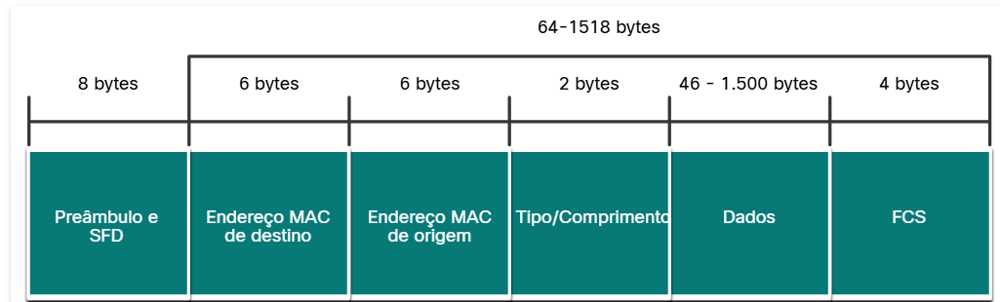
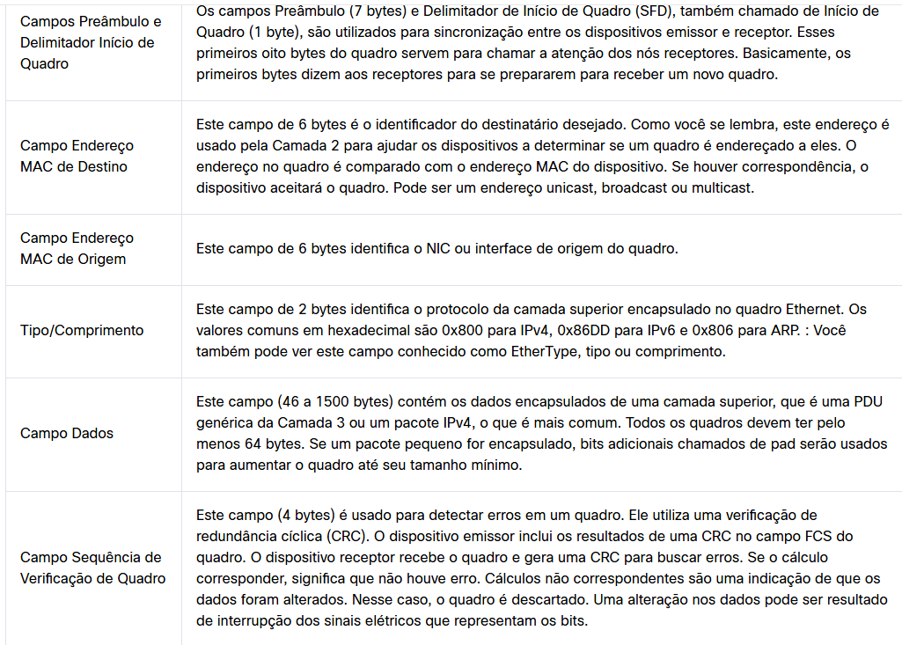

#  4.2.2 Subcamadas de Enlace de Dados

Protocolos IEEE 802 LAN/MAN, incluindo Ethernet, usam as seguintes duas subcamadas separadas da camada de link de dados para operar. Eles são o controle de link lógico (LLC) e o controle de acesso de mídia (MAC), como mostrado na figura.

Lembre-se de que LLC e MAC têm as seguintes funções na camada de enlace:

Subcamada LLC - Esta subcamada IEEE 802.2 se comunica entre o software de rede nas camadas superiores e o hardware do dispositivo nas camadas inferiores. Ela coloca a informação no quadro que identifica qual protocolo de camada de rede está sendo usado para o quadro. Essas informações permitem que vários protocolos da camada 3, como IPv4 e IPv6, usem a mesma interface de rede e mídia.
Subcamada MAC - Esta subcamada (IEEE 802.3, 802.11 ou 802.15 por exemplo) é implementada em hardware e é responsável pelo encapsulamento de dados e controle de acesso ao meio. Ele fornece endereçamento de camada de link de dados e é integrado com várias tecnologias de camada física.

#  4.2.3 Subcamada MAC

## Padrões Ethernet na subcamada MAC

A subcamada MAC é responsável pelo encapsulamento de dados e acesso à mídia.

Encapsulamento de dados

O encapsulamento de dados IEEE 802.3 inclui o seguinte:

Quadro Ethernet - Esta é a estrutura interna do quadro Ethernet.
Endereçamento Ethernet - O quadro Ethernet inclui um endereço MAC de origem e de destino para entregar o quadro Ethernet de NIC Ethernet para NIC Ethernet na mesma LAN.
Detecção de erro Ethernet - O quadro Ethernet inclui um trailer de seqüência de verificação de quadro (FCS) usado para detecção de erro.
Acessando a mídia

Como mostrado na figura, a subcamada MAC IEEE 802.3 inclui as especificações para diferentes padrões de comunicações Ethernet em vários tipos de mídia, incluindo cobre e fibra.

Lembre-se que a Ethernet legada que usa uma topologia de barramento ou hubs, é um meio compartilhado e half-duplex. Ethernet em um meio half-duplex usa um método de acesso baseado em contenção, detecção de múltiplos acessos/detecção de colisão (CSMA/CD). Isso garante que apenas um dispositivo esteja transmitindo por vez. O CSMA/CD permite que vários dispositivos compartilhem o mesmo meio half-duplex, detectando uma colisão quando mais de um dispositivo tenta transmitir simultaneamente. Ele também fornece um algoritmo de back-off para retransmissão.

As LANs Ethernet de hoje usam switches que operam em full-duplex. As comunicações full-duplex com switches Ethernet não exigem controle de acesso através do CSMA/CD.

#  4.2.4 Campos do Quadro Ethernet

## Campos do quadro Ethernet

O tamanho mínimo do quadro Ethernet é de 64 bytes e o máximo esperado é de 1518 bytes. Isso inclui todos os bytes do campo de endereço MAC de destino até o campo FCS (Frame Check Sequence). O campo de preâmbulo não é incluído ao descrever o tamanho do quadro.

Observação: o tamanho do quadro pode ser maior se requisitos adicionais forem incluídos, como a marcação de VLAN. A marcação de VLAN está além do escopo deste curso.

Qualquer quadro com comprimento menor que 64 bytes é considerado um"fragmento de colisão" ou um "quadro desprezível" e é automaticamente descartado pelas estações receptoras. Quadros com mais de 1.500 bytes de dados são considerados “jumbo” ou “baby giant”.

Se o tamanho de um quadro transmitido for menor que o mínimo ou maior que o máximo, o dispositivo receptor descarta o quadro. É provável que quadros perdidos sejam resultado de colisões ou outros sinais indesejados. Eles são considerados inválidos. Os quadros jumbo geralmente são suportados pela maioria dos switches e NICs Fast Ethernet e Gigabit Ethernet.

