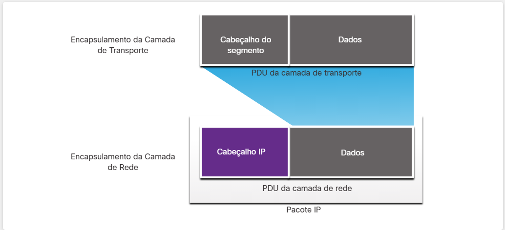

#  5.1.2 A Camada de Rede

##  Protocolos da Camada de Rede

A camada de rede, ou Camada OSI 3, fornece serviços para permitir que dispositivos finais troquem dados entre redes. Como mostrado na figura, IP versão 4 (IPv4) e IP versão 6 (IPv6) são os principais protocolos de comunicação de camada de rede. Outros protocolos de camada de rede incluem protocolos de roteamento, como OSPF (Open Shortest Path First) e protocolos de mensagens, como ICMP (Internet Control Message Protocol).

Para realizar comunicações de ponta a ponta através dos limites da rede, os protocolos de camada de rede executam quatro operações básicas:

Endereçamento de dispositivos finais – Os dispositivos finais devem ser configurados com um endereço IP exclusivo para identificação na rede.
Encapsulamento – A camada de rede encapsula a unidade de dados de protocolo (PDU) da camada de transporte em um pacote. O processo de encapsulamento adiciona informações de cabeçalho IP, como os endereços IP dos hosts origem (emissor) e destino (receptor). O processo de encapsulamento é executado pela origem do pacote IP.

Roteamento – A camada de rede fornece serviços para direcionar os pacotes para um host de destino em outra rede. Para trafegar para outras redes, o pacote deve ser processado por um roteador. A função do roteador é escolher o melhor caminho e direcionar os pacotes para o host de destino em um processo conhecido como roteamento. Um pacote pode atravessar muitos roteadores antes de chegar ao host de destino. Cada roteador que um pacote atravessa para chegar ao host de destino é chamado de salto.

Desencapsulamento - Quando o pacote chega à camada de rede do host de destino, o host verifica o cabeçalho IP do pacote. Se o endereço IP de destino no cabeçalho corresponder ao seu próprio endereço IP, o cabeçalho IP será removido do pacote. Depois que o pacote é desencapsulado pela camada de rede, a PDU resultante da Camada 4 é transferida para o serviço apropriado na camada de transporte. O processo de desencapsulamento é executado pelo host de destino do pacote IP.

Diferentemente da camada de transporte (OSI Layer 4), que gerencia o transporte de dados entre os processos em execução em cada host, os protocolos de comunicação da camada de rede (ou seja, IPv4 e IPv6) especificam a estrutura de pacotes e o processamento usado para transportar os dados de um host para outro hospedeiro. A operação sem levar em consideração os dados contidos em cada pacote permite que a camada de rede transporte pacotes para diversos tipos de comunicações entre vários hosts.

Encapsulamentos:
Dados (até a camada 4) -> Segmento -> Pacote (Camada 3) -> Quadro (Camada 2) -> bits (Camada 1)

Desencapsulamentos é o processo contrário acima.

#  5.1.3 Encapsulamento IP

O IP encapsula o segmento da camada de transporte (a camada logo acima da camada de rede) ou outros dados adicionando um cabeçalho IP. O cabeçalho IP é usado para entregar o pacote ao host de destino.

A figura ilustra como a PDU da camada de transporte é encapsulada pela PDU da camada de rede para criar um pacote IP.

O processo de encapsulamento camada por camada possibilita o desenvolvimento e a expansão dos serviços nas diferentes camadas sem afetar outras camadas. Isso significa que os segmentos da camada de transporte podem ser imediatamente empacotados por IPv4 , IPv6 ou qualquer protocolo que venha a ser desenvolvido no futuro.

O cabeçalho IP é examinado por dispositivos de Camada 3 (ou seja, roteadores e switches de Camada 3) à medida que viaja através de uma rede até seu destino. É importante notar que as informações de endereçamento IP permanecem as mesmas desde o momento em que o pacote sai do host de origem até chegar ao host de destino, exceto quando traduzidas pelo dispositivo que executa a Tradução de Endereços de Rede (NAT) para IPv4.

Observação: O NAT é discutido em módulos posteriores.

Os roteadores implementam protocolos de roteamento para rotear pacotes entre redes. O roteamento realizado por esses dispositivos intermediários examina o endereçamento da camada de rede no cabeçalho do pacote. Em todos os casos, a parte de dados do pacote, ou seja, a PDU da camada de transporte encapsulada ou outros dados, permanece inalterada durante os processos da camada de rede.

#  5.1.4 Características do IP

O IP foi desenvolvido como um protocolo com baixa sobrecarga. Ele fornece apenas as funções necessárias para enviar um pacote de uma origem a um destino por um sistema interconectado de redes. O protocolo não foi projetado para rastrear e gerenciar o fluxo de pacotes. Essas funções, se exigido, são realizadas por outros protocolos em outras camadas, principalmente TCP na Camada 4.

Estas são as características básicas da IP:

Sem conexão - Não há conexão com o destino estabelecido antes do envio de pacotes de dados.
Melhor esforço - o IP é inerentemente não confiável, porque a entrega de pacotes não é garantida.
Independente da mídia - A operação é independente do meio (ou seja, cobre, fibra ótica ou sem fio) que carrega os dados.

