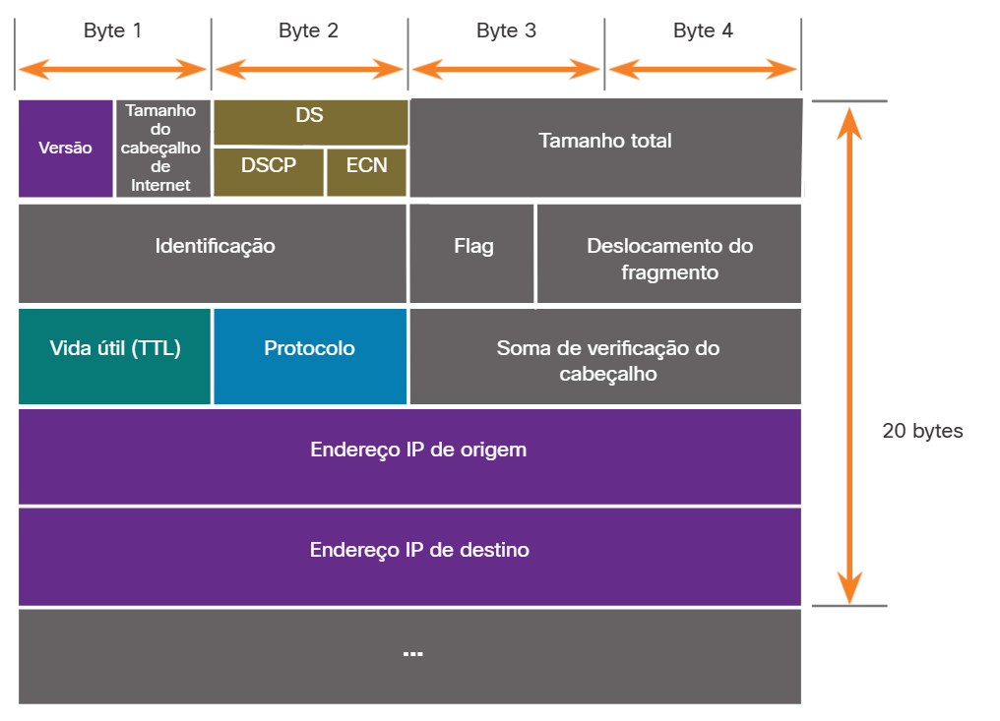

#  5.2.1 Cabeçalho do Pacote IPv4

O IPv4 é um dos principais protocolos de comunicação de camada de rede. O cabeçalho do pacote IPv4 é usado para garantir que esse pacote seja entregue para sua próxima parada no caminho para seu dispositivo final de destino.

O cabeçalho de um pacote IPv4 consiste em campos com informações importantes sobre o pacote. Esses campos contêm números binários que são examinados pelo processo da Camada 3.

## Campos no cabeçalho do pacote IPv4

Campos significativos no cabeçalho IPv4 incluem o seguinte:

Versão – Contém um valor binário de 4 bits definido como 0100 que identifica que este é um pacote IP versão 4.
Serviços diferenciados ou DiffServ (DS) - Anteriormente chamado de Tipo de Serviço (ToS), o campo DS é um campo de 8 bits usado para determinar a prioridade de cada pacote. Os seis bits mais significativos do campo DiffServ são os bits do ponto de código de serviços diferenciados (DSCP) e os dois últimos são os bits de notificação de congestionamento explícita (ECN).
Tempo de vida (TTL) – TTL contém um valor binário de 8 bits que é usado para limitar a vida útil de um pacote. O dispositivo de origem do pacote IPv4 define o valor TTL inicial. É diminuído em um cada vez que o pacote é processado por um roteador. Se o campo TTL for decrementado até zero, o roteador descartará o pacote e enviará uma mensagem ICMP de tempo excedido para o endereço IP de origem. Como o roteador decrementa o TTL de cada pacote, o roteador também deve recalcular a soma de verificação do cabeçalho.
Protocolo - Este campo é usado para identificar o protocolo de próximo nível. O valor binário de 8 bits indica o tipo de carga de dados que o pacote está carregando, o que permite que a camada de rede transfira os dados para o protocolo apropriado das camadas superiores. Valores comuns incluem ICMP (1), TCP (6) e UDP (17).
Checksum de cabeçalho — Isso é usado para detectar corrupção no cabeçalho IPv4.
Endereço IP Origem – Contém um valor binário de 32 bits que representa o endereço IP origem do pacote. O endereço de origem IPv 4 é sempre um endereço unicast.
Endereço IP Destino – Contém um valor binário de 32 bits que representa o endereço IP destino do pacote. O endereço IPv4 destino é um endereço unicast, multicast, ou broadcast.
Os dois campos mais referenciados são os endereços IP de origem e destino. Esses campos identificam a procedência do pacote e para onde ele vai. Normalmente, esses endereços não mudam durante a viagem da origem ao destino.

Os campos Tamanho do Cabeçalho de Internet (IHL), Tamanho Total e Soma de Verificação do Cabeçalho servem para identificar e validar o pacote.

Outros campos são usados para reorganizar um pacote fragmentado. O pacote IPv4 usa especificamente os campos Identificação, Flags e Deslocamento do Fragmento para organizar os fragmentos. Um roteador pode precisar fragmentar um pacote IPv4 ao encaminhá-lo de um meio para outro com uma MTU menor.

Os campos Opções e Preenchimento raramente são usados e estão além do escopo deste módulo.

