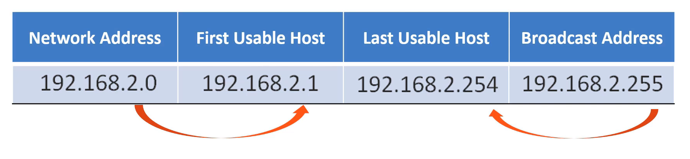

#  6.1.4 Determinando a rede: "AND" lógico

Um AND lógico é uma das três operações booleanas usadas na lógica booleana ou digital. As outras duas são OR e NOT. A operação AND é usada para determinar o endereço de rede.

AND lógico é a comparação de dois bits que produz os resultados mostrados abaixo. Observe como somente 1 AND 1 produz um 1. Qualquer outra combinação resulta em um 0.

1 E 1 = 1
0 E 1 = 0
1 E 0 = 0
0 E 0 = 0
Observação : Na lógica digital, 1 representa Verdadeiro e 0 representa Falso. Ao usar uma operação AND, ambos os valores de entrada devem ser Verdadeiro (1) para que o resultado seja Verdadeiro (1).

Para identificar o endereço de rede de um host IPv4, é feito um AND lógico, bit a bit, entre o endereço IPv4 e a máscara de sub-rede. Quando se usa AND entre o endereço e a máscara de sub-rede, o resultado é o endereço de rede.

Para ilustrar como AND é usado para descobrir um endereço de rede, considere um host com endereço IPv4 192.168.10.10 e máscara de sub-rede 255.255.255.0, conforme mostrado na figura:

Endereço de host IPv4 (192.168.10.10) - O endereço IPv4 do host em formato decimal com pontos e binário.
Máscara de sub-rede (255.255.255.0) - A máscara de sub-rede do host nos formatos decimal com pontos e binário.
Endereço de rede (192.168.10.0) - A operação lógica AND entre o endereço IPv4 e a máscara de sub-rede resulta em um endereço de rede IPv4 mostrado nos formatos decimal com pontos e binário.

Usando a primeira sequência de bits como exemplo, observe que a operação AND é executada no 1 bit do endereço do host com o 1 bit da máscara de sub-rede. Isso resulta em um bit 1 para o endereço de rede. 1 AND 1 = 1.

A operação AND entre um endereço de host IPv4 e uma máscara de sub-rede resulta no endereço de rede IPv4 para este host. Neste exemplo, a operação AND entre o endereço de host 192.168.10.10 e a máscara de sub-rede 255.255.255.0 (/24) resulta no endereço de rede IPv4 192.168.10.0/24. Esta é uma operação IPv4 importante, pois informa ao host a qual rede pertence.

