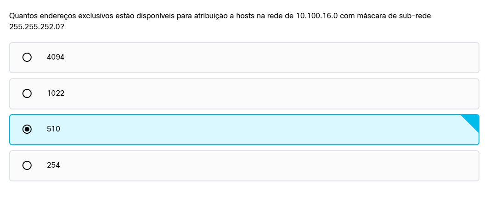
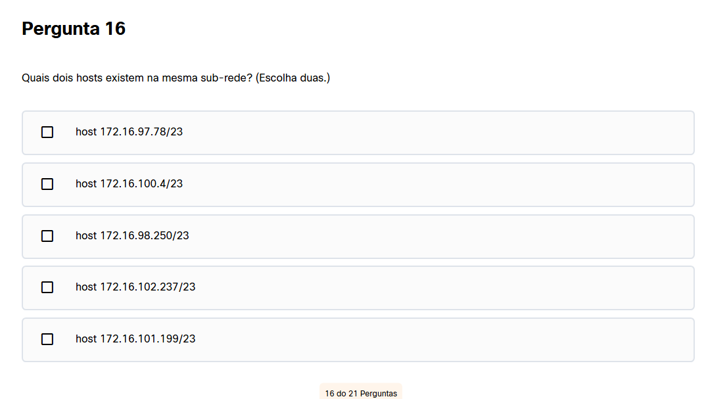
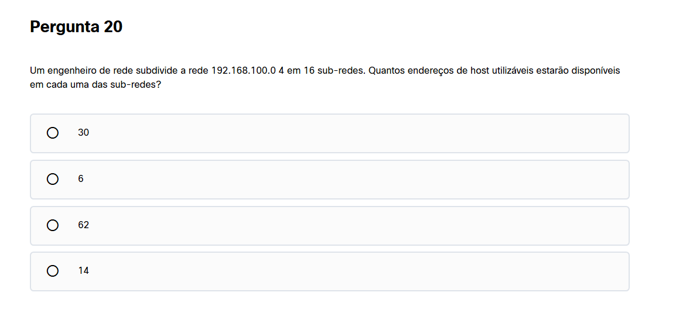

A máscara é: 255.255.252.0 = 11111100

São 22 bits de rede: /22, logo 32-22 = 10 bits para hosts

Para calcular a quantidade de endereços existe a fórmula 2^n, logo 2^10 = 1024 endereços - 2 (broadcast e rede) = 1022

Para esta questão fazemos:

/23: 11111110 = 255.255.254.0
Pegamos o 254 e fazemos 256 - 254 = 2, logo as sub-redes avançam de 2 em 2 no terceiro octeto.
Logo 100 e 101 a resposta seria a resposta.

Rede: 192.168.100.0/24
Sendo 24 bits para rede
8 bits para host

Quer dividir em 16 sub-redes

2⁴ = 16, logo pegamos o 4 para a rede, ficando /28

Agora fazemos 32-28 = 4
2⁴ = 16
16-2 = 14 redes disponíveis.

