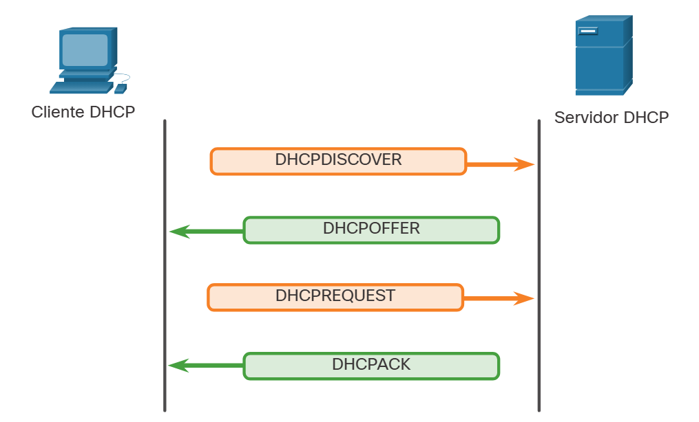

#  8.2.1 Protocolo de Configuração Dinâmica de Host (DHCP)

O serviço DHCP para IPv4 torna automática a atribuição de endereços IPv4, máscaras de sub-rede, gateways e outros parâmetros de rede IPv4. Isso é conhecido como o endereçamento dinâmico. A alternativa para o endereçamento dinâmico é o endereçamento estático. Ao usar o endereçamento estático, o administrador de redes insere manualmente informações de endereço IP em hosts.

Quando um host está conectado à Internet, o servidor DHCP é contatado e um endereço é requisitado. O servidor DHCP escolhe um endereço de uma lista configurada de endereços chamada pool e o atribui (aloca) ao host.

Em redes maiores, ou onde a população de usuários muda frequentemente, o DHCP é preferido para atribuição de endereços. Novos usuários podem chegar e precisar de uma conexão; outros podem ter novos computadores que devem ser conectados. Em vez usar endereçamento estático para cada conexão, é mais eficiente ter endereços IPv4 atribuídos automaticamente usando o DHCP.

O DHCP pode alocar endereços IP por um período de tempo configurável, chamado período de concessão. O período de concessão é uma configuração DHCP importante, quando o período de concessão expira ou o servidor DHCP recebe uma mensagem DHCPRELEASE, o endereço é retornado ao pool DHCP para reutilização. Os usuários podem se mover livremente de um local para outro e restabelecer com facilidade conexões de rede com o DHCP.

Muitas redes utilizam DHCP e endereçamento estático. O DHCP é usado para hosts de uso geral, como dispositivos de usuário final. O endereçamento estático é usado para dispositivos de rede, como roteadores de gateway, comutadores, servidores e impressoras.

O DHCP para IPv6 (DHCPv6) fornece serviços semelhantes para clientes IPv6. Uma diferença importante é que o DHCPv6 não fornece o endereço do gateway padrão. Isso só pode ser obtido dinamicamente a partir da mensagem Anúncio do roteador do roteador.

#  8.2.3 Mensagens DHCP

Como mostra a figura, quando um dispositivo IPv4 configurado com DHCP inicia ou se conecta à rede, o cliente transmite uma mensagem de descoberta DHCP (DHCPDISCOVER) para identificar qualquer servidor DHCP disponível na rede. Um servidor DHCP responde com uma mensagem de oferta DHCP (DHCPOFFER), que oferece uma locação ao cliente. A mensagem de oferta contém o endereço IPv4 e a máscara de sub-rede a serem atribuídos, o endereço IPv4 do servidor DNS e o endereço IPv4 do gateway padrão. A oferta de locação também inclui a duração da locação.

O cliente pode receber várias mensagens DHCPOFFER, caso exista mais de um servidor DHCP na rede local. Portanto, deve escolher entre eles e transmitir uma mensagem de requisição de DHCP (DHCPREQUEST) que identifique o servidor explícito e a oferta de locação que o cliente está aceitando. Um cliente também pode decidir requisitar um endereço que já havia sido alocado pelo servidor.

Presumindo que o endereço IPv4 requisitado pelo cliente, ou oferecido pelo servidor, ainda seja válido, o servidor retornará uma mensagem de confirmação DHCP (DHCPACK) que confirma para o cliente que a locação foi finalizada. Se a oferta não é mais válida, o servidor selecionado responde com uma mensagem de confirmação negativa DHCP (DHCPNAK). Se uma mensagem DHCPNAK for retornada, o processo de seleção deverá recomeçar com a transmissão de uma nova mensagem DHCPDISCOVER. Quando o cliente tiver a locação, ela deverá ser renovada por outra mensagem DHCPREQUEST antes do vencimento.

O servidor DHCP garante que todos os endereços IP sejam exclusivos (um mesmo endereço IP não pode ser atribuído a dois dispositivos de rede diferentes simultaneamente). A maioria dos ISPs usa o DHCP para alocar endereços para seus clientes.

O DHCPv6 possui um conjunto de mensagens semelhantes às do DHCPv4. As mensagens DHCPv6 são SOLICIT, ADVERTISE, INFORMATION REQUEST, e REPLY.

