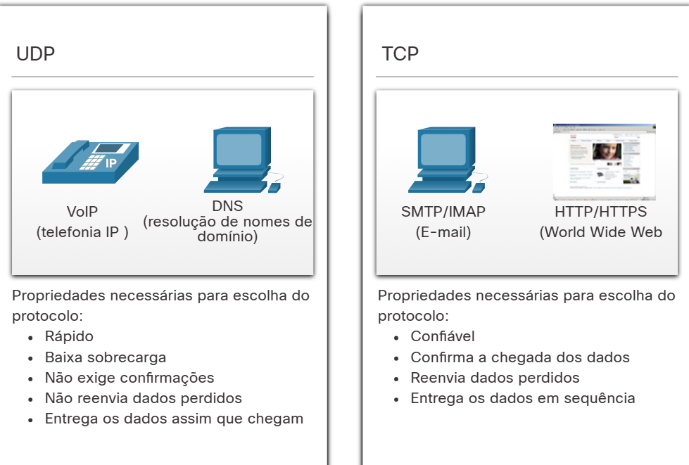

#  9.1.2 Responsabilidades da Camada de Transporte

A camada de transporte tem muitas responsabilidades.

## Rastreamento de Conversações Individuais
Na camada de transporte, cada conjunto de dados que flui entre um aplicativo de origem e um aplicativo de destino é conhecido como conversa e é rastreado separadamente. É responsabilidade da camada de transporte manter e monitorar essas várias conversações.

Como ilustrado na figura, um host pode ter vários aplicativos que estão se comunicando pela rede simultaneamente.

A maioria das redes tem uma limitação da quantidade de dados que pode ser incluída em um único pacote. Portanto, os dados devem ser divididos em partes gerenciáveis.

## Segmentação de Dados e Remontagem de Segmentos
É responsabilidade da camada de transporte dividir os dados do aplicativo em blocos de tamanho adequado. Dependendo do protocolo de camada de transporte usado, os blocos de camada de transporte são chamados de segmentos ou datagramas. A figura ilustra a camada de transporte usando blocos diferentes para cada conversa.

A camada de transporte divide os dados em blocos menores (ou seja, segmentos ou datagramas) que são mais fáceis de gerenciar e transportar.

## Adicionar Informações de Cabeçalho
O protocolo da camada de transporte também adiciona informações de cabeçalho contendo dados binários organizados em vários campos a cada bloco de dados. São os valores nesses campos que permitem que os vários protocolos da camada de transporte realizem diferentes funções no gerenciamento da comunicação de dados.

Por exemplo, as informações de cabeçalho são usadas pelo host de recebimento para remontar os blocos de dados em um fluxo de dados completo para o programa de camada de aplicativo de recebimento.

A camada de transporte garante que, mesmo com vários aplicativos em execução em um dispositivo, todos os aplicativos recebam os dados corretos.

## Identificação das Aplicações
A camada de transporte deve separar e gerenciar várias comunicações com as diferentes necessidades de requisitos de transporte. Para passar fluxos de dados para os aplicativos adequados, a camada de transporte identifica o aplicativo de destino usando um identificador chamado número da porta. Conforme ilustrado na figura, cada processo de software que precisa acessar a rede recebe um número de porta exclusivo para esse host.

## Multiplexação das Conversas
O envio de alguns tipos de dados (por exemplo, um vídeo de streaming) através de uma rede, como um fluxo de comunicação completo, pode consumir toda a largura de banda disponível. Isso impediria que outras conversas de comunicação ocorressem ao mesmo tempo. Isso também dificultaria a recuperação de erro e retransmissão dos dados danificados.

Como mostrado na figura, a camada de transporte usa segmentação e multiplexação para permitir que diferentes conversas de comunicação sejam intercaladas na mesma rede.

A verificação de erros pode ser realizada nos dados do segmento, para determinar se o segmento foi alterado durante a transmissão.

#  9.1.3 Protocolos da Camada de Transporte

O IP está preocupado apenas com a estrutura, endereçamento e roteamento de pacotes. O IP não especifica como a entrega ou o transporte de pacotes ocorrem.

Os protocolos de camada de transporte especificam como transferir mensagens entre hosts e são responsáveis pelo gerenciamento dos requisitos de confiabilidade de uma conversa. A camada de transporte inclui os protocolos TCP e UDP.

Diferentes aplicações têm diferentes necessidades de confiabilidade de transporte. Portanto, o TCP/IP fornece dois protocolos de camada de transporte.

#  9.1.4 Protocolo de Controle de Transmissão (TCP)

O IP se preocupa apenas com a estrutura, o endereçamento e o roteamento de pacotes, do remetente original ao destino final. A IP não é responsável por garantir a entrega ou determinar se uma conexão entre o remetente e o destinatário precisa ser estabelecida.

O TCP é considerado um protocolo de camada de transporte confiável, completo, que garante que todos os dados cheguem ao destino. O TCP inclui campos que garantem a entrega dos dados do aplicativo. Esses campos exigem processamento adicional pelos hosts de envio e recebimento.

Nota: O TCP divide os dados em segmentos.

O transporte TCP é análogo a enviar pacotes que são rastreados da origem ao destino. Se um pedido pelo correio estiver dividido em vários pacotes, um cliente poderá verificar on-line a sequência de recebimento do pedido.

O TCP fornece confiabilidade e controle de fluxo usando estas operações básicas:

Número e rastreamento de segmentos de dados transmitidos para um host específico a partir de um aplicativo específico
Confirmar dados recebidos
Retransmitir quaisquer dados não reconhecidos após um certo período de tempo
Dados de sequência que podem chegar em ordem errada
Enviar dados a uma taxa eficiente que seja aceitável pelo receptor
Para manter o estado de uma conversa e rastrear as informações, o TCP deve primeiro estabelecer uma conexão entre o remetente e o receptor. É por isso que o TCP é conhecido como um protocolo orientado a conexão.

#  9.1.5 Protocolo UDP (User Datagram Protocol)

O UDP é um protocolo de camada de transporte mais simples do que o TCP. Ele não fornece confiabilidade e controle de fluxo, o que significa que requer menos campos de cabeçalho. Como o remetente e os processos UDP receptor não precisam gerenciar confiabilidade e controle de fluxo, isso significa que datagramas UDP podem ser processados mais rápido do que segmentos TCP. O UDP fornece as funções básicas para fornecer datagramas entre os aplicativos apropriados, com muito pouca sobrecarga e verificação de dados.

Nota: O UDP divide os dados em datagramas que também são chamados de segmentos.

UDP é um protocolo sem conexão. Como o UDP não fornece confiabilidade ou controle de fluxo, ele não requer uma conexão estabelecida. Como o UDP não controla informações enviadas ou recebidas entre o cliente e o servidor, o UDP também é conhecido como um protocolo sem estado.

UDP também é conhecido como um protocolo de entrega de melhor esforço porque não há confirmação de que os dados são recebidos no destino. Com o UDP, não há processo de camada de transporte que informe ao remetente se a entrega foi bem-sucedida.

O UDP é como colocar uma carta regular, não registrada, no correio. O remetente da carta não tem conhecimento se o destinatário está disponível para receber a carta. Nem a agência de correio é responsável por rastrear a carta ou informar ao remetente se ela não chegar ao destino final.

#  9.1.6 O Protocolo de Camada de Transporte Certo para a Aplicação Certa

Alguns aplicativos podem tolerar a perda de dados durante a transmissão pela rede, mas atrasos na transmissão são inaceitáveis. Para esses aplicativos, o UDP é a melhor escolha, pois requer menos sobrecarga da rede. O UDP é preferível para aplicativos como Voz sobre IP (VoIP). Agradecimentos e retransmissão atrasariam a entrega e tornariam a conversa por voz inaceitável.

O UDP também é usado por aplicativos de solicitação e resposta onde os dados são mínimos, e a retransmissão pode ser feita rapidamente. Por exemplo, o Domain Name System (DNS) usa UDP para esse tipo de transação. O cliente solicita endereços IPv4 e IPv6 para um nome de domínio conhecido de um servidor DNS. Se o cliente não receber uma resposta em um período predeterminado de tempo, ele simplesmente envia a solicitação novamente.

Por exemplo, se um ou dois segmentos de uma transmissão de vídeo ao vivo não conseguir chegar, isso criará apenas uma interrupção momentânea na transmissão. Isso pode aparecer como uma distorção na imagem ou no som, mas pode não ser notado pelo usuário. Se o dispositivo de destino considerasse os dados perdidos, a transmissão poderia atrasar, enquanto aguardasse as retransmissões, causando, portanto, grandes perdas de áudio e vídeo. Nesse caso, é melhor fornecer a melhor experiência de mídia com os segmentos recebidos e descartar a confiabilidade.

Para outras aplicações, é importante que todos os dados cheguem e que possam ser processados em sua sequência adequada. Para esses tipos de aplicativos, o TCP é usado como o protocolo de transporte. Por exemplo, aplicações como bancos de dados, navegadores e clientes de e-mail exigem que todos os dados enviados cheguem ao destino em seu estado original. Quaisquer dados ausentes podem corromper uma comunicação, tornando-a incompleta ou ilegível. Por exemplo, é importante ao acessar informações bancárias pela web certificar-se de que todas as informações são enviadas e recebidas corretamente.

Os desenvolvedores de aplicações devem escolher que tipo de protocolo de transporte é apropriado com base nas necessidades de suas aplicações. O vídeo pode ser enviado através de TCP ou UDP. Os aplicativos que transmitem áudio e vídeo armazenados normalmente usam TCP. O aplicativo usa TCP para executar buffer, sondagem de largura de banda e controle de congestionamento, a fim de controlar melhor a experiência do usuário.

Vídeo e voz em tempo real geralmente usam UDP, mas também podem usar TCP, ou UDP e TCP. Um aplicativo de videoconferência pode usar UDP por padrão, mas como muitos firewalls bloqueiam UDP, o aplicativo também pode ser enviado por TCP.

Os aplicativos que transmitem áudio e vídeo armazenados usam TCP. Por exemplo, se sua rede, repentinamente, não comportar a largura de banda necessária para a transmissão de um filme sob demanda, a aplicação interrompe a reprodução. Durante essa interrupção, você deverá ver uma mensagem de “buffering...” , enquanto o TCP age para restabelecer a transmissão. Quando todos os segmentos estão em ordem e um nível mínimo de largura de banda é restaurado, a sessão TCP é retomada e o filme retoma a reprodução.

