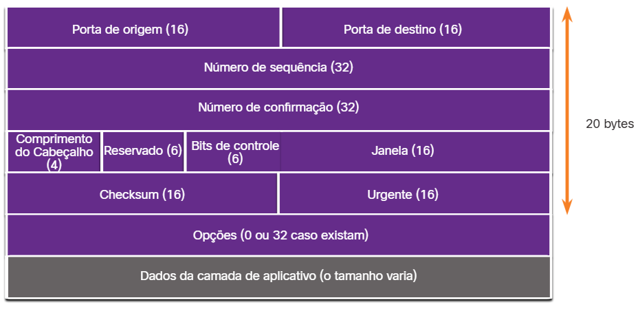
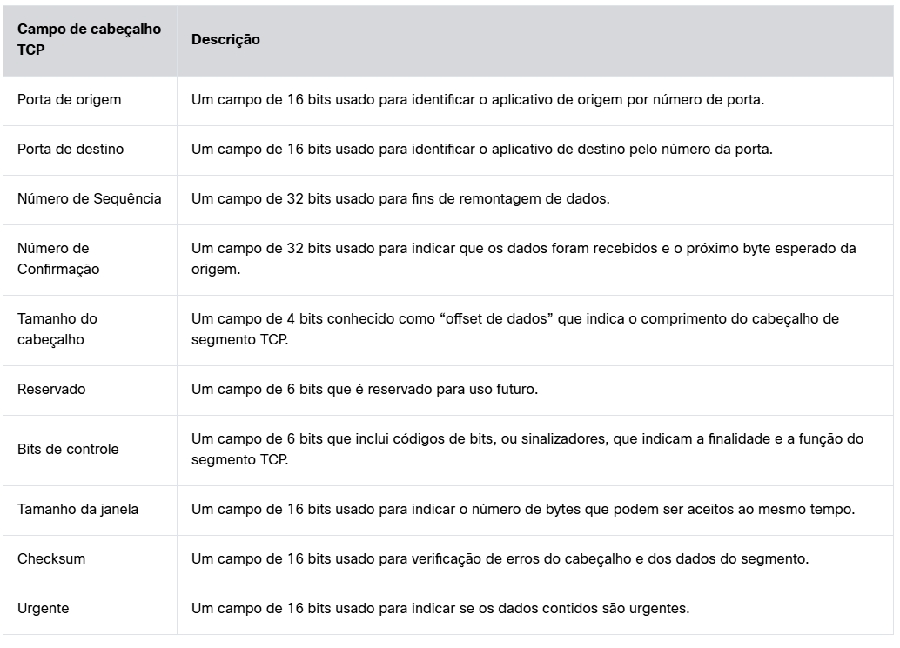

#  9.2.1 Recursos TCP

No tópico anterior, você aprendeu que TCP e UDP são os dois protocolos de camada de transporte. Este tópico fornece mais detalhes sobre o que o TCP faz e quando é uma boa idéia usá-lo em vez de UDP.

Para entender as diferenças entre TCP e UDP, é importante entender como cada protocolo implementa recursos específicos de confiabilidade e como cada protocolo rastreia conversas.

Além de suportar as funções básicas de segmentação e remontagem de dados, o TCP também fornece os seguintes serviços:

Estabelece uma sessão - O TCP é um protocolo orientado à conexão que negocia e estabelece uma conexão (ou sessão) permanente entre os dispositivos de origem e de destino antes de encaminhar qualquer tráfego. Com o estabelecimento da sessão, os dispositivos negociam o volume de tráfego esperado que pode ser encaminhado em determinado momento e os dados de comunicação entre os dois podem ser gerenciados atentamente.
Garante a entrega confiável - Por várias razões, é possível que um segmento seja corrompido ou perdido completamente, pois é transmitido pela rede. O TCP garante que cada segmento enviado pela fonte chegue ao destino.
Fornece entrega no mesmo pedido - Como as redes podem fornecer várias rotas que podem ter taxas de transmissão diferentes, os dados podem chegar na ordem errada. Ao numerar e sequenciar os segmentos, o TCP garante que os segmentos sejam remontados na ordem correta.
Suporta controle de fluxo - os hosts de rede têm recursos limitados (ou seja, memória e poder de processamento). Quando percebe que esses recursos estão sobrecarregados, o TCP pode requisitar que a aplicação emissora reduza a taxa de fluxo de dados. Para isso, o TCP regula o volume de dados transmitido pelo dispositivo origem. O controle de fluxo pode impedir a necessidade de retransmissão dos dados quando os recursos do host receptor estão sobrecarregados.
Para obter mais informações sobre o TCP, procure o RFC 793 na Internet.

#  9.2.2 Cabeçalho TCP

TCP é um protocolo stateful, o que significa que ele controla o estado da sessão de comunicação. Para manter o controle do estado de uma sessão, o TCP registra quais informações ele enviou e quais informações foram confirmadas. A sessão com estado começa com o estabelecimento da sessão e termina com o encerramento da sessão.

Um segmento TCP adiciona 20 bytes (ou seja, 160 bits) de sobrecarga ao encapsular os dados da camada de aplicativo. A figura mostra os campos em um cabeçalho TCP.

#  9.2.4 Aplicações que usam TCP

O TCP é um bom exemplo de como as diferentes camadas do conjunto de protocolos TCP/IP têm funções específicas. O TCP lida com todas as tarefas associadas à divisão do fluxo de dados em segmentos, fornecendo confiabilidade, controlando o fluxo de dados e reordenando segmentos. O TCP libera a aplicação da obrigação de gerenciar todas essas tarefas. Aplicações como as mostradas na figura, podem simplesmente enviar o fluxo de dados à camada de transporte e usar os serviços TCP.

