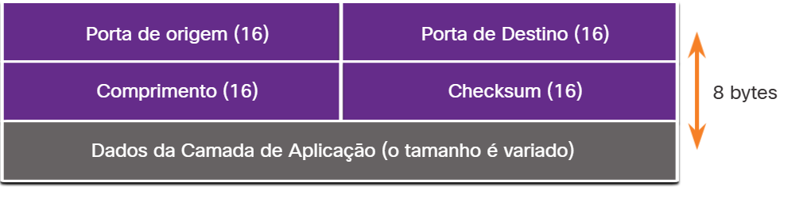
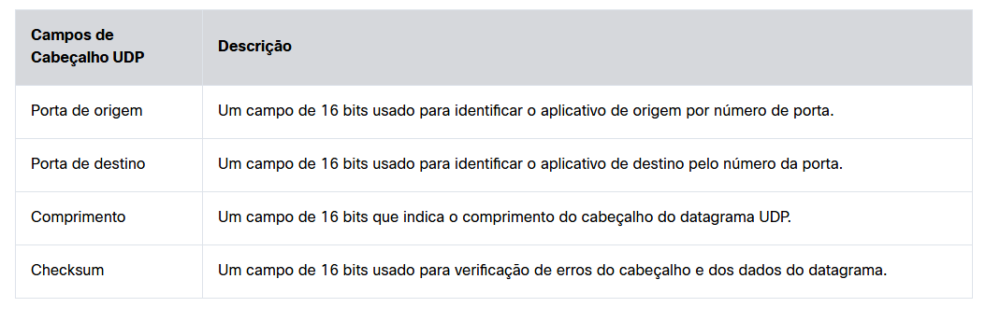

#  9.3.1 Recursos UDP

Este tópico abordará o UDP, o que ele faz e quando é uma boa idéia usá-lo em vez de TCP. UDP é um protocolo de transporte de melhor esforço. O UDP é um protocolo de transporte leve que oferece a mesma segmentação de dados e remontagem que o TCP, mas sem a confiabilidade e o controle de fluxo do TCP.

O UDP é um protocolo simples, normalmente descrito nos termos do que ele não faz em comparação ao TCP.

Os recursos UDP incluem o seguinte:

Os dados são reagrupados na ordem em que são recebidos.
Quaisquer segmentos perdidos não são reenviados.
Nenhum estabelecimento de seção.
O envio não é informado sobre a disponibilidade do recurso.
Para obter mais informações sobre o UDP, pesquise na Internet o RFC.

#  9.3.2 Cabeçalho UDP

UDP é um protocolo sem estado, o que significa que nem o cliente nem o servidor rastreiam o estado da sessão de comunicação. Se a confiabilidade for necessária ao usar o UDP como protocolo de transporte, ela deve ser tratada pela aplicação.

Um dos requisitos mais importantes para transmitir vídeo ao vivo e voz sobre a rede é que os dados continuem fluindo rapidamente. Vídeo ao vivo e aplicações de voz podem tolerar alguma perda de dados com efeito mínimo ou sem visibilidade e são perfeitos para o UDP.

Os blocos de comunicação no UDP são chamados de datagramas ou segmentos. Esses datagramas são enviados como o melhor esforço pelo protocolo da camada de transporte.

O cabeçalho UDP é muito mais simples do que o cabeçalho TCP porque só tem quatro campos e requer 8 bytes (ou seja, 64 bits). A figura mostra os campos em um cabeçalho UDP.

#  9.3.4 Aplicações que usam UDP

Há três tipos de aplicações que são mais adequadas para o UDP:

Aplicações de vídeo e multimídia ao vivo - Esses aplicativos podem tolerar a perda de dados, mas requerem pouco ou nenhum atraso. Os exemplos incluem VoIP e transmissão de vídeo ao vivo.
Aplicações de solicitação e resposta simples - Aplicativos com transações simples em que um host envia uma solicitação e pode ou não receber uma resposta. Os exemplos incluem DNS e DHCP.
Aplicativos que lidam com a confiabilidade - Comunicações unidirecionais em que o controle de fluxo, a detecção de erros, as confirmações e a recuperação de erros não são necessários ou podem ser gerenciados pela aplicação. Os exemplos incluem SNMP e TFTP.
