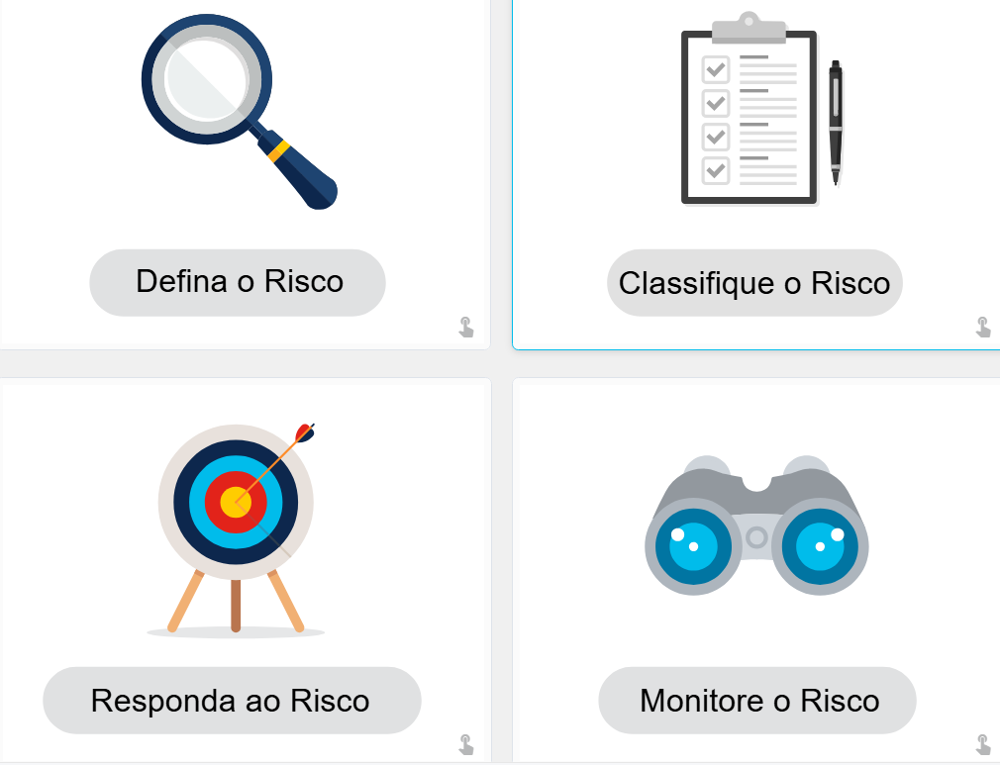

# 4.2.1 Segurança Baseada em Comportamento

A segurança baseada em comportamento é uma abordagem de detecção de ameaças que consiste em capturar e analisar o fluxo de comunicação entre um usuário da rede local e destinos locais ou remotos.

O objetivo é identificar desvios dos padrões normais de utilização da rede. Qualquer alteração significativa nesses padrões é considerada uma **anomalia**, podendo indicar a ocorrência de um ataque ou atividade maliciosa.

## Honeypots

Um **honeypot** é uma ferramenta de detecção baseada em comportamento projetada para atrair invasores por meio da simulação de sistemas ou serviços vulneráveis.

Quando um atacante interage com o honeypot, o administrador pode:

- Capturar atividades maliciosas;
- Registrar ações realizadas;
- Analisar técnicas utilizadas pelo invasor;
- Desenvolver mecanismos de defesa mais eficazes.

## Arquitetura da Solução Cisco Cyber Threat Defense

A arquitetura **Cisco Cyber Threat Defense** utiliza detecção baseada em comportamento e indicadores de comprometimento para aumentar a visibilidade, o contexto e o controle sobre eventos de segurança.

Seu objetivo é responder às seguintes perguntas:

- Quem está realizando o ataque?
- Qual tipo de ataque está sendo executado?
- Onde o ataque está ocorrendo?
- Quando ele acontece?
- Como ele está sendo realizado?

Para alcançar esse objetivo, a solução integra diversas tecnologias de segurança em uma arquitetura unificada.

# 4.2.2 NetFlow

O **NetFlow** é uma tecnologia utilizada para coletar informações sobre os fluxos de dados que trafegam em uma rede.

Com ela é possível identificar:

- Quem está utilizando a rede;
- Quais dispositivos estão conectados;
- Quando os acessos ocorrem;
- Como usuários e dispositivos interagem com a infraestrutura.

## Importância do NetFlow

O NetFlow é um componente fundamental para:

- Monitoramento de rede;
- Análise comportamental;
- Detecção de ameaças;
- Investigação de incidentes.

Equipamentos como:

- Switches;
- Roteadores;
- Firewalls;

podem gerar registros NetFlow contendo informações sobre tráfego de entrada, saída e trânsito na rede.

## Coletores NetFlow

Os dados gerados pelos dispositivos são enviados para **coletores NetFlow**, responsáveis por:

1. Receber os registros;
2. Armazenar as informações;
3. Processar os dados;
4. Gerar relatórios e análises.

Essas informações permitem criar linhas de base (*baselines*) comportamentais utilizando mais de 90 atributos diferentes, incluindo:

- Endereço IP de origem;
- Endereço IP de destino;
- Portas utilizadas;
- Protocolos de comunicação;
- Volume de tráfego.

# 4.2.3 Teste de Penetração

O **Teste de Penetração** (*Penetration Testing* ou *Pen Test*) é uma avaliação prática de segurança que busca identificar vulnerabilidades em sistemas, redes, aplicações e processos organizacionais.

O objetivo é simular ataques reais para descobrir falhas que poderiam ser exploradas por invasores, permitindo corrigi-las antes que sejam utilizadas de forma maliciosa.

## Etapa 1: Planejamento

Nesta fase, o profissional responsável coleta o máximo possível de informações sobre o ambiente alvo.

As atividades incluem:

- Pesquisa de vulnerabilidades;
- Levantamento de informações públicas;
- Reconhecimento passivo;
- Reconhecimento ativo (*footprinting*).

O objetivo é compreender a estrutura do ambiente e identificar possíveis pontos de ataque.

## Etapa 2: Varredura

Após o planejamento, inicia-se a fase de reconhecimento ativo para identificar vulnerabilidades exploráveis.

As principais atividades são:

### Varredura de Portas

Identificação de portas abertas e possíveis serviços acessíveis.

### Verificação de Vulnerabilidades

Busca por falhas conhecidas que possam ser exploradas.

### Enumeração

Estabelecimento de conexões com o alvo para identificar:

- Usuários;
- Contas administrativas;
- Serviços disponíveis;
- Informações do sistema.

## Etapa 3: Obter Acesso

Nesta etapa, o testador tenta explorar vulnerabilidades para obter acesso ao ambiente.

As técnicas podem incluir:

- Execução de exploits;
- Uso de payloads maliciosos controlados;
- Engenharia social;
- Exploração de vulnerabilidades web;
- Exploração de falhas em software e hardware;
- Aproveitamento de configurações incorretas;
- Violação de controles de acesso;
- Ataques a redes Wi-Fi com criptografia fraca.

## Etapa 4: Manter o Acesso

Após obter acesso, o objetivo é verificar até onde um invasor conseguiria avançar sem ser detectado.

Para isso, podem ser utilizados mecanismos como:

- Backdoors;
- Cavalos de Troia (*Trojans*);
- Rootkits;
- Canais ocultos de comunicação.

Essa etapa permite identificar:

- Dados sensíveis acessíveis;
- Sistemas vulneráveis;
- Possíveis impactos de um comprometimento real.

## Etapa 5: Análise e Relatório

Ao final do processo, é elaborado um relatório contendo:

- Vulnerabilidades identificadas;
- Evidências coletadas;
- Impactos potenciais;
- Recomendações de correção;
- Melhorias em políticas e procedimentos;
- Necessidades de treinamento.

O relatório serve como base para fortalecer a postura de segurança da organização.

# 4.2.5 Redução do Impacto

Mesmo com boas práticas de segurança, nenhuma organização está completamente protegida contra incidentes.

Por isso, é essencial possuir estratégias para minimizar danos caso uma violação ocorra.

## Comunicar o Problema

A comunicação transparente é fundamental durante um incidente.

### Comunicação Interna

Todos os colaboradores devem ser informados sobre:

- O incidente ocorrido;
- Os riscos envolvidos;
- O plano de ação definido.

### Comunicação Externa

Clientes, parceiros e demais partes interessadas devem receber informações por meio de:

- Comunicados oficiais;
- E-mails;
- Canais corporativos.

## Ser Sincero e Responsável

A organização deve agir com honestidade e assumir responsabilidade sempre que houver falhas sob seu controle.

A transparência contribui para preservar a confiança dos usuários e reduzir impactos reputacionais.

## Fornecer os Detalhes

É importante informar:

- Como a violação ocorreu;
- Quais dados foram comprometidos;
- Quais medidas corretivas estão sendo adotadas.

Em muitos casos, espera-se que a organização arque com custos relacionados à proteção contra roubo de identidade e outros danos causados aos clientes.

## Encontrar a Causa

A investigação da origem do incidente deve identificar:

- Como ocorreu a invasão;
- Quais vulnerabilidades foram exploradas;
- Quais fatores contribuíram para o ataque.

Especialistas em perícia digital podem ser contratados para conduzir essa análise.

## Aplicar as Lições Aprendidas

Todo conhecimento obtido durante a investigação deve ser utilizado para fortalecer os controles de segurança e evitar incidentes semelhantes.

## Verificar e Verificar Novamente

Invasores frequentemente deixam mecanismos de persistência para retornar ao ambiente posteriormente.

Por isso, é necessário garantir que:

- Não existam backdoors ativos;
- Nenhum sistema permaneça comprometido;
- Todos os artefatos maliciosos sejam removidos.

## Educar

A conscientização contínua de:

- Funcionários;
- Parceiros;
- Clientes;

é uma das formas mais eficazes de reduzir riscos futuros.

# 4.2.6 O que é Gerenciamento de Risco?

O **Gerenciamento de Riscos** é um processo contínuo de identificação, avaliação, tratamento e monitoramento de riscos relacionados à segurança da informação.

Embora não seja possível eliminar todos os riscos, é possível determinar níveis aceitáveis de exposição considerando:

- O impacto das ameaças;
- A probabilidade de ocorrência;
- O custo dos controles de mitigação.

> O custo de um controle de segurança nunca deve ser superior ao valor do ativo que está sendo protegido.

## 1. Identificar as Ameaças

O primeiro passo consiste em identificar fatores que podem aumentar os riscos da organização.

Exemplos incluem:

- Falhas de processos;
- Problemas em produtos;
- Ataques cibernéticos;
- Interrupções de serviços;
- Danos à reputação;
- Responsabilidades legais;
- Perda de propriedade intelectual.

## 2. Avaliar a Gravidade dos Riscos

Após identificar as ameaças, é necessário determinar o impacto de cada uma delas.

Essa análise pode ser realizada de duas formas:

### Análise Quantitativa

Baseada em valores financeiros e custos estimados.

### Análise Qualitativa

Baseada na gravidade operacional e nos impactos para o negócio.

Essa avaliação permite priorizar riscos e direcionar recursos de forma eficiente.

## 3. Desenvolver um Plano de Tratamento

Com os riscos identificados e classificados, deve-se definir um plano de ação para reduzir a exposição da organização.

As estratégias geralmente incluem:

### Eliminar

Remover completamente a causa do risco.

### Mitigar

Reduzir a probabilidade ou o impacto do risco.

### Transferir

Transferir o risco para terceiros, como seguradoras ou fornecedores especializados.

### Aceitar

Aceitar conscientemente o risco quando os custos de mitigação superam seus benefícios.

## 4. Monitorar Continuamente

O gerenciamento de riscos é um processo contínuo.

Todos os riscos tratados devem ser monitorados regularmente para garantir que os controles permaneçam eficazes.

Além disso, os riscos aceitos precisam ser acompanhados constantemente, pois mudanças no ambiente podem alterar seu nível de criticidade.