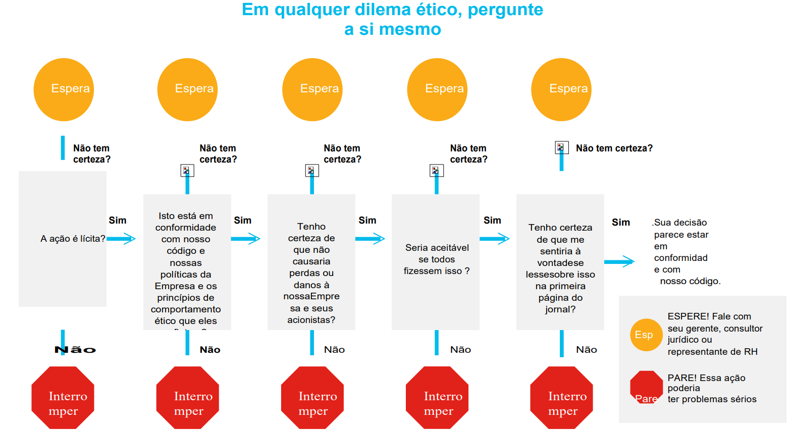

5.1.1 Questões jurídicas em segurança cibernética

Questões jurídicas pessoais
No trabalho ou em casa, você pode ter a oportunidade e as habilidades de hackear o computador ou a rede de outra pessoa. Mas há um ditado antigo: "Só porque você pode, não significa que você deveria". A maioria dos hacks deixa rastros, que podem ser rastreados até você.

Os profissionais de cibersegurança desenvolvem muitas habilidades, que podem ser usadas de forma positiva ou ilegal. Há sempre uma demanda enorme por aqueles que escolhem usar suas habilidades digitais dentro dos limites legais.

Questões jurídicas corporativas
A maioria dos países tem leis de segurança digital em vigor, que empresas e organizações devem cumprir.

Em alguns casos, se você violar as leis de segurança cibernética enquanto faz seu trabalho, a organização pode ser punida e você pode perder seu emprego. Em outros casos, você pode ser processado, multado e possivelmente condenado.

Em geral, se você não tiver certeza se uma ação ou comportamento pode ser ilegal, assuma que é ilegal e não o faça. Sempre verifique com o departamento jurídico ou de RH da empresa.

Direito internacional e Cibersegurança
A lei internacional de cibersegurança é um campo em constante evolução. Os ataques cibernéticos ocorrem no ciberespaço, um espaço eletrônico criado, mantido e de propriedade de entidades públicas e privadas. Não há limites geográficos tradicionais no ciberespaço. Para complicar ainda mais os problemas, é muito mais fácil mascarar a origem de um ataque na guerra cibernética do que na guerra convencional.

A sociedade global ainda está debatendo a melhor forma de lidar com o ciberespaço. A prática do país, opinio juris (um sentimento em nome de um país de que está sujeito à lei em questão) e quaisquer tratados elaborados irão moldar a lei internacional de cibersegurança.

5.1.2 Questões éticas em segurança cibernética
Pense do teste de penetração que você realizou no @Apollo. Esse teste revelou que um de seus colegas, que começou ao mesmo tempo que você, foi responsável por uma violação de dados. Você está pensando em não incluir isso em seu relatório, pois ele pode ter problemas.

Faça a si mesmo as seguintes perguntas para ajudá-lo a decidir sobre a melhor linha de ação.

A ação é lícita?
Sua ação está em conformidade com a política da @Apollo ?
Sua ação será favorável para a @Apollo e suas partes interessadas?
Tudo bem se todos em @Apollo fizerem isso?
O resultado de sua ação representaria @Apollo em uma perspectiva positiva em uma manchete?

Se você conseguir responder “Sim” a todas essas perguntas, provavelmente será adequado prosseguir com sua ação.

No entanto, é importante lembrar que apenas porque algo é legal, pode não ser ético.

Nesse caso, embora ocultar as informações do relatório de teste de penetração não seja ilegal, não é a coisa ética a fazer. As consequências de não relatar o ocorrido podem ser devastadoras para @Apollo e seus clientes.

Se sua resposta a qualquer uma dessas perguntas for "Não", você deve interromper e reconsiderar suas ações, o que pode ter implicações legais graves para você e para a empresa.

Neste exemplo, você está certo em questionar suas ideias iniciais. Cada nova descoberta em cibersegurança deve ser reportada para proteger a @Apollo e seus clientes.

Lembre-se, sempre busque orientação de seu gerente de linha, de um representante jurídico ou do RH para esclarecer se sua ação ou comportamento pode ser considerado antiético.

5.2.2 Certificações profissionais
Cisco Certified Support Technician (CCST) Cibersegurança
Esta certificação é destinada a estudantes do ensino médio e em início de faculdade, bem como àqueles interessados em uma mudança de carreira.

CompTIA Security+
Esta é uma certificação de segurança básica que atende aos requisitos da Diretiva 8570.01-M do Departamento de Defesa dos EUA, que é um item importante para quem procura trabalhar em segurança de TI para o governo federal.

Hacker Ético Certificado pelo EC-Council (CEH-Certified Ethical Hacker)
Esta certificação testa sua compreensão e conhecimento de como procurar fraquezas e vulnerabilidades em sistemas alvo usando o mesmo conhecimento e ferramentas de um hacker malicioso, mas de maneira legal e legítima.

ISC2 Certified Information Systems Security Professional (CISSP)
Essa é a certificação de segurança mais conhecida e reconhecida. Para fazer o exame, você precisa ter pelo menos cinco anos de experiência relevante no setor.

Cisco Certified CyberOps  Associate
Essa certificação valida as habilidades exigidas dos analistas de cibersegurança de nível de associado nos centros de operações de segurança.