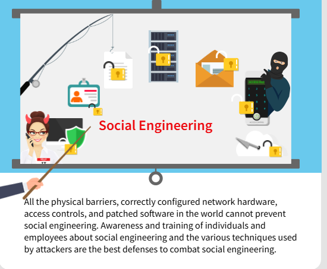

#  1.2.8 Piggybacking e Tailgating
Piggybacking ou Tailgating ocorre quando um criminoso segue uma pessoa autorizada para obter entrada física em um local seguro ou em uma área restrita. Os criminosos podem conseguir isso:

Dar a impressão de ser escoltado para a instalação por uma pessoa autorizada.
Juntar-se e fingir ser parte de uma grande multidão que entra na instalação.
Visar uma pessoa autorizada que não tem cuidado com as regras da instalação.
Uma maneira de evitar isso é usar dois conjuntos de portas. Isso às vezes é chamado de mantrap e significa que os indivíduos entram por uma porta externa, que deve fechar antes que eles possam ter acesso através de uma porta interna.

# Baiting 
Baiting is using a false promise to gain a victim’s interest to lure them into a trap that steals their personal information or infects their systems with malware.

# Shoulder surfing
Shoulder surfing is looking over someone’s shoulder while they are using a computer and visually capturing logins or passwords or other sensitive information.

# Pretexting 
Pretexting is when an attacker establishes trust with their victim by impersonating persons who have right-to-know authority and asks questions that appear to be required to confirm the victim’s identity, but through which they gather important personal data.

# Phishing 
Phishing is designed to get victims to click on links to malicious websites, open attachments that contain malware, or reveal sensitive information.

# Spear phishing
Spear phishing is more targeted version of the phishing, in which an attacker chooses specific individuals or enterprises and then customizes their phishing attack to their victims to make it less conspicuous. Whaling is when the specific target is a high profile employee such as a CEO or CFO.

# Scareware and ransomware
Scareware and ransomware. Scareware is when victims are deceived to think their system is infected with malware and receive false alarms prompting them to install software that is not needed or is itself malware. Ransomware is when victims are prevented from accessing their system or personal files until they make a ransom payment in order to regain access.

# Tailgating 
Tailgating is when an attacker who lacks the proper authorization follows a victim with authorized credentials through a door or other secure building access point into a restricted area.

# Dumpster diving
Dumpster diving is a technique used to retrieve information that could be used to carry out an attack on an individual, a company and a company’s computer network. Seemingly innocent information like phone lists, calendars, or organizational charts thrown in the trash as well as items like access codes or passwords, can be used to assist an attacker using social engineering techniques to gain access to the company and the company’s computer network.

# Parte 2 Criar um pôster de conscientização de segurança digital
