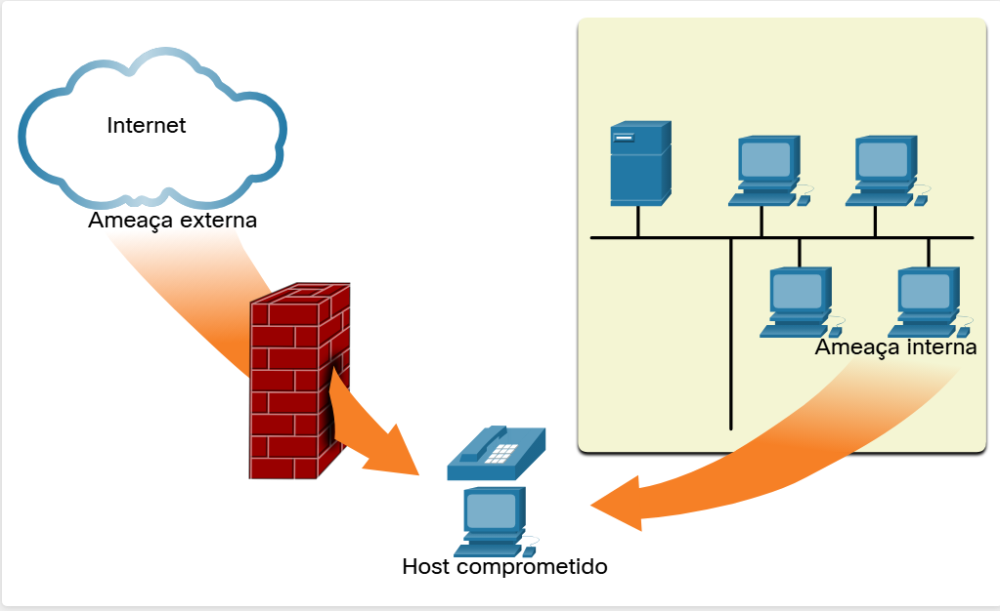

#  2.1.4 Vetores de ataques de rede

Ameaças internas e externas

Um vetor de ataque é um caminho pelo qual um atacante poder obter acesso a um servidor, equipamento ou rede. Os vetores de ataque são originários de dentro ou de fora da rede corporativa, conforme mostrado na figura. Por exemplo, os atacantes podem direcionar uma rede pela Internet, para interromper as operações da rede e criar um ataque de negação de serviço (DoS).

Nota: Um ataque de DoS ocorre quando um dispositivo ou aplicativo de rede está incapacitado e não é mais capaz de suportar solicitações de usuários legítimos.

Um usuário interno, como um funcionário, pode acidentalmente ou intencionalmente:

Roubar e copiar dados confidenciais para mídia removível, email, software de mensagens e outras mídias.
Comprometer servidores internos ou dispositivos de infraestrutura de rede.
Desconectar uma conexão de rede crítica e cause uma interrupção na rede.
Conectar uma unidade USB infectada a um sistema de computador corporativo.
Ameaças internas têm o potencial de causar maior dano que as ameaças externas, pois os usuários internos têm acesso direto ao edifício e a seus dispositivos de infraestrutura. Os funcionários normalmente têm conhecimento da rede corporativa, seus recursos e seus dados confidenciais.

Os profissionais de segurança de rede devem implementar ferramentas e aplicar técnicas para mitigar ameaças externas e internas.