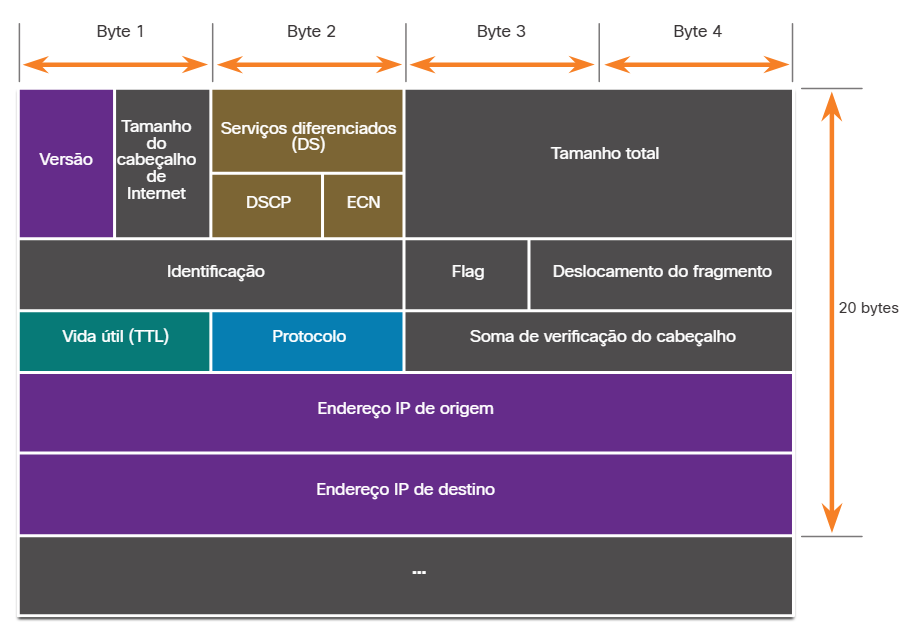
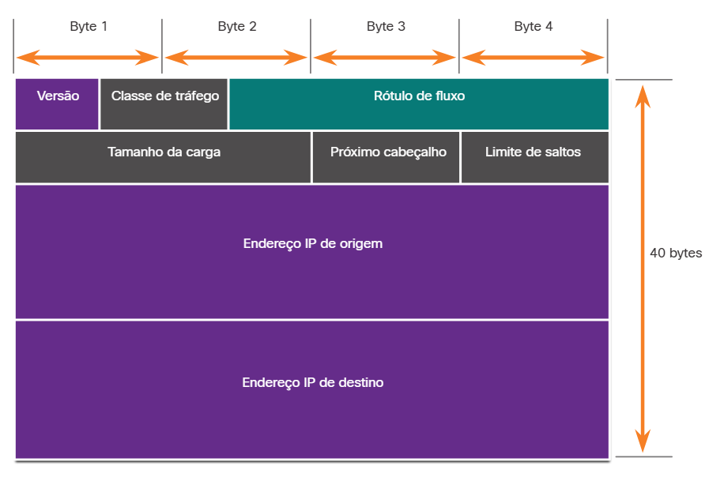

#  3.1.1 IPv4 e IPv6

O IP foi projetado como um protocolo sem conexão de Camada 3. Ele fornece as funções necessárias para entregar um pacote de um host de origem a um host de destino por meio de um sistema interconectado de redes. O protocolo não foi projetado para rastrear e gerenciar o fluxo de pacotes. Essas funções, se necessárias, são executadas principalmente pelo TCP na camada 4.

O IP não faz nenhum esforço para validar se o endereço IP de origem contido em um pacote realmente veio dessa origem. Por esse motivo, os agentes de ameaças podem enviar pacotes usando um endereço IP de origem falsificado. Além disso, os agentes da ameaça podem adulterar os outros campos do cabeçalho IP para realizar seus ataques. Portanto, é importante que os analistas de segurança entendam os diferentes campos dos cabeçalhos IPv4 e IPv6.

#  3.1.2 O cabeçalho do pacote IPv4

Cabeçalho do Pacote IPv4
Os campos no cabeçalho do pacote IPv4 são mostrados na figura.

- Versão
Contém um valor binário de 4 bits definido como 0100 que identifica isso como um pacote IPv4.

- Comprimento do cabeçalho da Internet
Um campo de 4 bits contendo o comprimento do cabeçalho IP.
O comprimento mínimo de um cabeçalho IP é de 20 bytes.

- Serviços diferenciados ou DiffServ (DS)
Anteriormente chamado de campo Tipo de serviço (ToS), o campo DS é um campo de 8 bits usado para determinar a prioridade de cada pacote.
Os seis bits mais significativos do campo DiffServ são o Ponto de código de serviços diferenciados (DSCP).
Os dois últimos bits são os bits de notificação de congestionamento explícito (ECN).

- Comprimento total
Especifica o comprimento do pacote IP, incluindo o cabeçalho IP e os dados do usuário.
O campo de comprimento total é de 2 bytes, portanto, o tamanho máximo de um pacote IP é de 65.535 bytes, no entanto, os pacotes são muito menores na prática.

- Deslocamento de identificação, bandeira e fragmento
À medida que um pacote IP se move pela Internet, talvez seja necessário cruzar uma rota que não possa lidar com o tamanho do pacote.
O pacote será dividido, ou fragmentado, em pacotes menores e remontado posteriormente.
Esses campos são usados para fragmentar e remontar pacotes.

- Tempo de Vida (TTL)
Contém um valor binário de 8 bits que é usado para limitar a vida útil de um pacote.
O remetente do pacote define o valor inicial do TTL e este é subtraído de um toda vez que o pacote é processado por um roteador.
Se o campo TTL for decrementado até zero, o roteador descartará o pacote e enviará uma mensagem ICMP de tempo excedido para o endereço IP de origem.

- Protocolo
O campo é usado para identificar o protocolo de próximo nível.
O valor binário de 8 bits indica o tipo de carga de dados que o pacote está carregando, o que permite que a camada de rede transfira os dados para o protocolo apropriado das camadas superiores.
Valores comuns incluem ICMP (1), TCP (6) e UDP (17).

- Cabeçalho checksum
Um valor calculado com base no conteúdo do cabeçalho IP.
Usado para determinar se algum erro foi introduzido durante a transmissão.

- Endereço IPv4 Origem
Contém um valor binário de 32 bits que representa o endereço IPv4 de origem do pacote.
O endereço de origem IPv 4 é sempre um endereço unicast.

- Endereço IPv4 de destino
Contém um valor binário de 32 bits que representa o endereço IPv4 de destino do pacote.

- Opções e Preenchimento
Este é um campo que varia em comprimento de 0 a um múltiplo de 32 bits.
Se os valores de opção não forem um múltiplo de 32 bits, 0s serão adicionados ou preenchidos para garantir que este campo contenha um múltiplo de 32 bits.

#  3.1.4 O cabeçalho do pacote IPv6

Cabeçalho do Pacote IPv6
Há oito campos no cabeçalho do pacote IPv6, como mostrado na figura.

- Versão
Este campo contém um valor binário de 4 bits definido como 0110 que o identifica como um pacote IPv6.

- Classe de tráfego
Este campo de 8 bits é equivalente ao campo IPv4 Differentiated Services (DS).

- Rótulo de fluxo
Este campo de 20 bits sugere que todos os pacotes com o mesmo rótulo de fluxo recebem o mesmo tipo de tratamento pelos roteadores.

- Tamanho da carga
Este campo de 16 bits indica o comprimento da porção de dados ou carga útil do pacote IPv6.

- Próximo cabeçalho
Este campo de 8 bits é equivalente ao campo do protocolo IPv4.
Ele exibe o tipo de carga de dados que o pacote está carregando, permitindo que a camada de rede transfira os dados para o protocolo apropriado das camadas superiores.

- Endereço IPv6 Origem
Este campo de 128 bits identifica o endereço IPv6 do host de envio.

- Endereço IPv6 Destino
Este campo de 128 bits identifica o endereço IPv6 do host receptor.

Um pacote IPv6 também pode conter cabeçalhos de extensão (EH) que fornecem informações opcionais da camada de rede. Opcionais, os cabeçalhos de extensão ficam posicionados entre o cabeçalho IPv6 e a carga. EHs são usados para fragmentação, segurança, suporte à mobilidade e muito mais.

Ao contrário de IPv4, os roteadores não fragmentam os pacotes IPv6 roteados.

