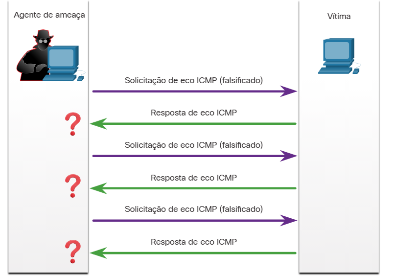
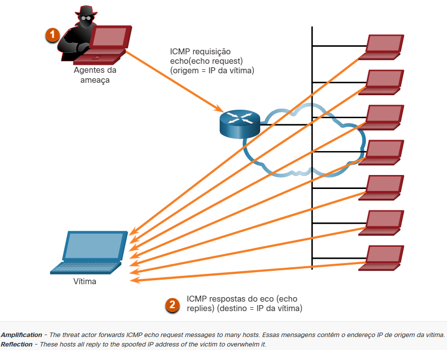
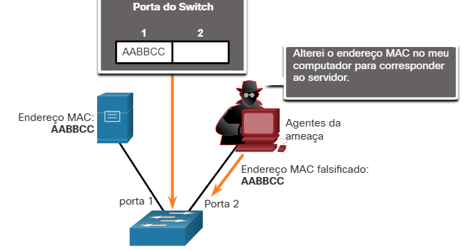
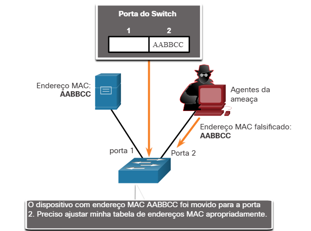

#  3.2 Vulnerabilidades de IP

Existem diferentes tipos de ataques que visam IP. A tabela a seguir lista alguns dos ataques comuns relacionados a IP:

- Ataques ICMP
Os atores de ameaças usam pacotes de eco (pings) do ICMP (Internet Control Message Protocol) para descobrir sub-redes e hosts em uma rede protegida, gerar ataques de inundação de DoS e alterar as tabelas de roteamento de hosts.

- Ataques de negação de serviço (DoS)
Os atores da ameaça tentam impedir que usuários legítimos acessem informações ou serviços.

- Ataques de negação de serviço distribuída (DDoS)
Semelhante a um ataque DoS, mas apresenta um ataque simultâneo e coordenado de várias máquinas de origem.

- Ataque de Falsificação de Endereços
Os atores da ameaça falsificam o endereço IP de origem na tentativa de executar falsificação cega ou não cega.

- Ataque homem no meio (MiTM)
Os agentes de ameaças se posicionam entre uma fonte e um destino para monitorar, capturar e controlar de forma transparente a comunicação. Eles poderiam simplesmente espiar inspecionando os pacotes capturados ou alterando os pacotes e encaminhando-os ao seu destino original.

- Sequestro de sessão
Os atores da ameaça obtêm acesso à rede física e, em seguida, usam um ataque MiTM para sequestrar uma sessão.

#  3.2.2 Ataques ICMP

O ICMP foi desenvolvido para transportar mensagens de diagnóstico e relatar condições de erro quando rotas, hosts e portas não estão disponíveis. Mensagens ICMP são geradas por dispositivos quando ocorre um erro de rede ou uma interrupção. O comando ping é uma mensagem ICMP gerada pelo usuário, chamada de solicitação de eco, usada para verificar a conectividade com um destino.

Os agentes de ameaças usam o ICMP para ataques de reconhecimento e varredura. Isso permite que eles lancem ataques de coleta de informações para mapear uma topologia de rede, descobrir quais hosts estão ativos (acessíveis), identificar o sistema operacional do host (impressão digital do sistema operacional) e determinar o estado de um firewall.

Os atores de ameaças também usam ICMP para ataques DoS e DDoS, conforme mostrado no ataque de inundação ICMP na figura.

## Inundação ICMP

Nota: ICMP para IPv4 (ICMPv4) e ICMP para IPv6 (ICMPv6) são suscetíveis a tipos semelhantes de ataques.

Veja a seguir uma lista de mensagens ICMP comuns de interesse para os agentes de ameaças.

- ICMP solicitação de eco (echo request) e resposta do eco (echo reply)
Isso é usado para executar verificação de host e ataques de DoS.

- ICMP inacessível
Isso é usado para executar ataques de reconhecimento e varredura de rede.

- Resposta da máscara ICMP
Isso é usado para mapear uma rede IP interna.

- ICMP redireciona
Isso é usado para atrair um host alvo para enviar todo o tráfego através de um dispositivo comprometido e criar um ataque MiTM.

- Descoberta de rotas ICMP
Isso é usado para injetar entradas de rota falsas na tabela de roteamento de um host de destino.

As redes devem ter uma filtragem rigorosa da lista de controle de acesso ICMP (ACL) na borda da rede para evitar a sondagem ICMP vindo da Internet. Os analistas de segurança devem ser capazes de detectar ataques relacionados ao ICMP, observando o tráfego capturado e os arquivos de log. No caso de grandes redes, os dispositivos de segurança, como firewalls e sistemas de detecção de intrusão (IDS), devem detectar tais ataques e gerar alertas para os analistas de segurança.

# 3.2.4 Ataques de amplificação e reflexão

Os agentes de ameaças geralmente usam técnicas de amplificação e reflexão para criar ataques de negação de serviço (DoS). O exemplo na figura ilustra como uma técnica de amplificação e reflexão chamada ataque Smurf é usada para sobrecarregar um host alvo.

Nota: As formas mais recentes de ataques de amplificação e reflexão, como ataques de reflexão e amplificação baseados em DNS e ataques de amplificação do Network Time Protocol (NTP), estão sendo usados agora.

Os agentes de ameaças também usam ataques de exaustão de recursos. Esses ataques consomem os recursos de um host de destino para travá-lo ou consumir os recursos de uma rede.

#  3.2.5 Ataques de falsificação de endereços

Ator de ameaça falsifica o endereço MAC de um servidor
Os ataques de falsificação de endereço IP ocorrem quando um agente de ameaça cria pacotes com informações falsas de endereço IP de origem para ocultar a identidade do remetente ou para se passar por outro usuário legítimo. O agente de ameaças pode obter acesso a dados inacessíveis ou burlar as configurações de segurança. A falsificação é geralmente incorporada a outro ataque, como um ataque Smurf.

Os ataques de falsificação podem ser cegos ou não cegos:

Spoofing não cego - O agente da ameaça pode ver o tráfego que está sendo enviado entre o host e o destino. O agente de ameaça usa a falsificação não cega para inspecionar o pacote de resposta da vítima alvo. A falsificação não cega determina o estado de um firewall e prever número de sequência. Também pode seqüestrar uma sessão autorizada.
Spoofing cego - O agente da ameaça não pode ver o tráfego que está sendo enviado entre o host e o destino. A falsificação cega é usada em ataques de negação de serviço.
Os ataques de falsificação de endereço MAC são usados quando os atores de ameaças têm acesso à rede interna. Os agentes de ameaças alteram o endereço MAC de seu host para corresponder a outro endereço MAC conhecido de um host de destino, conforme mostrado na figura. O host atacante envia um quadro pela rede com o endereço MAC recém-configurado. Quando o switch recebe o quadro, ele examina o endereço MAC de origem.

Threat Actor falsifica o endereço MAC de um servidor

O switch substitui a entrada atual da tabela CAM e atribui o endereço MAC à nova porta, como mostrado na figura. Em seguida, encaminha os quadros destinados ao host de destino para o host atacante.

## O Switch atualiza a tabela CAM com endereço falsificadoSwitch atualiza a tabela CAM com endereço falsificado

A falsificação de aplicativos ou serviços é outro exemplo de falsificação. Um agente de ameaça pode conectar um servidor DHCP não autorizado para criar uma condição MiTM.

