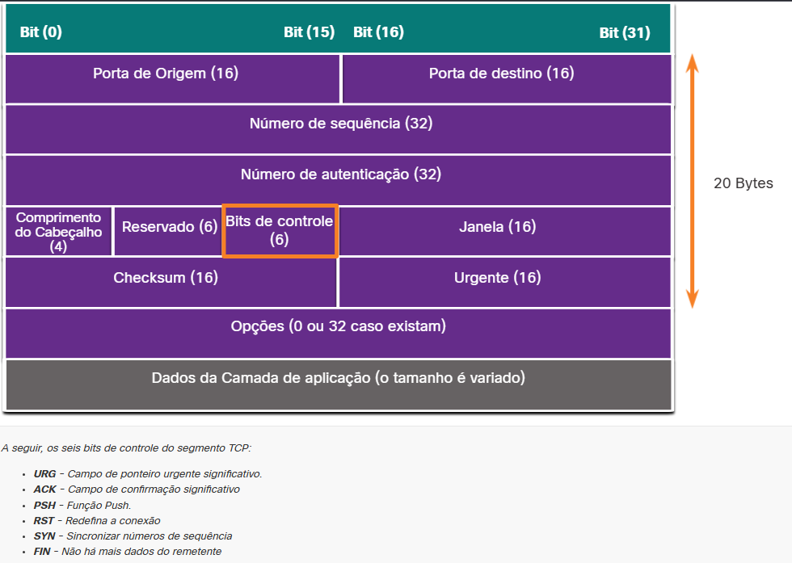
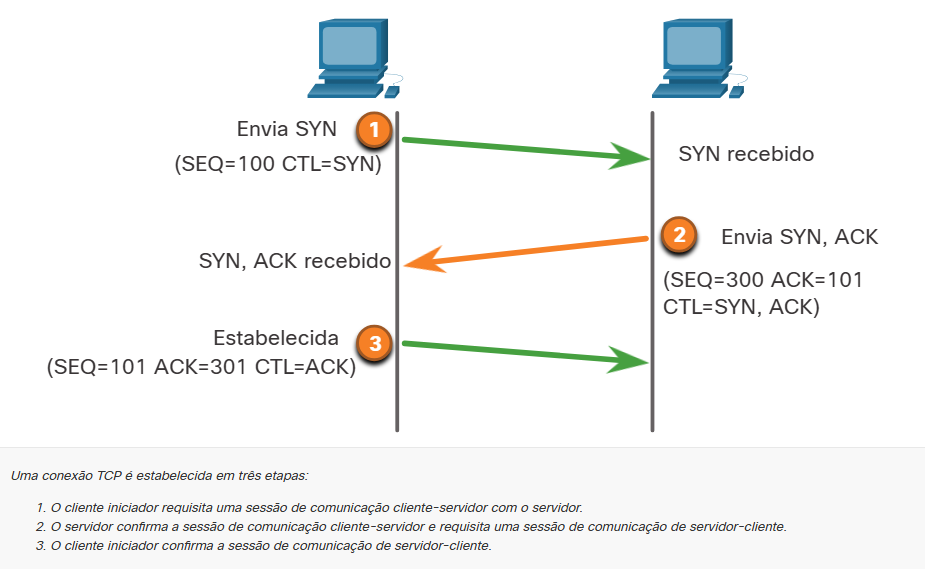
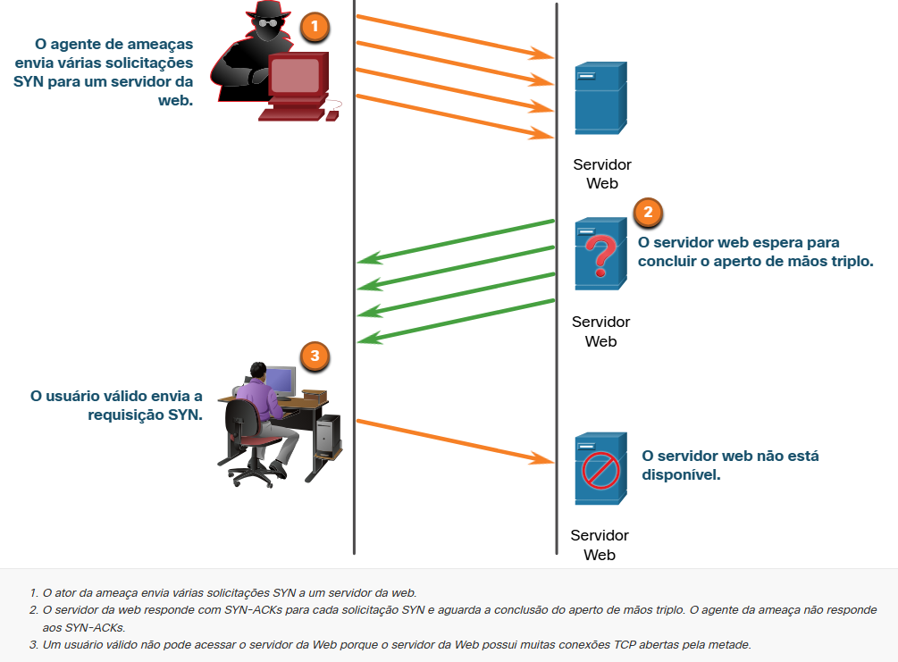
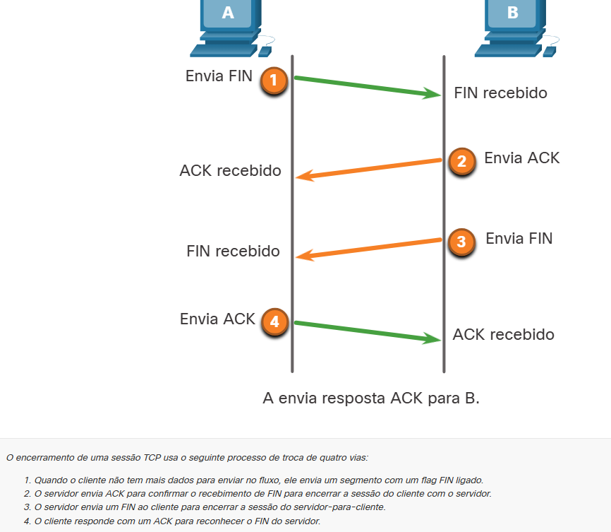
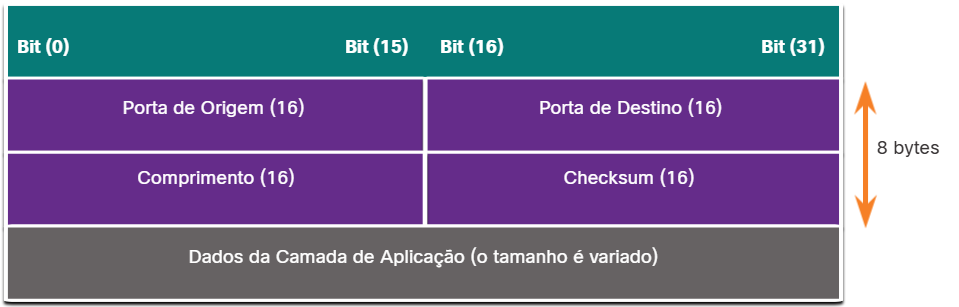

# 3.3.1 Cabeçalho do Segmento TCP

Enquanto alguns ataques têm como alvo o IP, este tópico discute ataques que têm como alvo o TCP e o UDP.

As informações do segmento TCP aparecem imediatamente após o cabeçalho IP. Os campos do segmento TCP e os sinalizadores para o campo bits de controle são exibidos na figura.

#  3.3.2 Serviços TCP

O TCP fornece estes serviços:

- Entrega confiável - O TCP incorpora reconhecimentos para garantir a entrega, em vez de depender de protocolos de camada superior para detectar e resolver erros. Se uma confirmação não for recebida à tempo, o remetente retransmitirá os dados. Exigir reconhecimentos dos dados recebidos pode causar atrasos substanciais. Exemplos de protocolos da camada de aplicação que usam a confiabilidade do TCP incluem HTTP, SSL / TLS, FTP, transferências de zona DNS e outros.
- Controle de fluxo - TCP implementa controle de fluxo para resolver esse problema. Em vez de reconhecer um segmento de cada vez, vários segmentos podem ser reconhecidos com um único segmento de reconhecimento.
- Comunicação stateful - A comunicação com estado do TCP entre duas partes ocorre durante o handshake de três vias do TCP. Antes que os dados possam ser transferidos usando o TCP, um aperto de mãos triplo abre a conexão TCP, conforme mostrado na figura. Se ambos os lados concordarem com a conexão TCP, os dados poderão ser enviados e recebidos por ambas as partes usando o TCP.
Aperto de mão de três vias TCP

#  3.3.3 Ataques TCP

Aplicações em Rede usam portas TCP ou UDP. Os atores de ameaças realizam varreduras de portas dos dispositivos de destino para descobrir quais serviços eles oferecem.

## Ataque de Inundação de SYN TCP

O ataque de inundação SYN TCP explora o aperto de mãos triplo do TCP. A figura mostra um agente de ameaça enviando continuamente pacotes de solicitação de sessão TCP SYN com um endereço IP de origem falsificado aleatoriamente para um destino. O dispositivo de destino responde com um pacote TCP SYN-ACK ao endereço IP falsificado e aguarda um pacote TCP ACK. Essas respostas nunca chegam. Eventualmente, o host de destino é sobrecarregado com conexões TCP semi-abertas e os serviços TCP são negados a usuários legítimos.

Ataque de Inundação de SYN TCP

#  Terminando uma conexão TCP

Ataque de redefinição de TCP

Um ataque de redefinição de TCP pode ser usado para encerrar as comunicações TCP entre dois hosts. A figura mostra como o TCP usa uma troca de quatro direções para fechar a conexão TCP usando um par de segmentos FIN e ACK de cada extremidade da conexão TCP. Uma conexão TCP termina quando recebe um bit RST. Essa é uma maneira abrupta de interromper a conexão TCP e informar o host de recebimento para parar imediatamente de usar a conexão TCP. Um agente de ameaça pode fazer um ataque de redefinição de TCP e enviar um pacote falsificado contendo um TCP RST para um ou ambos os pontos de extremidade.

Terminando uma conexão TCP

Sequestro de sessão TCP

Sequestro de sessão TCP é outra vulnerabilidade do TCP. Embora seja difícil de conduzir, um agente de ameaça assume um host já autenticado quando ele se comunica com o alvo. O agente de ameaça deve falsificar o endereço IP de um dos hosts, prever o próximo número de sequência e enviar um ACK para o outro host. Se for bem-sucedido, o agente da ameaça poderá enviar, mas não receber, dados do dispositivo de destino.

# 3.3.4 Cabeçalho e Operação do Segmento UDP

UDP é comumente usado por DNS, DHCP, TFTP, NFS e SNMP. Também é usado com aplicações em tempo real, como streaming de mídia ou VoIP. UDP é um protocolo de camada de transporte não orientado à conexão. Ele tem uma sobrecarga muito mais baixa que o TCP, porque não é orientado a conexão e não oferece retransmissão, sequenciamento e mecanismos de controle de fluxo sofisticados que fornecem confiabilidade. A estrutura de segmentos UDP, mostrada na figura, é muito menor que a estrutura de segmentos da TCP.

Nota: UDP realmente divide dados em datagramas. No entanto, o termo genérico “segmento” é comumente usado

Embora UDP seja normalmente chamado de não confiável, em contraste com a confiabilidade do TCP, isso não significa que os aplicativos que usam UDP são sempre não confiáveis, nem significa que o UDP é um protocolo inferior. Isso simplesmente significa que essas funções não são fornecidas pelo protocolo da camada de transporte e devem ser implementadas em outros locais, se houver necessidade.

A baixa sobrecarga do UDP o torna muito interessante para protocolos que efetuam transações simples de requisição e resposta. Por exemplo, usar TCP para o DHCP geraria tráfego de rede desnecessário. Se nenhuma resposta for recebida, o dispositivo reenvia a solicitação.

#  3.3.5 Ataques UDP

O UDP não está protegido por nenhuma criptografia. Você pode adicionar criptografia ao UDP, mas não está disponível por padrão. A falta de criptografia significa que qualquer pessoa pode ver o tráfego, alterá-lo e enviá-lo ao seu destino. Alterar os dados no tráfego alterará o número de checagem de 16 bits, mas o número de checagem é opcional e nem sempre é usado. Quando o número de checagem é usado, o agente de ameaça pode criar um novoo número de checagem com base na nova carga de dados e registrá-lo no cabeçalho como um novo o número de checagem. O dispositivo de destino descobrirá que o número de checagem corresponde aos dados sem saber que os dados foram alterados. Esse tipo de ataque não é amplamente utilizado.

Ataques de inundação UDP

É mais provável que você veja um ataque de inundação UDP. Em um ataque de inundação UDP, todos os recursos em uma rede são consumidos. O agente de ameaça deve usar uma ferramenta como UDP Unicorn ou Low Orbit Ion Cannon. Essas ferramentas enviam uma inundação de pacotes UDP, geralmente de um host falsificado, para um servidor na sub-rede. O programa varrerá todas as portas conhecidas tentando encontrar portas fechadas. Isso fará com que o servidor responda com uma mensagem inacessível da porta ICMP. Como existem muitas portas fechadas no servidor, isso cria muito tráfego no segmento, que consome a maior parte da largura de banda. O resultado é muito semelhante a um ataque de negação de serviço (DoS).