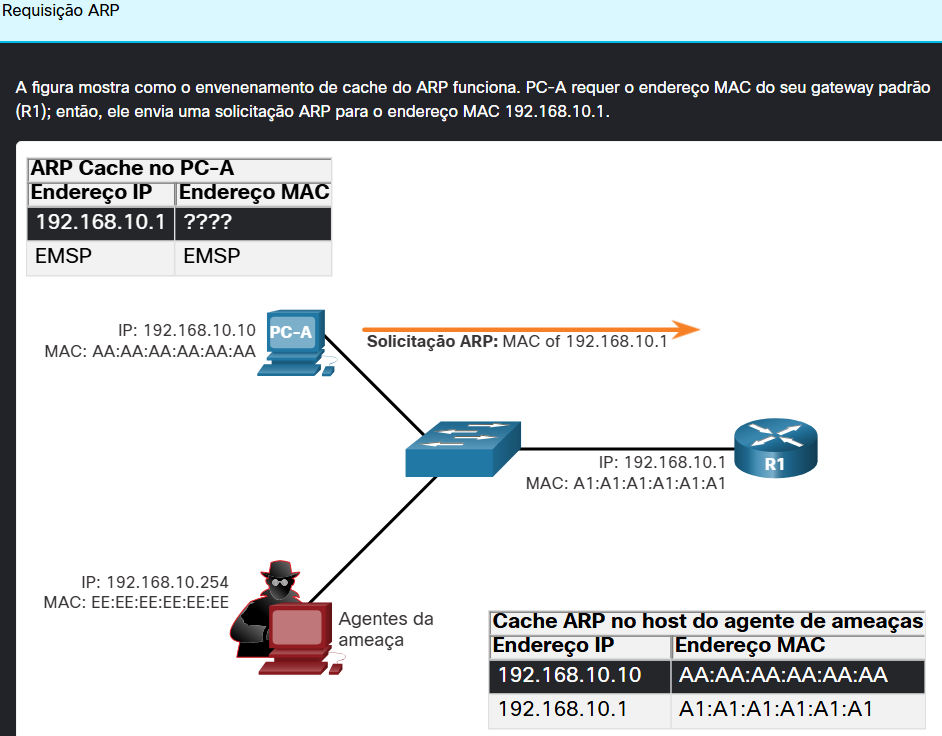
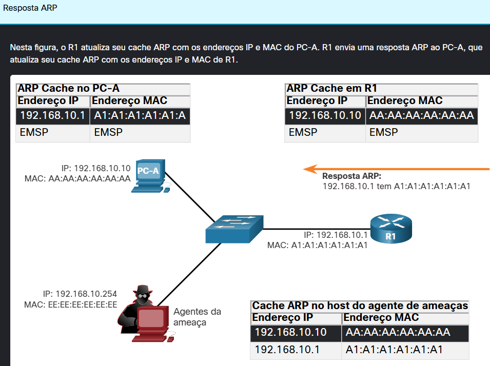
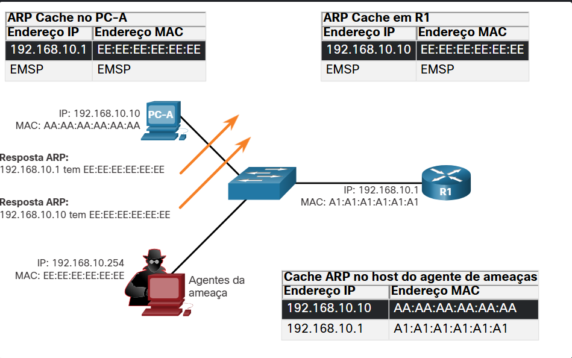
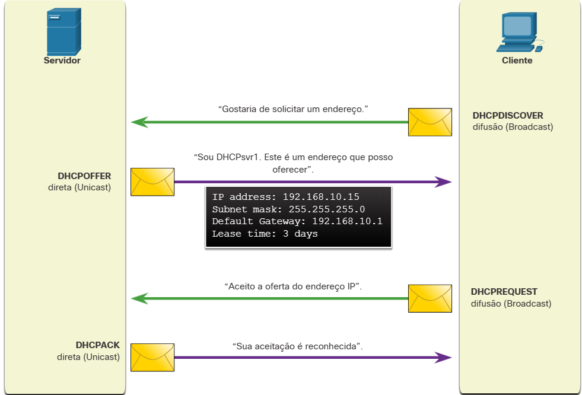

#  4.1.1 Vulnerabilidades ARP

Os hosts transmitem uma solicitação ARP para outros hosts no segmento de rede para determinar o endereço MAC de um host com um endereço IP específico. Todos os hosts na sub-rede recebem e processam a solicitação ARP. O host com o endereço IP correspondente na solicitação ARP envia uma resposta ARP.

Qualquer cliente pode enviar uma resposta ARP não solicitada denominada "ARP gratuito". Isso geralmente é feito quando um dispositivo é inicializado para informar todos os outros dispositivos na rede local o endereço MAC do novo dispositivo. Quando um host envia um ARP gratuito, outros hosts na sub-rede armazenam o endereço MAC e o endereço IP contidos no ARP gratuito em suas tabelas ARP.

No entanto, esse recurso do ARP também significa que qualquer host pode reivindicar ser o proprietário de qualquer IP / MAC que escolher. Um ator de ameaça pode envenenar o cache ARP de dispositivos na rede local, criando um ataque MiTM para redirecionar o tráfego. O objetivo é associar o endereço MAC do ator de ameaça ao endereço IP do gateway padrão nos caches ARP dos hosts no segmento LAN. Isso posiciona o agente de ameaça entre a vítima e todos os outros sistemas fora da sub-rede local.

#  4.1.2 Envenenamento de cache ARP

O envenenamento do cache ARP pode ser usado para iniciar vários ataques do tipo man-in-the-middle.

### Respostas falsas gratuitas de ARP

Na figura, o agente da ameaça envia duas respostas ARP gratuitas falsificadas usando seu próprio endereço MAC para os endereços IP de destino indicados. O PC-A atualiza seu cache ARP com seu gateway padrão, que agora está apontando para o endereço MAC do host do agente da ameaça. O R1 também atualiza seu cache ARP com o endereço IP do PC-A apontando para o endereço MAC do agente da ameaça.

O host do ator de ameaça está executando um ataque de envenenamento ARP. O ataque de envenenamento ARP pode ser passivo ou ativo. O envenenamento ARP passivo é onde os atores de ameaças roubam informações confidenciais. O envenenamento ARP ativo é onde os agentes de ameaças modificam dados em trânsito ou injetam dados maliciosos.

Nota: Existem muitas ferramentas disponíveis na Internet para criar ataques ARP MITM, incluindo dsniff, Cain & Abel, ettercap, Yersinia e outros.

#  4.1.3 Ataques DNS

O protocolo DNS (Domain Name Service) define um serviço automatizado que corresponde a nomes de recursos, como www.cisco.com, com o endereço de rede numérico necessário, como o endereço IPv4 ou IPv6. Ele inclui o formato para consultas, respostas e dados e usa os registros de recursos (RR) para identificar o tipo de resposta DNS.

A proteção do DNS geralmente é ignorada. No entanto, é crucial para a operação de uma rede e deve ser protegido adequadamente.

Os ataques de DNS incluem os seguintes:

Ataques de resolvedor aberto de DNS
Ataques furtivos de DNS
Ataques de sombreamento de domínio DNS
Ataques de tunelamento de DNS

### Ataques de resolvedor aberto de DNS

Muitas organizações usam os serviços de servidores DNS abertos ao público, como o GoogleDNS (8.8.8.8), para fornecer respostas às consultas. Esse tipo de servidor DNS é chamado de resolvedor aberto. Um resolvedor aberto de DNS responde a consultas de clientes fora de seu domínio administrativo. Os resolvedores abertos de DNS são vulneráveis a várias atividades maliciosas descritas na tabela.

- Ataques de envenenamento de cache DNS
Os agentes de ameaças enviam informações de recurso de registro falsificado e falsificado (RR) a um resolvedor de DNS para redirecionar usuários de sites legítimos para sites maliciosos. Os ataques de envenenamento de cache DNS podem ser usados para informar o resolvedor de DNS a usar um servidor de nomes mal-intencionado que fornece informações de RR para atividades mal-intencionadas.

- Ataques de amplificação e reflexão de DNS
Os agentes de ameaças usam ataques DoS ou DDoS em resolvedores abertos do DNS para aumentar o volume de ataques e ocultar a verdadeira fonte de um ataque. Os agentes de ameaças enviam mensagens DNS para os resolvedores abertos usando o endereço IP de um host de destino. Esses ataques são possíveis porque o resolvedor aberto responderá às perguntas de qualquer pessoa que faça uma pergunta.

- Ataques de utilização de recursos DNS
Um ataque de DoS que consome os recursos dos resolvedores abertos do DNS. Esse ataque do DoS consome todos os recursos disponíveis para afetar negativamente as operações do resolvedor aberto do DNS. O impacto desse ataque de DoS pode exigir que o resolvedor aberto do DNS seja reinicializado ou que os serviços sejam interrompidos e reiniciados.

### Ataques furtivos de DNS

Para ocultar sua identidade, os agentes de ameaças também usam as técnicas furtivas de DNS descritas na tabela para realizar seus ataques.

- Fluxo Rápido
Os atores de ameaças usam essa técnica para ocultar seus sites de entrega de phishing e malware atrás de uma rede que muda rapidamente de hosts DNS comprometidos. Os endereços IP do DNS são alterados continuamente em minutos. As redes de bots geralmente empregam técnicas do Fast Flux para impedir a detecção eficaz de servidores mal-intencionados.

- Fluxo de IP duplo
Os atores de ameaças usam essa técnica para alterar rapidamente o nome do host para os mapeamentos de endereço IP e também para alterar o servidor de nomes autoritativo. Isso aumenta a dificuldade de identificar a fonte do ataque.

- Algoritmos de geração de domínio
Os atores de ameaças usam essa técnica em malware para gerar aleatoriamente nomes de domínio que podem ser usados como pontos de encontro para seus servidores de comando e controle (C&C).

### Ataques de sombreamento de domínio DNS
O sombreamento de domínio envolve o agente de ameaças coletando credenciais de conta de domínio para criar silenciosamente vários subdomínios a serem usados durante os ataques. Esses subdomínios normalmente apontam para servidores mal-intencionados sem alertar o proprietário real do domínio pai.

#  4.1.4 Tunelamento DNS

Botnets se tornaram um método de ataque popular de atores ameaçadores. Na maioria das vezes, os botnets são usados para espalhar malware ou iniciar ataques de DDoS e phishing.

O DNS na empresa às vezes é negligenciado como um protocolo que pode ser usado por botnets. Por isso, quando o tráfego DNS é determinado como parte de um incidente, o ataque geralmente já acabou. É necessário que o analista de segurança cibernética seja capaz de detectar quando um invasor está usando tunelamento DNS para roubar dados e prevenir e conter o ataque. Para isso, o analista de segurança deve implementar uma solução que possa bloquear as comunicações de saída dos hosts infectados.

Os agentes de ameaças que usam o tunelamento DNS colocam tráfego que não é de DNS, dentro do tráfego DNS. Esse método geralmente contorna soluções de segurança. Para que o agente da ameaça use o túnel DNS, os diferentes tipos de registros DNS, como TXT, MX, SRV, NULL, A ou CNAME, são alterados. Por exemplo, um registro TXT pode armazenar os comandos enviados para os bots de host infectados como respostas DNS. Um ataque de tunelamento DNS usando TXT funciona assim:

1. Os dados são divididos em vários blocos codificados.
2. Cada pedaço é colocado em um rótulo de nome de domínio de nível inferior na consulta DNS.
3. Como não há resposta do DNS local ou em rede para a consulta, a solicitação é enviada aos servidores DNS recursivos do ISP.
4. O serviço DNS recursivo encaminhará a consulta para o servidor de nomes autorizado do invasor.
5. O processo é repetido até que todas as consultas contendo os chunks sejam enviadas.
6. Quando o servidor de nomes autoritativo do invasor recebe as consultas DNS dos dispositivos infectados, ele envia respostas para cada consulta DNS, que contém os comandos encapsulados e codificados.
7. O malware no host comprometido recombina os pedaços e executa os comandos ocultos.

Para poder interromper o túnel DNS, um filtro que inspecione o tráfego DNS deve ser usado. Preste atenção especial às consultas DNS que são mais longas do que a média, ou aquelas que têm um nome de domínio suspeito. Além disso, as soluções de segurança de DNS, como Cisco Umbrella (anteriormente Cisco OpenDNS), bloqueiam grande parte do tráfego de túnel DNS ao identificar domínios suspeitos. Domínios associados a serviços DNS dinâmicos devem ser considerados altamente suspeitos.

#  4.1.5 DHCP

Operação normal do DHCP

Os servidores DHCP fornecem dinamicamente informações de configuração de IP aos clientes. A figura mostra a sequência típica de uma troca de mensagens DHCP entre cliente e servidor.

Na figura, um cliente transmite uma mensagem de descoberta DHCP. O servidor DHCP responde com uma oferta direta (unicast) que inclui informações de endereçamento que o cliente pode usar. O cliente transmite em difusão (broadcast) uma solicitação DHCP para informar ao servidor que aceita a oferta. O servidor responde com uma confirmação de direta (unicast) aceitando a solicitação.

