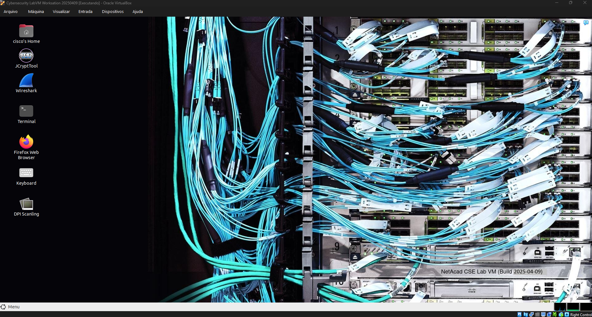
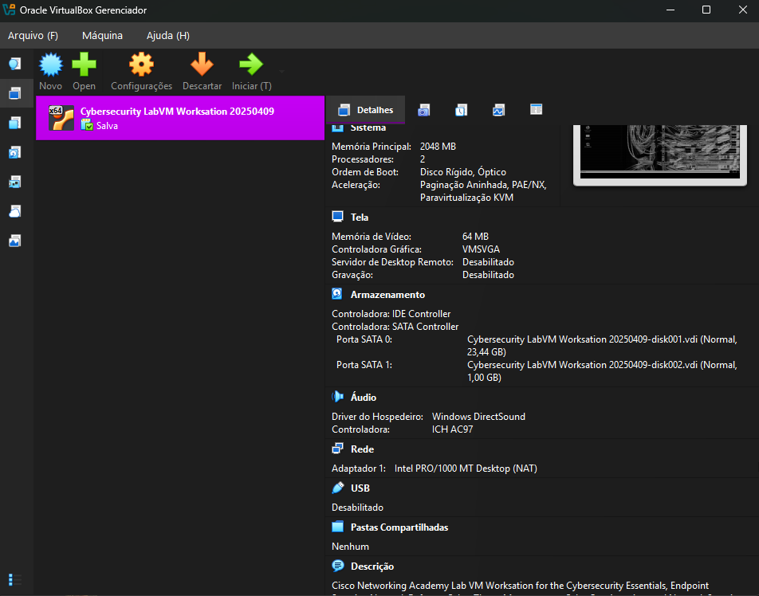

#  4.2.1 HTTP and HTTPS

Os navegadores da Internet são usados por quase todos. Bloquear completamente a navegação na Web não é uma opção porque as empresas precisam de acesso à Web, sem comprometer a segurança da Web.

Para investigar ataques baseados na Web, os analistas de segurança devem ter uma boa compreensão de como funciona um ataque padrão baseado na Web. Estes são os estágios comuns de um ataque típico da web:

1. A vítima visita inconscientemente uma página web que foi comprometida por malware.
2. A página Web comprometida redireciona o usuário, muitas vezes através de muitos servidores comprometidos, para um site contendo código malicioso.
3. O usuário visita este site com código malicioso e seu computador fica infectado. Isso é conhecido como uma unidade por download. Quando o usuário visita o site, um kit de exploração verifica o software em execução no computador da vítima, incluindo o sistema operacional, Java ou Flash player que procura uma exploração no software. O kit de exploração geralmente é um script PHP e fornece ao invasor um console de gerenciamento para gerenciar o ataque.
4. Depois de identificar um pacote de software vulnerável em execução no computador da vítima, o kit de exploração entra em contato com o servidor do kit de exploração para baixar código que pode usar a vulnerabilidade para executar código mal-intencionado no computador da vítima.
5. Depois que o computador da vítima foi comprometido, ele se conecta ao servidor de malware e baixa uma carga útil. Isso pode ser malware ou um serviço de download de arquivos que baixa outro malware.
6. O último pacote de malware é executado no computador da vítima.
Independente do tipo de ataque que está sendo usado, o objetivo principal do ator da ameaça é garantir que o navegador da Web da vítima acabe na página da web do ator da ameaça, que, em seguida, serve a exploração maliciosa para a vítima.

Alguns sites mal-intencionados aproveitam plug-ins vulneráveis ou vulnerabilidades do navegador para comprometer o sistema do cliente. Redes maiores dependem de IDSs para verificar arquivos baixados em busca de malware. Se detectado, o IDS emite alertas e registra o evento em arquivos de log para análise posterior.

Os logs de conexão do servidor geralmente podem revelar informações sobre o tipo de varredura ou ataque. Os diferentes tipos de códigos de status de conexão estão listados aqui:

- Informativo 1xx - Esta é uma resposta provisória, consistindo apenas na Linha de Status e cabeçalhos opcionais. É encerrado por uma linha vazia. Não há cabeçalhos necessários para esta classe de código de status. Servidores NÃO DEVE enviar uma resposta 1xx para um cliente HTTP/1.0, exceto em condições experimentais.
- Successful 2xx - A solicitação do cliente foi recebida, compreendida e aceita com êxito.
- Redirection 3xx - Outras ações devem ser tomadas pelo agente do usuário para atender a solicitação. Um cliente DEVE detectar loops de redirecionamento infinitos, porque esses loops geram tráfego de rede para cada redirecionamento.
- Client Error 4xx - Para casos em que o cliente parece ter errado. Exceto quando responder a uma solicitação HEAD, o servidor DEVE incluir uma entidade contendo uma explicação da situação, e se ela é temporária. Agentes de usuário DEVE exibir qualquer entidade incluída para o usuário.
- Server Error 5xx - Para casos em que o servidor está ciente de que ele errou ou não pode executar a solicitação. Exceto quando responder a uma solicitação HEAD, o servidor DEVE incluir uma entidade contendo uma explicação da situação de erro, e se ela é temporária. Agentes de usuário DEVE exibir qualquer entidade incluída para o usuário.
Para se defender contra ataques baseados na web, as seguintes contramedidas devem ser usadas:

- Sempre atualize o sistema operacional e os navegadores com patches e atualizações atuais.
- Use um proxy da Web como o Cisco Cloud Web Security ou o Cisco Web Security Appliance para bloquear sites mal-intencionados.
- Use as melhores práticas de segurança do Open Web Application Security Project (OWASP) ao desenvolver aplicativos Web.
- Educar os usuários finais mostrando-lhes como evitar ataques baseados na Web.
O OWASP Top 10 Riscos de Segurança de Aplicativos Web foi projetado para ajudar as organizações a criar aplicativos Web seguros. É uma lista útil de potenciais vulnerabilidades que são comumente exploradas por atores de ameaças.

# 4.2.2 Exploits HTTP comuns

IFrames maliciosos
Os atores de ameaças costumam usar quadros inline maliciosos (iFrames). Um iFrame é um elemento HTML que permite que o navegador carregue outra página da Web a partir de outra fonte. Os ataques de iFrame tornaram-se muito comuns, pois são frequentemente usados para inserir anúncios de outras fontes na página. Os atores de ameaças comprometem um servidor da Web e modificam páginas da Web adicionando HTML para o iFrame malicioso. O HTML vincula ao servidor da web do ator da ameaça. Em alguns casos, a página IFrame carregada consiste em apenas alguns pixels. Isso torna muito difícil para o usuário ver. Como o iFrame é executado na página, ele pode ser usado para fornecer uma exploração mal-intencionada, como publicidade de spam, um kit de exploração e outros malwares.

Estas são algumas das maneiras de prevenir ou reduzir iFrames maliciosos:

### Use um proxy da Web para bloquear sites mal-intencionados.
Como os invasores geralmente alteram o HTML de origem do iFrame em um site comprometido, verifique se os desenvolvedores da Web não usam iFrames. Isso isolará qualquer conteúdo de sites de terceiros e facilitará a localização de páginas modificadas.
Use um serviço como o Cisco Umbrella para impedir que os usuários naveguem para sites conhecidos por serem mal-intencionados.
Certifique-se de que o usuário final entenda o que é um iFrame. Os atores de ameaças costumam usar esse método em ataques baseados na Web.

### Amortecimento HTTP 302
Outro tipo de ataque HTTP é o ataque de amortecimento HTTP 302. Os atores de ameaças usam o código de status de resposta 302 Found HTTP para direcionar o navegador da Web do usuário para um novo local. Os atores de ameaças costumam usar funções HTTP legítimas, como redirecionamentos HTTP para realizar seus ataques. HTTP permite que os servidores redirecionem a solicitação HTTP de um cliente para um servidor diferente. O redirecionamento HTTP é usado, por exemplo, quando o conteúdo da Web é movido para um URL ou nome de domínio diferente. Isso permite que URLs e marcadores antigos continuem a funcionar. Portanto, os analistas de segurança devem entender como uma função como o redirecionamento HTTP funciona e como ela pode ser usada durante ataques.

Quando a resposta do servidor é um status 302 Encontrado, ele também fornece a URL no campo de localização. O navegador acredita que o novo local é o URL fornecido no cabeçalho. O navegador é convidado a solicitar este novo URL. Esta função de redirecionamento pode ser usada várias vezes até que o navegador finalmente pouse na página que contém o exploit. Os redirecionamentos podem ser difíceis de detectar devido ao fato de que redirecionamentos legítimos ocorrem frequentemente na rede.

Estas são algumas maneiras de evitar ou reduzir ataques de amortecimento HTTP 302:

Use um proxy da Web para bloquear sites mal-intencionados.
Use um serviço como o Cisco Umbrella para impedir que os usuários naveguem para sites conhecidos por serem mal-intencionados.
Certifique-se de que o usuário final entenda como o navegador é redirecionado por meio de uma série de redirecionamentos HTTP 302.

### Sombreamento de domínio
Quando um ator de ameaça deseja criar um ataque de sombreamento de domínio, o ator de ameaça deve primeiro comprometer um domínio. Em seguida, o ator de ameaça deve criar vários subdomínios desse domínio para ser usado para os ataques. Logins de registro de domínio seqüestrados são usados para criar os muitos subdomínios necessários. Depois que esses subdomínios tiverem sido criados, os invasores podem usá-los como quiserem, mesmo que sejam encontrados domínios mal-intencionados. Eles podem simplesmente fazer mais do domínio pai. A sequência a seguir é normalmente usada por atores de ameaça:

Um site fica comprometido.
O amortecimento HTTP 302 é usado para enviar o navegador para sites maliciosos.
O sombreamento de domínio é usado para direcionar o navegador para um servidor comprometido.
Uma página inicial do kit de exploração é acessada.
Downloads de malware da página inicial do kit de exploração.
Estas são algumas maneiras de prevenir ou reduzir ataques de sombreamento de domínio:

Proteja todas as contas de proprietário do domínio. Use senhas fortes e use autenticação de dois fatores para proteger essas contas poderosas.
Use um proxy da Web para bloquear sites mal-intencionados.
Use um serviço como o Cisco Umbrella para impedir que os usuários naveguem para sites conhecidos por serem mal-intencionados.
Certifique-se de que os proprietários de domínio validem as suas contas de registo e procure quaisquer subdomínios que não tenham autorizado.

# 4.2.3 E-mail

Nos últimos 25 anos, o email evoluiu de uma ferramenta usada principalmente por profissionais técnicos e de pesquisa para se tornar a espinha dorsal das comunicações corporativas. A cada dia, mais de 100 bilhões de mensagens de e-mail corporativo são trocadas. À medida que o nível de uso aumenta, a segurança torna-se uma prioridade maior. A maneira como os usuários acessam o email hoje também aumenta a oportunidade de a ameaça de malware ser introduzida. Costumava ser que os usuários corporativos acessavam e-mails baseados em texto a partir de um servidor corporativo. O servidor corporativo estava em uma estação de trabalho protegida pelo firewall da empresa. Hoje, as mensagens HTML são acessadas a partir de muitos dispositivos diferentes que muitas vezes não são protegidos pelo firewall da empresa. HTML permite mais ataques devido à quantidade de acesso que às vezes pode ignorar diferentes camadas de segurança.

### Ataques baseados em anexos
Atores de ameaças incorporam conteúdo malicioso em arquivos de negócios, como um e-mail do departamento de TI. Usuários legítimos abrem conteúdo malicioso. O malware é usado em ataques amplos, muitas vezes visando uma vertical de negócios específica para parecer legítima, atraindo usuários que trabalham nessa vertical para abrir anexos ou clicar em links incorporados.

### Falsificação de e-mail
Os atores de ameaças criam mensagens de e-mail com um endereço de remetente falsificado que visa enganar o destinatário a fornecer dinheiro ou informações confidenciais. Por exemplo, um banco envia um e-mail solicitando que você atualize suas credenciais. Quando este e-mail exibe o logotipo do banco idêntico ao e-mail que você abriu anteriormente e que era legítimo, ele tem uma maior chance de ser aberto, ter anexos abertos e links clicados. O e-mail falsificado pode até pedir que você verifique suas credenciais para que o banco tenha certeza de que você é você, expondo suas informações de login.

### E-mail de spam
Os agentes de ameaças enviam e-mails não solicitados contendo anúncios ou ficheiros maliciosos. Esse tipo de e-mail é enviado com mais frequência para solicitar uma resposta, informando ao ator da ameaça que o e-mail é válido e que um usuário abriu o spam.

### Servidor de e-mail do tipo Open Relay
Os atores de ameaças aproveitam os servidores corporativos configurados incorretamente como retransmissores de email abertos para enviar grandes volumes de spam ou malware para usuários desavisados. O retransmissor de email aberto é um servidor SMTP que permite que qualquer pessoa na internet envie e-mails. Como qualquer pessoa pode usar o servidor, eles são vulneráveis a spammers e worms. Volumes muito grandes de spam podem ser enviados usando um retransmissor de email aberto. É importante que os servidores de e-mail corporativos nunca sejam configurados como uma retransmissão aberta. Isso reduzirá consideravelmente a quantidade de e-mails não solicitados.

### Homoglifos
Os atores de ameaças podem usar caracteres de texto muito semelhantes ou até mesmo idênticos aos caracteres de texto legítimos. Por exemplo, pode ser difícil distinguir entre um O (letra maiúscula O) e um 0 (número zero) ou um l (minúsculo “L”) e um 1 (número um). Eles podem ser usados em e-mails de phishing para torná-los muito convincentes. No DNS, esses caracteres são muito diferentes do real. Quando o registro DNS é pesquisado, um URL completamente diferente é encontrado quando o link com o homoglifo é usado na pesquisa.

Assim como qualquer outro serviço que esteja escutando uma porta para conexões de entrada, os servidores SMTP também podem ter vulnerabilidades. Mantenha sempre o software SMTP atualizado com patches e atualizações de segurança e software. Para evitar que os atores da ameaça completem sua tarefa de enganar o usuário final, implemente contramedidas. Use um Security Appliance específico para e-mail, como o Cisco Email Security Appliance. Isso ajudará a detectar e bloquear muitos tipos conhecidos de ameaças, como phishing, spam e malware. Além disso, eduque o usuário final. Quando os ataques fazem isso pelas medidas de segurança em vigor, e eles vão às vezes, o usuário final é a última linha de defesa. Ensine-os a reconhecer spam, tentativas de phishing, links e URLs suspeitos, homoglifos e a nunca abrir anexos suspeitos.

#  4.2.4 Bancos de dados expostos pela Web

Aplicativos Web geralmente se conectam a um banco de dados relacional para acessar dados. Como os bancos de dados relacionais geralmente contêm dados confidenciais, os bancos de dados são um alvo freqüente para ataques.

### Injeção de código
Os atacantes podem executar comandos no sistema operacional de um servidor Web através de uma aplicação Web vulnerável. Isso pode ocorrer se o aplicativo Web fornecer campos de entrada para o invasor para inserir dados mal-intencionados. Os comandos do intruso são executados através da aplicação Web e têm as mesmas permissões que a aplicação Web. Este tipo de ataque é usado porque muitas vezes não há validação insuficiente de entrada. Um exemplo é quando um ator ameaça injeta código PHP em um campo de entrada inseguro na página do servidor.

### Injeção de SQL
SQL é a linguagem usada para consultar um banco de dados relacional. Os atores de ameaças usam injeções SQL para violar o banco de dados relacional, criar consultas SQL mal-intencionadas e obter dados confidenciais do banco de dados relacional.

Um dos ataques de banco de dados mais comuns é o ataque de injeção SQL. O ataque de injeção SQL consiste em inserir uma consulta SQL através dos dados de entrada do cliente para o aplicativo. Uma exploração de injeção SQL bem-sucedida pode ler dados confidenciais do banco de dados, modificar dados do banco de dados, executar operações de administração no banco de dados e, às vezes, emitir comandos para o sistema operacional.

A menos que um aplicativo use validação rigorosa de dados de entrada, ele será vulnerável ao ataque de injeção SQL. Se um aplicativo aceitar e processar dados fornecidos pelo usuário sem qualquer validação de dados de entrada, um ator de ameaça poderá enviar uma string de entrada criada com intuito malicioso para acionar o ataque de injeção SQL.

Os analistas de segurança devem ser capazes de reconhecer consultas SQL suspeitas para detectar se o banco de dados relacional foi submetido a ataques de injeção SQL. Eles precisam ser capazes de determinar qual ID de usuário foi usado pelo ator da ameaça para fazer login e, em seguida, identificar qualquer informação ou acesso adicional que o ator da ameaça poderia ter aproveitado após um login bem-sucedido.

#  4.2.5 Scripts do lado do cliente

Scripting através de sites

Nem todos os ataques são iniciados do lado do servidor. Cross-Site Scripting (XSS) é onde as páginas da Web executadas no lado do cliente, dentro de seu próprio navegador da Web, são injetadas com scripts mal-intencionados. Esses scripts podem ser usados pelo Visual Basic, JavaScript e outros para acessar um computador, coletar informações confidenciais ou implantar mais ataques e espalhar malware. Tal como acontece com a injeção de SQL, isso é muitas vezes devido ao invasor postar conteúdo em um site confiável com falta de validação de entrada. Os futuros visitantes do Web site fidedigno serão expostos ao conteúdo fornecido pelo intruso.

Estes são os dois tipos principais de XSS:

- Armazenado (persistente) - Isso é armazenado permanentemente no servidor infectado e é recebido por todos os visitantes da página infectada.
- Refletido (não persistente) - Isso requer apenas que o script mal-intencionado esteja localizado em um link e os visitantes devem clicar no link infectado para se infectarem.
Estas são algumas maneiras de prevenir ou reduzir ataques XSS:

- Certifique-se de que os desenvolvedores de aplicativos da Web estejam cientes das vulnerabilidades XSS e de como evitá-las.
- Use uma implementação IPS para detectar e evitar scripts mal-intencionados.
- Use um proxy da Web para bloquear sites mal-intencionados.
- Use um serviço como o Cisco Umbrella para impedir que os usuários naveguem para sites conhecidos por serem mal-intencionados.
- Tal como acontece com todas as outras medidas de segurança, certifique-se de educar os usuários finais. Ensine-os a identificar ataques de phishing e notificar o pessoal da Infosec quando suspeitar de qualquer coisa relacionada à segurança.

# Lab 2 VM (Pasta labs)

