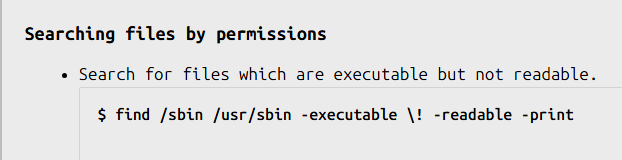

#  Bandit Level 5 → Level 6
Level Goal
The password for the next level is stored in a file somewhere under the inhere directory and has all of the following properties:

human-readable
1033 bytes in size
not executable
Commands you may need to solve this level
ls , cd , cat , file , du , find
---
## Resolução

find . -executable -readable -print

Tudo que aparece é executável e possível de ler, porém queremos que seja possível de ler para humanos, ou seja: ASCII

 find . -not -executable -type f -exec du -b {} \;
ls -a

pXa26xhMWaC2SvDotA4r9EgZkulOeSBW